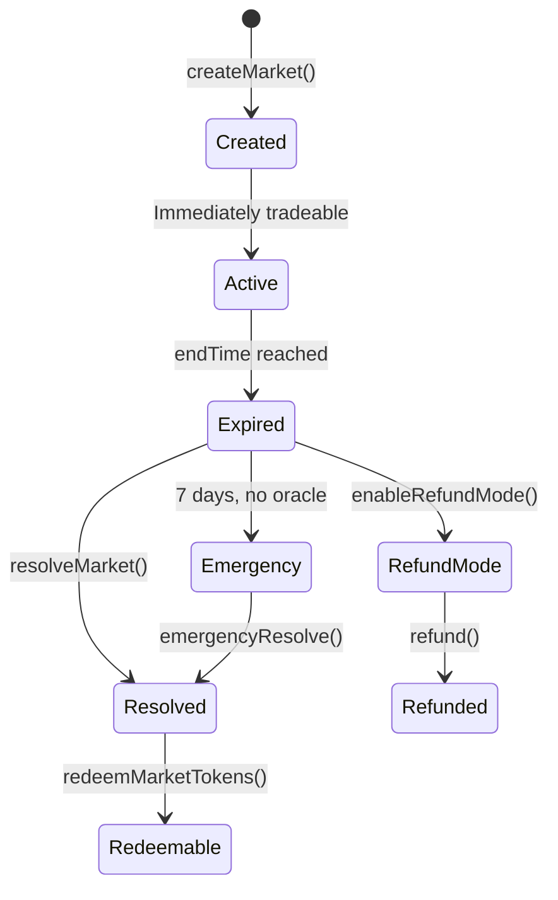

# Resolution

Resolution is the process of determining the outcome of a market and allowing winners to redeem USDC.

## Market Lifecycle

## Normal Resolution

1. **Oracle resolves:** The assigned oracle calls `resolve(marketId, outcome)` with `true` (YES wins) or `false` (NO wins)
2. **Anyone finalizes:** After the oracle has resolved and `endTime` has passed, anyone calls `resolveMarket(marketId)`
3. **Winners redeem:** Holders of winning tokens call `redeemMarketTokens(marketId)` to receive $1.00 USDC per token

## Emergency Resolution

If the oracle fails to resolve within **7 days** after `endTime`:

- An address with `OPERATOR_ROLE` can call `emergencyResolve(marketId, outcome)`
- This is a safety mechanism, not the normal flow

## Refund Mode

If a market cannot be properly resolved (ambiguous question, oracle failure, dispute):

1. `OPERATOR_ROLE` calls `enableRefundMode(marketId)`
2. Any token holder calls `refund(marketId)`
3. USDC is returned proportionally based on total token holdings

> ⚠️ Refund mode is irreversible. Once enabled, the market cannot be resolved normally.

## Category Resolution

For [multi-outcome markets](multi-outcome-markets.md), `resolveCategory(categoryId, winningOutcomeIndex)` settles all markets in the category. Only `ADMIN_ROLE` can call this.

## Next Steps

- [Multi-Outcome Markets](multi-outcome-markets.md) — categories and group operations
- [Developer: Resolve & Redeem](../developers/resolve-redeem.md) — code examples
- [Contract: Oracle](../contracts/oracle.md) — oracle adapter details
