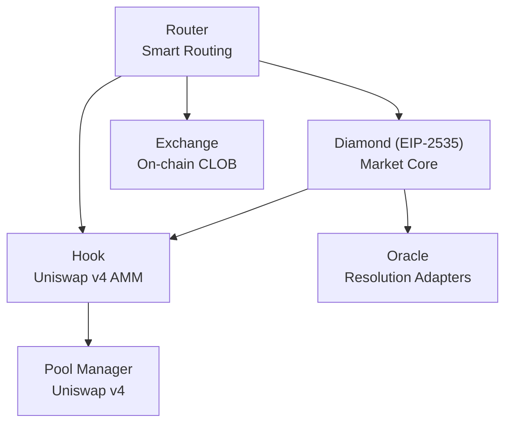

# Smart Contracts Overview

PrediX consists of five core contracts deployed on **Unichain Sepolia Testnet** (Chain ID: `1301`).

## Architecture

## Contract Addresses

| Contract | Address | Role |
|----------|---------|------|
| **Diamond** | `0xF38a265E6e4F57D000a1CC08004da5B4A380B08A` | Market creation, positions, resolution |
| **Hook** | `0xAe7eA7eba1D3B0815dCA2b43f250428c20ed30c0` | Uniswap v4 AMM + dynamic fees |
| **Exchange** | `0xa202abCb2A358c0862B2dA76b553398339F2C638` | On-chain CLOB matching engine |
| **Router** | `0xEfc57eB2b5b5BE7E5b8377be23f8D31354811Eb7` | Smart order routing (CLOB + AMM) |
| **Oracle** | `0x699A8C74663b1C852E195b2ffa00D5965E992Cf3` | Manual oracle adapter |
| **USDC** | `0x12fd156C8b5F2901BA2781d97db84AaC56b2b911` | Test collateral token |
| **Pool Manager** | `0x00B036B58a818B1BC34d502D3fE730Db729e62AC` | Uniswap v4 core |

## Chain Info

| Property | Value |
|----------|-------|
| Network | Unichain Sepolia |
| Chain ID | `1301` |
| RPC | `https://sepolia.unichain.org` |
| Explorer | `https://sepolia.uniscan.xyz` |

## Why Diamond Proxy (EIP-2535)

48 source files across 6 facets exceed the 24KB contract size limit. Diamond pattern provides:

- **Modular upgrades:** Update MarketFacet without touching AccessControl
- **Shared storage:** All facets share state via `AppStorage` struct
- **No migration:** Single address forever, regardless of upgrades

## ABI Downloads

- [Diamond ABI (MarketFacet)](./abis/diamond.json)
- [Exchange ABI](./abis/exchange.json)
- [Router ABI](./abis/router.json)
- [Hook ABI](./abis/hook.json)
- [ERC-20 ABI](./abis/erc20.json)

## Next Steps

- [Diamond](diamond.md) — facets, function routing, upgrades
- [Exchange](exchange.md) — CLOB mechanics
- [Router](router.md) — smart routing logic
- [Security](security.md) — access control, caps, audits
