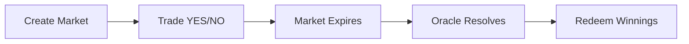

# How It Works

## Market Lifecycle

### 1. Create Market

An admin creates a market with a question, end time, and oracle. The protocol automatically deploys YES and NO tokens (ERC-20) and initializes a Uniswap v4 pool.

### 2. Trade

Users buy YES or NO tokens through the Router. The Router checks the CLOB for limit orders first, then routes overflow to the AMM — always giving you the best available price.

- **YES at $0.60** means the market estimates a 60% probability.
- **YES + NO ≈ $1.00** always, enforced by arbitrage.

### 3. Resolve

After the market's end time, the oracle submits the outcome. Anyone can then call `resolveMarket()` to finalize.

### 4. Redeem

Winning tokens are worth $1.00 each. Losing tokens are worth $0.00. Call `redeemMarketTokens()` to receive USDC.

## Example

You believe ETH will surpass $10K by December.

| Step | Action | Cost/Return |
|------|--------|-------------|
| Buy | 100 YES tokens at $0.60 each | Pay $60 USDC |
| Wait | Market expires, ETH is above $10K | — |
| Redeem | 100 YES tokens → 100 USDC | Receive $100 |
| **Profit** | | **+$40 USDC (67% return)** |

If ETH stays below $10K, your YES tokens are worth $0 and you lose your $60.

> ⚠️ You can never lose more than your initial investment. Maximum loss = purchase price.

## Key Concepts

- **Split/Merge:** Convert between USDC and token pairs — see [Split & Merge](../concepts/split-and-merge.md)
- **Fees:** Dynamic AMM fees from 0.5% to 5% — see [Fees](../concepts/fees.md)
- **Resolution:** Normal, emergency, and refund paths — see [Resolution](../concepts/resolution.md)

## Next Steps

- [Quick Start](quick-start.md) — start trading in 5 steps
- [Outcome Tokens](../concepts/outcome-tokens.md) — how YES/NO tokens work
