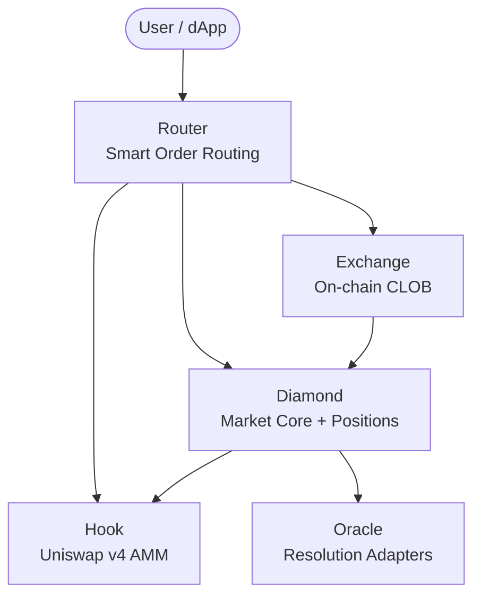

# What is PrediX?

PrediX Protocol is a decentralized prediction market where users trade binary outcome tokens (YES/NO) denominated in USDC. All trading, settlement, and resolution happen on-chain on Unichain — Uniswap's L2 rollup.

## Key Differentiators

| Feature | PrediX | Others |
|---------|--------|--------|
| **Liquidity** | Hybrid CLOB + AMM via Smart Router | Single venue (CLOB or AMM) |
| **Token standard** | ERC-20 (LP-able, composable) | ERC-1155 (non-composable) |
| **AMM engine** | Uniswap v4 with custom Hooks | Forked AMMs or off-chain |
| **Fee model** | Dynamic time-decay (0.5%→5%) | Static fees |
| **Upgradability** | Diamond proxy (EIP-2535) | Monolithic or immutable |
| **Oracle** | Pluggable multi-oracle system | Single oracle dependency |

## Architecture

**Diamond** manages markets, positions (split/merge), and resolution. **Router** aggregates liquidity from both **Exchange** (CLOB) and **Hook** (AMM). **Oracle** adapters resolve outcomes.

## Next Steps

- [How It Works](how-it-works.md) — step-by-step lifecycle
- [Core Concepts](../concepts/prediction-markets.md) — prediction market fundamentals
- [Contract Overview](../contracts/overview.md) — technical architecture
