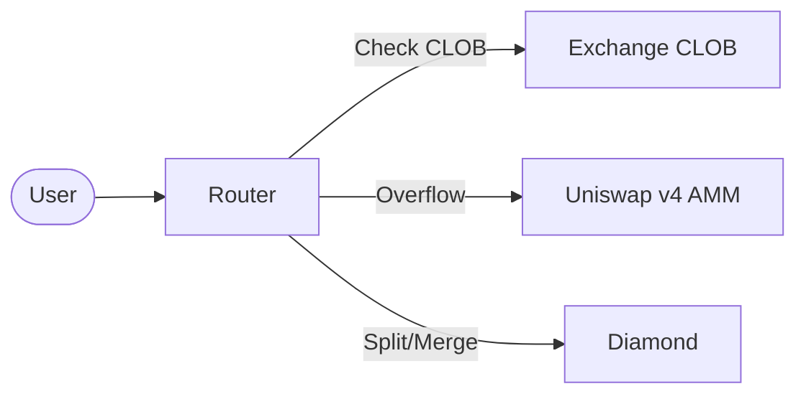

# Trading Overview

PrediX offers two trading venues unified by a single Smart Router.

## Two Venues

| Venue | Type | Best For |
|-------|------|----------|
| **Exchange (CLOB)** | On-chain limit order book | Precise price, larger orders |
| **Hook (AMM)** | Uniswap v4 concentrated liquidity | Instant execution, passive LP |

## Smart Router

The Router is the primary entry point for all trades. It checks the CLOB first for matching limit orders, then routes any remaining amount to the AMM.

## Market Orders vs Limit Orders

| | Market Orders | Limit Orders |
|---|---|---|
| **Via** | Router | Exchange |
| **Execution** | Immediate, best available price | Only at your specified price |
| **Functions** | `buyYes`, `sellYes`, `buyNo`, `sellNo` | `placeOrder`, `cancelOrder` |
| **Slippage** | Protected via `minOut` | None (exact price) |

## Virtual NO Pricing

Only the YES token has a direct AMM pool (YES/USDC). The NO token is priced **virtually**:

- **Buy NO** = Split USDC → YES + NO, sell YES on AMM, keep NO
- **Sell NO** = Buy YES on AMM, merge YES + NO → USDC

From the user's perspective, this is seamless — the Router handles it atomically via Uniswap v4 flash accounting. Price relationship: **NO ≈ 1 − YES**, enforced by arbitrage.

## Next Steps

- [Market Orders](market-orders.md) — Router functions and code
- [Limit Orders](limit-orders.md) — CLOB functions and code
- [Smart Routing](smart-routing.md) — how the Router splits orders
