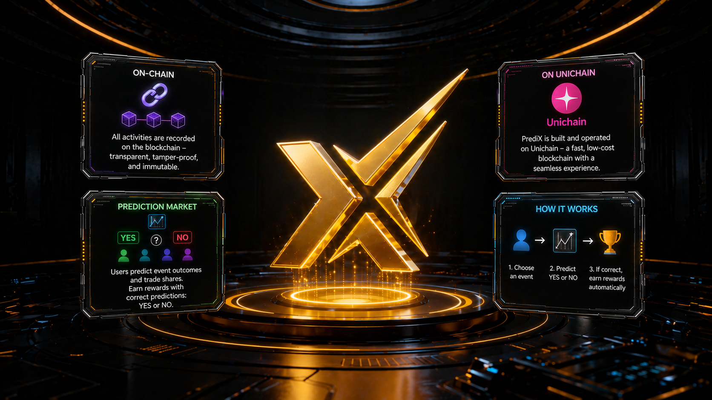

# PREDIX 101 — QUICK START


**PrediX is the On-chain Prediction Market on** [**Unichain**](https://www.unichain.org/)**. Each event creates two outcome tokens `YES / NO` and the correct token redeems 1:1 USDC when the market resolves.**


### Protocol Overview

> 🟡 **Status —** see on [**Network info**](users-guide/getting-started.md#network-info)**.**
>
> * Beta on **Unichain Sepolia testnet** (chain `1301`).&#x20;
> * Mainnet launches after **external audit** (chain `130`).

**Example**: Market _"Bitcoin above $100k before 2027?"_ creates YES + NO tokens. Users buy the side they believe will win.

| When Market Resolves     | YES holder                 | NO holder                  |
| ------------------------ | -------------------------- | -------------------------- |
| Event **happens**        | Receives `$1 USDC / token` | `$0` (total loss)          |
| Event **doesn't happen** | `$0` (total loss)          | Receives `$1 USDC / token` |

***

### Quick Links


Quick access to protocol documentation, developer resources, infrastructure architecture, and ecosystem channels across the PrediX network.


<a href="fundamentals/overview.md" class="button primary" data-icon="layer-plus">FUNDAMENTALS</a>

> <mark style="color:$success;">Understand the thesis, architecture, and market positioning.</mark>


[overview.md](fundamentals/overview.md)



[core-innovations.md](fundamentals/core-innovations.md)


***

#### <a href="users-guide/getting-started.md" class="button primary" data-icon="chart-column">START TRADING</a>

> <mark style="color:$success;">Trade predictive markets on Unichain.</mark>


[connect-wallet.md](users-guide/wallet-setup/connect-wallet.md)



[bridge-to-unichain.md](users-guide/wallet-setup/bridge-to-unichain.md)



[market-order.md](users-guide/yes-no-markets/market-order.md)


***

<a href="core-concepts/overview.md" class="button primary" data-icon="square-half-stroke">CORE CONCEPTS</a>

> <mark style="color:$success;">Learn how PrediX markets function.</mark>


[prediction-market.md](core-concepts/prediction-market.md)



[outcome-tokens.md](core-concepts/outcome-tokens.md)



[clob-amm-hybrid.md](core-concepts/clob-amm-hybrid.md)



[resolution.md](core-concepts/resolution.md)


***

<a href="users-guide/liquidity-and-market/" class="button primary" data-icon="chart-column">LIQUIDITY &#x26; MARKET</a>

> <mark style="color:$success;">Provide liquidity or create markets.</mark>


[provide-liquidity.md](users-guide/liquidity-and-market/provide-liquidity.md)



[create-market.md](users-guide/liquidity-and-market/create-market.md)


***

<a href="economics/README.md" class="button primary" data-icon="coin-blank">ECONOMY</a>

> <mark style="color:$success;">Explore staking, governance, and incentives.</mark>


[prx-economy](economics/prx-economy/)



[veprx-gauge.md](economics/veprx-gauge.md)



[incentive-and-community](economics/incentive-and-community/)


***

<a href="developers-guide/introduction.md" class="button primary" data-icon="code">FOR DEVELOPERS</a>

> <mark style="color:$success;">Build on PrediX infrastructure.</mark>


[api-reference.md](developers-guide/api-reference.md)



[architecture.md](developers-guide/architecture.md)



[security.md](developers-guide/security.md)


***

<a href="resources/glossary.md" class="button primary" data-icon="arrow-up-right-from-square">RESOURCES</a>

> <mark style="color:$success;">Additional protocol resources.</mark>


[glossary.md](resources/glossary.md)



[links.md](resources/links.md)



[faq.md](resources/faq.md)

