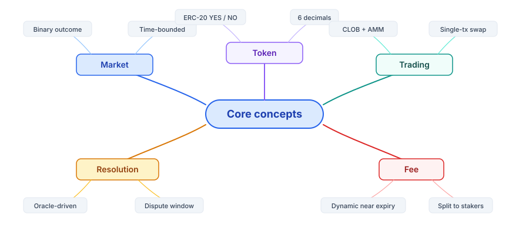

# Overview

Understand how PrediX works. Read in order if you're new, or jump to the section you need.

## Read in Order

* [Prediction market](prediction-market.md) — Price = probability
* [Outcome tokens](outcome-tokens.md) — YES/NO, split/merge, $1 invariant
* [CLOB + AMM hybrid](clob-amm-hybrid.md) — On-chain order book + Uniswap v4 pool
* [Resolution & oracle](resolution.md) — Who decides the outcome

Need step-by-step tutorials (where to click, what to enter) → [Guides](../guides/).

Need technical details (smart contracts, events, storage) → [Developers](../developers/).
