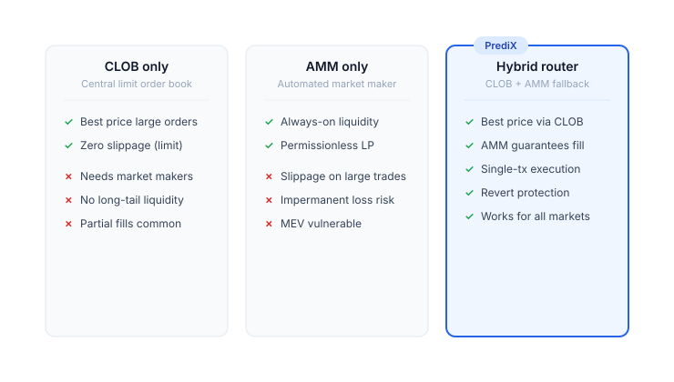
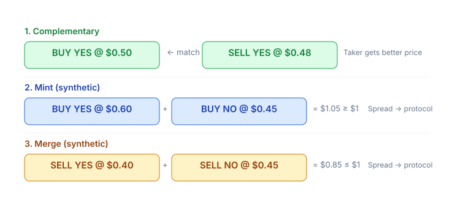
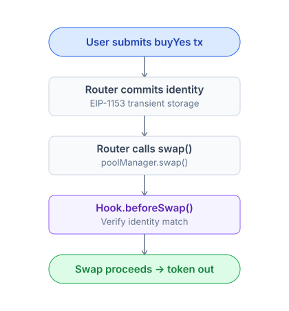

# CLOB + AMM hybrid

PrediX combines 2 liquidity mechanisms: an on-chain order book (CLOB) + Uniswap v4 pool (AMM). The Router automatically selects the best path within the same transaction.

## Why Hybrid

|                 | CLOB only (Polymarket)             | AMM only (Uniswap)           | **Hybrid (PrediX)**                                   |
| --------------- | ---------------------------------- | ---------------------------- | ----------------------------------------------------- |
| Small trades    | OK but wide slippage if few makers | Smooth, low slippage         | Smooth + price improvement when makers are present    |
| Large trades    | Depends on maker depth             | Slippage increases with size | Drain CLOB first, AMM for the remainder               |
| Maker incentive | Limit order (no fee)               | Only LPs earn fees           | **Both** — makers place orders, LPs provide liquidity |
| Fair pricing    | Makers set their own               | AMM curve                    | AMM = floor, CLOB = price improvement                 |
| MEV protection  | Order book harder to frontrun      | Pool vulnerable to sandwich  | Hook anti-sandwich + identity commit                  |

## Router — Single Entry Point

The Router is **stateless** — the invariant `balanceOf(router) == 0` is enforced on-chain after every public call. No custody, no stuck funds.

## CLOB — On-Chain Order Book

Contract: `PrediXExchange`.

* **Tick size**: 99 price levels at $0.01, $0.02, ..., $0.99. Stored on compressed bitmaps.
* **Limit order**: User selects side (BUY\_YES / SELL\_YES / BUY\_NO / SELL\_NO), price, and amount. Token or USDC deposit is locked until filled or cancelled.
* **Makers** place limit orders and wait for fills. **Takers** execute against them as market orders.

### 3 Match Types

* **Complementary**: BUY\_YES ↔ SELL\_YES in the same market. Most common.
* **Mint** (synthetic): BUY\_YES + BUY\_NO ≥ $1. Diamond mints a pair, delivers YES to the YES buyer and NO to the NO buyer. Spread → protocol.
* **Merge** (synthetic): SELL\_YES + SELL\_NO ≤ $1. Diamond burns a pair, returns USDC to both sellers. Spread → protocol.

All 3 satisfy: **no one is disadvantaged** — each side accepts their own price.

## AMM — Uniswap v4 Pool

Each market has 1-2 v4 pools: YES-USDC and optionally NO-USDC.

**PrediX Hook** plugs into v4:

| Callback                | Function                                                                                                      |
| ----------------------- | ------------------------------------------------------------------------------------------------------------- |
| `beforeSwap`            | Verify anti-sandwich identity (Router must commit identity first, Hook checks via transient storage EIP-1153) |
| `beforeAddLiquidity`    | Block adding LP if market is resolved / refunded                                                              |
| `beforeRemoveLiquidity` | Track pool registration                                                                                       |
| `beforeDonate`          | Block donations after endTime (prevent brute-force payout attacks)                                            |

The Hook **does not hold user funds long-term**. LPs receive LP tokens per the v4 PositionManager standard. LP flow details: [Provide liquidity](../users-guide/liquidity-and-market/provide-liquidity.md).

## When Does the Router Prefer CLOB Over AMM

The Router **always** checks CLOB first:

1. If CLOB has orders at a better price than AMM spot → fills CLOB.
2. Partially fills CLOB, routes the remainder to AMM if CLOB depth is insufficient.
3. If CLOB reverts (insufficient token match, price deviation) → Router skips, emits `ClobSkipped(reason)` event, falls back entirely to AMM.

Users don't need to worry — the Router always returns the best price within the same tx.

## Trading Directly on AMM

Possible. The YES-USDC pool is a standard v4 pool — you can swap via UniversalRouter, Uniswap web, or PoolManager directly.

**However**: bypassing CLOB liquidity → price may be worse. Always use `PrediXRouter` to take advantage of both.

## MEV Protection

PrediX Hook implements **identity commit** to prevent sandwich attacks:

MEV bots cannot frontrun + backrun your trade within the same block — the Hook reverts if identity doesn't match.
