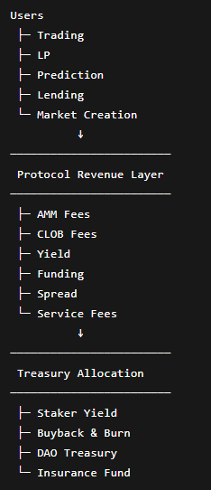

# Economic Architecture

### Core Value Accrual

PrediX is designed with a multi-layered revenue architecture that combines trading fees, liquidity monetization, yield optimization, and financial infrastructure services.

All on-chain revenue generated by the ecosystem is routed back into the PRX value accrual system, reinforcing long-term alignment between protocol growth, liquidity depth, and token utility.

The protocol economy is structured around three core objectives:

* [x] Sustainable protocol revenue generation
* [x] Deep liquidity and market efficiency
* [x] Direct value capture for PRX holders and stakers

***

### Revenue Architecture

#### <mark style="color:$warning;">**1. AMM Swap Fee**</mark>

Dynamic swap fees are applied to trades executed through the Uniswap v4 AMM infrastructure.

| Time to Expiry | Dynamic Fee |
| -------------- | ----------- |
| 7+ days        | 0.5%        |
| 3–7 days       | 1%          |
| 1–3 days       | 2%          |
| Under 24 hours | 5%          |

**Design Objectives**

* Protect LPs against volatility spikes
* Reduce toxic flow near settlement
* Compensate LPs for late-stage information asymmetry
* Preserve long-term liquidity sustainability

This mechanism improves LP profitability while stabilizing liquidity during high-risk settlement periods.

#### <mark style="color:$warning;">**2. CLOB Taker Fee**</mark>

The protocol charges taker fees on trades executed through the Central Limit Order Book (CLOB).

<mark style="color:$warning;">**Fee Formula:**</mark><mark style="color:$warning;">**&#x20;**</mark><mark style="color:$warning;">**`Fee=C×r×p(1−p)\mathrm{Fee}=C \times r \times p(1-p)Fee=C×r×p(1−p)`**</mark>

> **Where:**
>
> * CCC = position size
> * rrr = market fee rate
> * ppp = implied probability price
>
> \
> **\***_**Example:** Sports markets apply a standard fee rate of 2.0%._

The pricing structure naturally reduces fees near probability extremes (0 or 1) while maximizing efficiency around highly contested markets.

#### <mark style="color:$warning;">**3. Spread Revenue**</mark>

PrediX operates a treasury-managed liquidity layer that captures spread revenue from market-making activities.

This model is conceptually similar to the liquidity framework pioneered by GMX through GLP.

**Revenue Sources**

* Bid-ask spread capture
* Inventory rebalancing
* Volatility-driven pricing inefficiencies

By internalizing part of the liquidity stack, the protocol creates an additional non-dilutive revenue stream.

#### <mark style="color:$warning;">**4. Collateral Yield**</mark>

Idle collateral assets such as USDC are deployed into low-risk lending strategies to improve capital efficiency.

> **Example Integrations**
>
> * Aave
>
> \
> **Target Yield Range**
>
> * 3% – 5% APY

This yield becomes part of the protocol’s recurring treasury income while maintaining high liquidity availability.

#### <mark style="color:$warning;">**5. Market Creation Fee**</mark>

Users creating new prediction markets pay a deployment fee.

<mark style="background-color:yellow;">**Base Fee: 10 – 50 USDC**</mark>

→ Starting from Phase 2, market creators **must additionally bond PRX tokens**. 

**PRX Bonding Objectives**

* Sybil resistance
* Market quality incentives
* Long-term token utility

#### <mark style="color:$warning;">**6. Perpetual Prediction Markets**</mark>

The protocol supports no-expiry prediction markets with perpetual trading mechanics.

**Revenue Sources**

* [x] Funding rate payments
* [x] Perpetual position rebalancing fees 

This creates continuous fee generation independent of fixed settlement cycles.

#### <mark style="color:$warning;">**7. Liquidity Manager**</mark>

PrediX monetizes advanced liquidity infrastructure through a dedicated Liquidity Manager layer.



* Percentage share of LP fees
* Premium analytics tools



* P\&L dashboard
* Liquidity heatmaps
* LP performance analytics



This layer primarily targets professional traders, LPs, and market makers.

#### <mark style="color:$warning;">**8. BNPL (Buy Now Pay Later)**</mark>

The protocol enables leveraged participation through installment-based market access.

> **Revenue Sources**
>
> * Installment fees
> * Interest spread income

> **Mechanism**
>
> * Installment fees
> * Interest spread income

This model expands accessibility while maintaining protocol solvency.

#### <mark style="color:$warning;">**9. Crowdfunded Market Creation**</mark>

Communities can collectively fund the creation of new markets.

Once funding targets are reached:

* [x] Markets are automatically deployed
* [x] The protocol charges a launch fee
* [x] A percentage of LP revenue is retained throughout the market lifecycle

\
This creates scalable permissionless market expansion.

#### <mark style="color:$warning;">**10. Group Buying**</mark>

Users can participate in coordinated group positioning.

> **Benefits**
>
> * Users receive execution discounts of 2% – 5%
> * The protocol still charges fees based on aggregate gross volume

This structure improves user acquisition while preserving positive net margins.

#### <mark style="color:$warning;">**11. Lossless Lottery**</mark>

PrediX offers yield-powered lottery mechanisms where principal remains protected.

> **Revenue Sources**
>
> * Management fees on generated yield
> * Yield spread before jackpot distribution

This model combines gamification with capital preservation.

***

### Fee & Revenue Routing

All protocol revenue generated on-chain is systematically routed back into the PRX ecosystem.

#### <mark style="color:$warning;">**1. Staker Yield**</mark>

A portion of protocol revenue is distributed in USDC to users who stake PRX tokens.

**Objectives**

* Reward long-term participation
* Reduce circulating supply
* Strengthen token retention

#### <mark style="color:$warning;">**2. Buyback & Burn**</mark>

Part of treasury revenue is used to repurchase PRX tokens from the open market and permanently burn them.

**Objectives**

* Create deflationary pressure
* Align protocol growth with token scarcity
* Improve long-term value capture

#### <mark style="color:$warning;">**3. Treasury & Insurance Fund**</mark>

Revenue allocation also supports the DAO Treasury and Insurance Fund.



Used for:

* Ecosystem growth
* Grants
* Operations
* Strategic expansion



Used to:

* Cover unexpected protocol risks
* Reduce insolvency events
* Improve user confidence during extreme volatility



***

### Long-Term Economic Vision

PrediX is designed to evolve beyond a traditional prediction market into a full-stack on-chain financial coordination layer.

**By combining:**

* [x] Trading infrastructure
* [x] Liquidity monetization
* [x] Yield generation
* [x] Market creation primitives
* [x] Treasury-owned liquidity


The ecosystem creates sustainable protocol revenue while continuously reinforcing the value of PRX through direct economic alignment.

