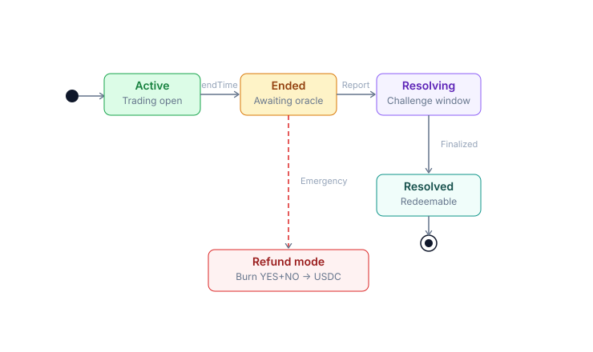
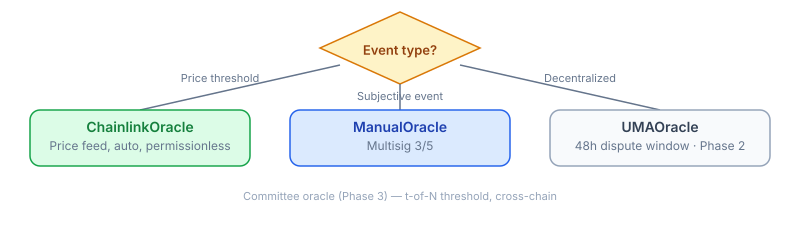

# Resolution & Oracle

### Market Lifecycle

<table><thead><tr><th width="374">Stage</th><th>Description</th></tr></thead><tbody><tr><td><strong>Created</strong></td><td>Creator (with <code>CREATOR_ROLE</code>) creates a market, sets <code>endTime</code> + selects oracle</td></tr><tr><td><strong>Trading</strong></td><td>Users split / merge / trade until <code>endTime</code></td></tr><tr><td><strong>EndTime</strong></td><td>Trading closes (hook blocks add liquidity + swap). Oracle window opens</td></tr><tr><td><strong>Resolved</strong></td><td>Oracle calls <code>resolveMarket()</code> with the outcome</td></tr><tr><td><strong>Redemption</strong></td><td>Users holding the winning token → redeem for USDC</td></tr><tr><td><strong>RefundMode</strong></td><td>Fallback if oracle cannot resolve (oracle down, dispute hung)</td></tr><tr><td><strong>Refunded</strong></td><td>Users burn YES+NO pairs → receive USDC pro-rata</td></tr></tbody></table>

***

### 4 Oracle Types

#### <mark style="color:$warning;">1. ChainlinkOracle — Automatic, permissionless.</mark>

PrediX uses ChainlinkOracle when Price-threshold markets (BTC, ETH, asset prices, FX rates).

#### <mark style="color:$warning;">2. ManualOracle</mark>

PrediX uses ChainlinkOracle with Subjective events (sports, elections, debate outcomes).

Multisig 2/3 reads the result from an off-chain source and signs the transaction.

* Source: Reuters, AP, official APIs, on-chain data, video streaming.
* Outcome is **immutable** once set (invariant INV-6).
* Audit trail: `OracleReportCreated` event on-chain.


**Risk mitigation**:

* [x] HSM signer + role separation
* [x] Public audit trail per signature
* [x] Refund mode escape hatch if an error is discovered after the fact


#### <mark style="color:$warning;">3. UMAOracle (Phase 2 — TBA)</mark>

PrediX uses UMAOracle with Events requiring decentralized resolution without multisig dependency (Permissionless propose + 48h dispute window).

**Bond sizing**: `max(min_bond, min(market_tvl x 0.5%, max_bond))`. Range $500 - $50,000 USDC.

#### <mark style="color:$warning;">4. Committee Oracle (Phase 3 — TBA)</mark>

PrediX uses Committee Oracle with Cross-chain governance outcomes, complex composite events.

* [x] t-of-N threshold signature (e.g., 5-of-9 validators).
* [x] Commit-reveal voting prevents front-running.
* [x] PRX slashing if a vote contradicts the final consensus.
* [x] Cross-chain via Wormhole / LayerZero.

***

### Oracles Comparison

|                   | Manual                | Chainlink                  | UMA                           | Committee                 |
| ----------------- | --------------------- | -------------------------- | ----------------------------- | ------------------------- |
| Who resolves      | Multisig 2/3          | Anyone                     | Anyone proposes, DVM disputes | t-of-N validators         |
| Subjective events | ✅                     | ❌                          | ✅                             | ✅                         |
| Dispute           | Off-chain social      | None (data is law)         | On-chain 48h                  | On-chain commit-reveal    |
| Latency           | Instant after signing | After 1 round (\~30s-1min) | 48h default                   | After commit-reveal cycle |
| Decentralization  | Low                   | Medium                     | High                          | High                      |

***

### Refund Mode — Last Resort

When no oracle can resolve → admin enables refund mode via 48h timelock → users burn YES+NO pairs → receive USDC pro-rata.


**Flow details:** [**Oracle — Refund mode**](/broken/pages/ChJv6jHOoCscxuz8XAzC#refund-mode--last-resort) **·** [**Redeem & refund**](../users-guide/redeem-refund.md)**.**


***

### Incorrect Resolution — What to Do

| Phase                | Mechanism                                                                                           |
| -------------------- | --------------------------------------------------------------------------------------------------- |
| **Phase 1** (Manual) | Multisig discussion, social consensus. If majority agrees resolution was wrong → enable refund mode |
| **Phase 2** (UMA)    | Dispute via UMA protocol, DVM vote                                                                  |
| **All phases**       | `isResolved=true` is never reverted (INV-6 hard invariant)                                          |

***

### Who Can Create Markets

* **Phase 1**: Addresses with `CREATOR_ROLE` (admin + whitelisted creators).
* **Phase 3 (TBA)**: Permissionless — anyone can create a market by staking a **PRX bond** (10k PRX proposed). Bond is slashed if the market is malformed or resolution is disputed.


**Details:** [**Create a market**](../users-guide/liquidity-and-market/create-market.md)**.**


***

### Resolve Timing

* **Resolve window**: 7 days after endTime. If delayed → may trigger default refund mode.
* **Redemption**: No hard deadline, 365-day grace period, after which admin may call `sweepUnclaimed` to transfer to treasury.
* **UMA dispute**: 48h after proposal.

Time parameters are configurable per-market or globally.


**See more:** [**Architecture & Contracts**](/broken/pages/ERPtu7loCex6MXMc5YjQ)**.**

