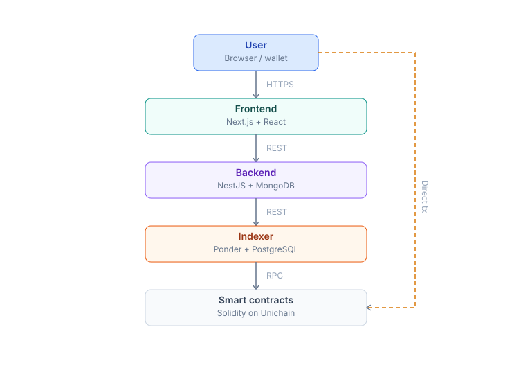
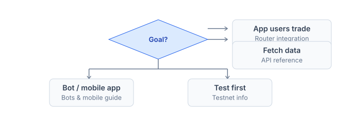

# Quickstart

Integrate PrediX into your app, bot, or data pipeline — and understand the protocol architecture underneath.

## 4-layer stack



Data flows **one way**: SC emits events -> Indexer syncs -> BE serializes -> FE renders. BE never writes back to the Indexer or SC. Users sign transactions directly with smart contracts via their wallet — never through BE.

## Design principles

1. **Non-custodial** — users always hold their private keys. The protocol never holds funds intermediately.
2. **Router stateless** — `balanceOf(router) == 0` enforced on-chain after every call.
3. **Composable ERC-20** — outcome tokens are standard ERC-20, pluggable into the broader DeFi stack.
4. **Separation of concerns** — each layer handles its own responsibility, no cross-boundary imports.
5. **Fail-loud** — no silent fallbacks. Invariant violated -> revert / throw.
6. **Upgrade via 48h timelock** — no emergency bypass.

## 4 technical pillars


## Integration paths



| I want to...                                       | Go to                                       |
| -------------------------------------------------- | ------------------------------------------- |
| Let my app users trade PrediX markets              | [Router integration](router-integration.md) |
| Fetch market / portfolio / candles / events        | [API reference](api-reference.md)           |
| Build a trading bot, mobile app, or custom web app | [Bots & mobile](bots-mobile.md)             |
| Test integration before mainnet                    | [Testnet info](testnet.md)                  |
| Understand smart contract architecture             | [Architecture & contracts](architecture.md) |
| Learn how market resolution works                  | [Oracle](oracle.md)                         |
| Review security model & invariants                 | [Security & timelock](security.md)          |

## Quickstart — first call

```typescript
import { createPublicClient, http } from 'viem';
import { unichainSepolia } from 'viem/chains';  // current testnet
// import { unichain } from 'viem/chains';      // mainnet after launch

const client = createPublicClient({
  chain: unichainSepolia,
  transport: http('https://sepolia.unichain.org'),
});

// Fetch market list from testnet Indexer (gated — see Testnet info for endpoint)
const TESTNET_INDEXER = 'https://indexer.testnet.predix.app';  // example, real URL via Discord
const res = await fetch(`${TESTNET_INDEXER}/api/markets?limit=10`);
const { data: markets } = await res.json();

console.log(markets.map(m => `${m.question} — YES @ ${m.yesPrice}`));
```

Step-by-step: [Router integration](router-integration.md). Get testnet endpoint: [Testnet info](testnet.md).

## Stack overview

| Layer           | Stack                                     | Language                       |
| --------------- | ----------------------------------------- | ------------------------------ |
| Smart contracts | Foundry + Solidity 0.8.34                 | Solidity                       |
| Indexer         | Ponder + PostgreSQL + Hono                | TypeScript                     |
| Backend         | NestJS + Fastify + MongoDB + zod          | TypeScript                     |
| Frontend        | Next.js + React + Tailwind + viem + wagmi | TypeScript                     |
| Paymaster       | ERC-4337 v0.7 + Pimlico bundler           | Solidity + TS off-chain signer |

## API environments

| Env                | Indexer                                | Backend                                |
| ------------------ | -------------------------------------- | -------------------------------------- |
| **Testnet** (live) | Gated — see [Testnet info](testnet.md) | Gated — see [Testnet info](testnet.md) |
| **Mainnet** (TBA)  | `https://indexer.predix.app`           | `https://api.predix.app`               |

> Testnet endpoints are currently gated via Discord #testnet-access (to prevent abuse). Mainnet endpoints will be public at launch.

## Chain info

|                | Testnet (live now)                                 | Mainnet (TBA)                      |
| -------------- | -------------------------------------------------- | ---------------------------------- |
| **Network**    | Unichain Sepolia                                   | Unichain                           |
| **Chain ID**   | `1301`                                             | `130`                              |
| **RPC public** | `https://sepolia.unichain.org`                     | `https://mainnet.unichain.org`     |
| **Explorer**   | [sepolia.uniscan.xyz](https://sepolia.uniscan.xyz) | [uniscan.xyz](https://uniscan.xyz) |
| **Status**     | Beta live                                          | TBA — after audit                  |

## Rate limits

| Tier       | Public        | Authenticated    | Notes              |
| ---------- | ------------- | ---------------- | ------------------ |
| Free       | 60 req/min/IP | 300 req/min/user | Default            |
| Pro        | 600 req/min   | 3000 req/min     | $20/month, API key |
| Enterprise | Custom        | Custom           | Contact            |

WebSocket: 10 conn/IP, unlimited messages.

## SDK (TBA)

Official SDK roadmap:

```bash
npm install @predix/sdk        # TypeScript / JavaScript (TBA)
pip install predix-sdk         # Python (TBA)
```

Pre-launch: use the REST API + viem directly.

## Recommended reading order

1. [Architecture & contracts](architecture.md) — packages, Diamond + facets, Hook, Exchange, Router, Paymaster, deployed addresses
2. [Oracle](oracle.md) — Manual, Chainlink, UMA, Committee
3. [Security & timelock](security.md) — invariants, audit posture, 48h delay, incident response
4. [Router integration](router-integration.md) — ABI, quote, swap, Permit2, error handling
5. [API reference](api-reference.md) — Indexer + Backend endpoints, SIWE auth, WebSocket
6. [Bots & mobile](bots-mobile.md) — API key, trading bot, mobile native, wagmi
7. [Testnet info](testnet.md) — network, faucet, contract addresses, dev flow

## Support

* **Smart contract security bug**: [security@predix.app](mailto:security@predix.app), bug bounty active.
* **API questions**: Discord #dev-support.
* **Feature requests**: GitHub issue [predix-protocol](https://github.com/predix-protocol).
* **Enterprise**: [business@predix.app](mailto:business@predix.app).

## Licensing

| Component       | License                         | Note                                    |
| --------------- | ------------------------------- | --------------------------------------- |
| Smart contracts | BUSL-1.1 -> GPLv3 after 2 years | Business Source License, non-commercial |
| Indexer         | MIT                             | Open source                             |
| Backend         | MIT                             | Open source                             |
| Frontend        | MIT                             | Open source                             |
| SDK             | MIT                             | Open source                             |
