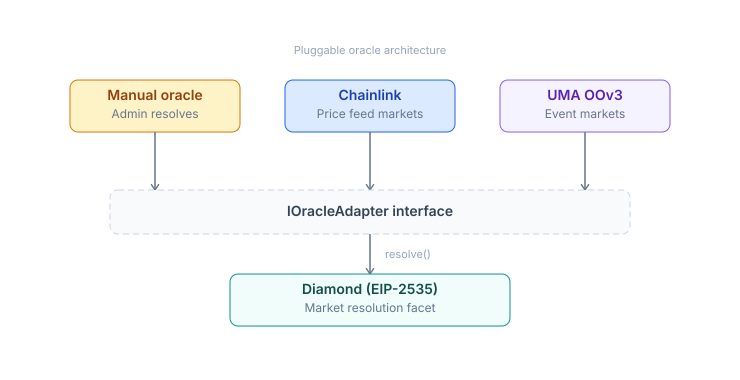
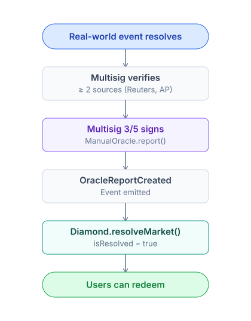
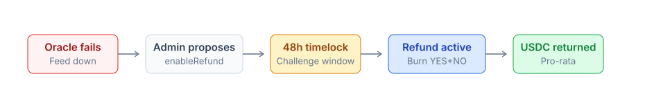

# Oracle

The oracle is the layer that reports real-world event outcomes on-chain. PrediX uses a pluggable architecture — multiple oracle types coexist.

## The core problem

Smart contracts cannot autonomously determine:

* "Has Argentina won the FIFA World Cup?"
* "Has BTC crossed $100k?"
* "Who won the 2028 US election?"

An **external source** must deliver data on-chain. If the oracle is wrong, the market resolves incorrectly and users lose funds.

## 4 phases, 4 oracle types



## ChainlinkOracle

Automated, permissionless.


**Use case**: Price-threshold markets (BTC, ETH, asset prices, FX rates).

**Strict checks**:

* Round adjacency — ensures the correct round at-snapshot is used, not stale, not skipped.
* L2 sequencer uptime — does not resolve during the grace period after an outage (avoids bad data).
* Feed staleness threshold — rejects if the round is too old relative to realtime.

## ManualOracle

Multisig 2/3 reads the outcome from an off-chain source and signs the transaction.

### Acceptable sources

| Event type   | Acceptable source                            |
| ------------ | -------------------------------------------- |
| Sports       | Official league API, Reuters, AP             |
| Election     | Official election commission, AP, Reuters    |
| Crypto event | On-chain data, official project announcement |
| Weather      | NOAA, regional met office                    |
| Award show   | Official website                             |

### Flow



### Risk mitigation

Multisig members are geographically distributed, and each signature has an on-chain audit trail. Refund mode serves as an escape hatch if the oracle is compromised. Long-term: phase out manual in favor of UMA + committee oracle.

### Revoke case

Admin can `revoke(marketId)` to clear a pending report when:

* A report was set incorrectly due to a bug.
* A dispute requires re-examination.

**Warning**: revoke **does not revert** `isResolved`. It only clears a pending report **before** resolution. After resolution, revoke is not possible (immutable invariant INV-6).

## UMAOracle (Phase 2 — TBA)

Permissionless propose + 48h dispute window.


### Bond sizing

```
bond = max(min_bond, min(market_tvl × 0.5%, max_bond))
min_bond = $500 USDC
max_bond = $50,000 USDC
```

Bond scales with market size -> disincentivizes spam, aligns incentives.

### Use case

Events requiring decentralized resolution without reliance on a multisig.

## Committee oracle (Phase 3 — TBA)

* **t-of-N threshold signature** (e.g. 5-of-9 validators).
* **Commit-reveal voting** prevents front-running.
* **Slashing** of PRX for validators who vote against the final consensus.
* **Stake PRX** to serve as a validator.
* **Cross-chain** support via Wormhole / LayerZero.

### Use case

Cross-chain governance outcomes, complex composite events.

## Oracle type comparison

|                   | Manual                  | Chainlink          | UMA                           | Committee                 |
| ----------------- | ----------------------- | ------------------ | ----------------------------- | ------------------------- |
| Who resolves      | Multisig 2/3            | Anyone             | Anyone proposes, DVM disputes | t-of-N validators         |
| Subjective events | Yes                     | No                 | Yes                           | Yes                       |
| Dispute mechanism | Off-chain social        | None (data is law) | On-chain 48h                  | On-chain commit-reveal    |
| Latency           | Immediate after signing | \~30s (1 round)    | 48h default                   | After commit-reveal cycle |
| Decentralization  | Low                     | Medium             | High                          | High                      |
| Bond required     | No                      | No                 | Yes                           | Validator stake           |

## Refund mode — last resort

When no oracle can resolve the market:



Details: [Redeem & refund](../users-guide/first-trade/redeem-refund.md).

## Incorrect resolution — handling flow

| Phase              | Mechanism                                                                          |
| ------------------ | ---------------------------------------------------------------------------------- |
| **Phase 1 Manual** | Multisig discussion, social consensus -> enable refund mode if confirmed incorrect |
| **Phase 2 UMA**    | Dispute via UMA, DVM is final                                                      |
| **All phases**     | `isResolved=true` is never reverted (INV-6 hard invariant)                         |

## Oracle approval list

Diamond maintains a set of approved oracles:

* `approveOracle(addr)` — admin adds a new adapter (instant).
* `revokeOracle(addr)` — admin removes (instant) — only prevents use for **new** markets.
* Markets already created with that oracle **continue to use it** — avoids retroactive breakage.

## Oracle selection per market

| Event type                     | Recommendation                                 |
| ------------------------------ | ---------------------------------------------- |
| Price threshold (BTC > $100k)  | ChainlinkOracle                                |
| Sports / election              | ManualOracle (Phase 1) -> UMAOracle (Phase 2+) |
| On-chain event (gov vote, TVL) | Custom adapter via Diamond approve             |
| Subjective (debate winner)     | UMAOracle                                      |
| Complex composite              | Custom adapter or manual + committee           |

Market creation details: [Create market](../users-guide/liquidity-and-market/create-market.md).
