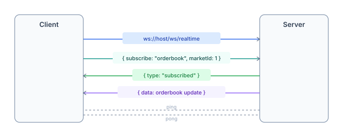

# WebSocket

Real-time streaming for orderbook updates, price changes, trades, and user portfolio events.



## Connection

```
Endpoint: wss://<host>/ws/realtime
Auth (optional): wss://<host>/ws/realtime?token=<session_token>
```

Authenticated connection required for user-specific topics (positions, orders, portfolio).

## Subscribe / Unsubscribe

```json
// Subscribe to market orderbook
{ "type": "subscribe", "topic": "orderbook", "marketId": "1" }

// Subscribe to user positions (requires auth)
{ "type": "subscribe", "topic": "user-positions", "subject": "0xYourAddress" }

// Unsubscribe
{ "type": "unsubscribe", "topic": "orderbook", "marketId": "1" }
```

## Topics

### Market topics (public)

Require `marketId` parameter.

| Topic | Data | Description |
|---|---|---|
| `orderbook` | Bid/ask levels | Real-time orderbook depth updates |
| `prices` | Latest YES/NO price | Price tick on every trade |
| `trades` | Trade events | New trades as they happen |

### User topics (authenticated)

Require `subject` = user wallet address. Must match authenticated session.

| Topic | Data | Description |
|---|---|---|
| `user-trades` | User's trades | When your orders fill |
| `user-orders` | Order status | Place, fill, cancel events |
| `user-positions` | Position changes | Balance updates |
| `user-portfolio` | Portfolio value | Aggregate P&L updates |

## Message format

### Server → Client

```json
// Subscription confirmed
{ "type": "subscribed", "topic": "orderbook", "marketId": "1" }

// Full snapshot (initial state after subscribe)
{ "type": "snapshot", "topic": "orderbook", "marketId": "1", "seq": 1, "data": { ... } }

// Delta update (incremental changes)
{ "type": "delta", "topic": "orderbook", "marketId": "1", "seq": 2, "changes": [ ... ] }

// Ping (client must respond with pong within 10s)
{ "type": "ping" }

// Error
{ "type": "error", "code": "INVALID_TOPIC", "message": "Invalid topic" }
```

> **Note**: Data delivery is poller-based (1s interval), not event-driven push. The server polls the indexer, diffs snapshots, and broadcasts deltas.

### Client → Server

```json
{ "type": "pong" }
```

## Limits

| Limit | Value |
|---|---|
| Subscriptions per connection | 50 |
| Connections per IP | 20 |
| Global connections | 5,000 |

## Example — TypeScript

```typescript
const ws = new WebSocket('wss://api.predix.app/ws/realtime');

ws.onopen = () => {
  // Subscribe to market orderbook
  ws.send(JSON.stringify({
    type: 'subscribe',
    topic: 'orderbook',
    marketId: '1',
  }));

  // Subscribe to market trades
  ws.send(JSON.stringify({
    type: 'subscribe',
    topic: 'trades',
    marketId: '1',
  }));
};

ws.onmessage = (event) => {
  const msg = JSON.parse(event.data);

  if (msg.type === 'ping') {
    ws.send(JSON.stringify({ type: 'pong' }));
    return;
  }

  if (msg.type === 'snapshot') {
    console.log(`[${msg.topic}] full:`, msg.data);
  }
  if (msg.type === 'delta') {
    console.log(`[${msg.topic}] update:`, msg.changes);
  }
};
```

## Example — Python

```python
import asyncio
import json
import websockets

async def listen():
    uri = "wss://api.predix.app/ws/realtime"
    async with websockets.connect(uri) as ws:
        # Subscribe
        await ws.send(json.dumps({
            "type": "subscribe",
            "topic": "prices",
            "marketId": "1",
        }))

        async for message in ws:
            msg = json.loads(message)
            if msg["type"] == "ping":
                await ws.send(json.dumps({"type": "pong"}))
            elif msg["type"] == "snapshot":
                print(f"[{msg['topic']}] full:", msg["data"])
            elif msg["type"] == "delta":
                print(f"[{msg['topic']}] update:", msg["changes"])

asyncio.run(listen())
```

## Authentication for user topics

```typescript
// Get session token via SIWE
const challengeRes = await fetch('/api/v1/auth/challenge');
const { nonce } = await challengeRes.json();

const signature = await wallet.signMessage({ message: siweMessage(nonce) });

const verifyRes = await fetch('/api/v1/auth/verify', {
  method: 'POST',
  body: JSON.stringify({ address, signature }),
});
const { token } = await verifyRes.json();

// Connect with auth
const ws = new WebSocket(`wss://api.predix.app/ws/realtime?token=${token}`);
```
