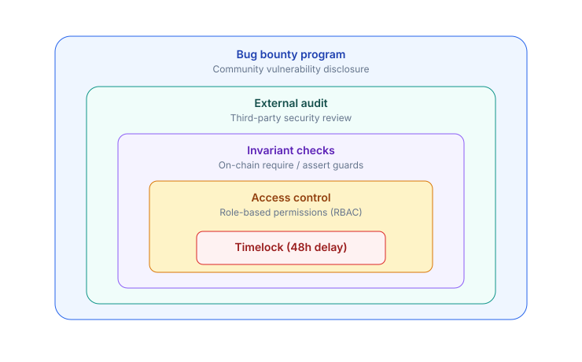
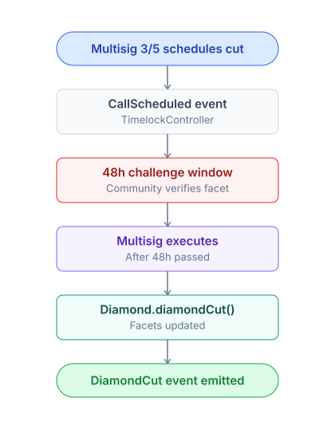
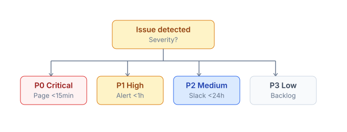

# Security & timelock

PrediX employs defense-in-depth. No "magic" — multiple layers, each doing one simple verifiable job.

## 5 defense layers



## 7 hard-enforced invariants

| # | Invariant | Description | Enforcement |
|---|---|---|---|
| INV-1 | Collateral solvency | `YES.totalSupply == NO.totalSupply == market.totalCollateral` | Diamond mint/burn atomic |
| INV-2 | Exchange solvency | `sum(order.depositLocked) == USDC.balanceOf(exchange) + sum(token.balanceOf(exchange))` | Exchange invariant test fuzz |
| INV-3 | Router non-custody | `balanceOf(router) == 0` after every public call | Router `FinalizeBalanceNonZero` revert |
| INV-4 | Redemption fee bound | Redemption fee capped on-chain | MarketFacet require |
| INV-5 | Hook identity commit | `beforeSwap` requires identity commit via EIP-1153 | Hook verifies transient storage |
| INV-6 | Resolution monotonicity | `isResolved` set once, never reverted | MarketFacet require |
| INV-7 | Outcome token supply | Only Diamond can mint/burn outcome tokens | OutcomeToken `onlyFactory` |

Invariant fuzz testing runs 10,000+ iterations in CI. Failure blocks merge.

## Audit posture

### External audits

External audit before mainnet launch — firm selection is underway. Reports will be published at [docs.predix.app/audits](https://docs.predix.app/audits) once completed.

### Internal review

Continuous internal review:

- Manual code review per PR.
- Static analysis (Slither, Mythril).
- Fuzz testing in CI.
- Differential testing vs reference implementation.

### Audit cadence

- **Pre-mainnet**: 2 full audit rounds from >= 2 different firms.
- **Major upgrade**: 1 audit round + intensive bug bounty.
- **Annual review**: Refresh audit every year.

## Timelock — 48h delay

All upgrades with blast radius go through a 48h timelock.

### Diamond facet upgrade



`CUT_EXECUTOR_ROLE` = **only the TimelockController contract**. No EOA can bypass.

### Hook proxy upgrade

Similar to Diamond but with its own contract (ERC1967 proxy):

```solidity
proposeUpgrade(newImpl) -> readyAt = now + timelockDuration
// timelockDuration >= 48h min, monotonic (can only increase)
// ...48h wait...
executeUpgrade(newImpl, sig, readyAt)
  require(readyAt <= now)
  _implementation = newImpl
```

### Why 48h

- Sufficient for community members across APAC + EU + US to see the announcement (every timezone has several waking hours to review).
- A 24h window is often missed due to timezone differences + weekends.
- Trade-off: emergency fixes are slower. Mitigated by: bug bounty + audit pre-deploy + insurance fund.

### Cannot be bypassed

- **No emergency upgrade path** for admins.
- **Need to rollback** -> deploy a new contract + migrate (user action).
- `timelockDuration` is monotonic -> cannot reduce from 48h to 1h to rush.

## Bug bounty

Range by severity:

| Severity | Reward (USDC) | Example |
|---|---|---|
| **Critical** | $50k - $500k | Drain funds, break INV-1 solvency |
| **High** | $10k - $50k | Bypass timelock, unauthorized state change |
| **Medium** | $1k - $10k | DoS, griefing |
| **Low** | $100 - $1k | Event mismatch, minor UI |

Payouts from treasury. Contact: [security@predix.app](mailto:security@predix.app).

### Safe harbor

Good-faith researchers have safe harbor — no legal action will be taken if:

- Disclosure is private before public.
- No funds drained beyond POC amount (< $1k).
- No user data stored or shared.
- 90-day responsible disclosure window is respected.

### Out of scope

- DoS that does not cause fund loss (UI lag, RPC overload).
- Theoretical attacks that are not reproducible.
- Issues already known + being fixed.
- Third-party dependencies (e.g. Chainlink downtime) — flag to the relevant party.

## Incident response

### Severity tiers



### P0 response flow

1. **Detect** — Prometheus alert / user report / bug bounty submission.
2. **Triage** — verify exploit within 30 min. Team Discord emergency channel.
3. **Contain** — Pause module (`PausableFacet.pause(MARKET)`) to stop the bleeding.
4. **Fix** — patch code, audit fix internally.
5. **Deploy** — timelock 48h (no bypass) OR instant config fix (oracle revoke).
6. **Postmortem** — public disclosure within 72h, blog post, root cause analysis.

## Monitoring stack

| Tool | Coverage |
|---|---|
| **Prometheus** | Latency, error rate, indexer lag, circuit breaker state |
| **Datadog** | Threshold alerting on revert rate, contract state anomaly |
| **Forta / Tenderly** | On-chain watcher: diamondCut scheduled, hook upgrade, oracle revoke, unusual volume spike |
| **Custom alerts** | Router balance != 0 (impossible but monitored), invariant violation |
| **Dune dashboard** | Public: TVL, volume, user count, pool depth per market |

## Non-negotiable rules

- **No** admin emergency withdraw from Exchange / Router / Pool.
- **No** pausable withdraw paths (users can always withdraw their own tokens).
- **No** user blacklisting at the protocol level. Geo-blocking is FE-level only, per compliance.
- **No** upgrading the tx path without timelock — all state-changing admin actions go through 48h.

## Insurance fund (Phase 2 — TBA)

Top-up from:
- Percentage of protocol revenue (TBA).
- Treasury budget.

Coverage:
- Partial reimbursement in the event of a contract exploit.
- Payout only via governance vote (vePRX supermajority).

Smart contract is immutable, locked vault.
