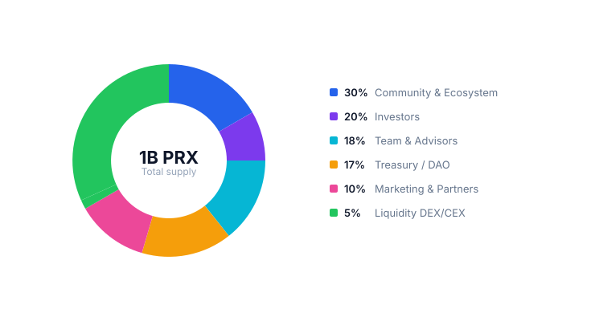

# PRX overview

PRX is the governance and revenue-sharing token of PrediX. Hard cap **1 billion**, no additional minting. ERC-20 on Unichain.

## Token utility

* **Stake** — receive a share of protocol fees in USDC (real yield, no emissions)
* **Lock vePRX** — vote on gauges, boost LP rewards 1.5-2.5x, protocol parameter governance
* **Market creation bond** — lock PRX to create permissionless markets (Phase 2)
* **Oracle dispute** — lock PRX to challenge an incorrect resolution
* **Collateral yield** — vePRX holders share yield from idle USDC in the protocol (Phase 2)
* **Perp Prediction margin** — PRX as margin for perpetual prediction markets (Phase 3)

## TGE — conditions-based

PrediX uses a conditions-based TGE (not time-based):

| Metric                | Threshold                         |
| --------------------- | --------------------------------- |
| Monthly volume        | >= $500K for 3 consecutive months |
| Weekly Active Traders | >= 1,000 for 3 months             |
| Active markets        | >= 10 for 3 months                |
| Smart contract audit  | 0 critical, 0 high                |

## Read more

### PRX Economy

| Topic                                       | Page                                          |
| ------------------------------------------- | --------------------------------------------- |
| Allocation, vesting, TGE circulating supply | [Allocation & vesting](allocation-vesting.md) |
| Staking USDC yield, lock boost              | [Staking](staking.md)                         |
| Lock -> vePRX -> vote -> gauge -> bribe     | [vePRX & gauge](veprx-gauge.md)               |
| Buyback-burn, treasury                      | [Buyback-burn](buyback-burn.md)               |

### Incentive & Community

| Topic                                   | Page                                  |
| --------------------------------------- | ------------------------------------- |
| 6-season Points, S0 testnet, 3-Wave TGE | [Points & seasons](points-seasons.md) |
| KOL & Ambassador program (12M PRX pool) | [KOL & Ambassador](kol-ambassador.md) |
| Badge, streak, daily challenge          | [Rewards](rewards.md)                 |
