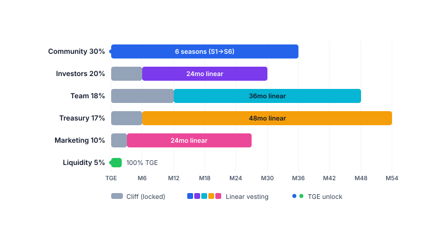

# Allocation & vesting

Total supply: **1,000,000,000 PRX** (1B). Hard cap, no additional minting after TGE.

## Allocation

| Bucket                     | %   | Tokens | TGE unlock | Cliff  | Linear vest         |
| -------------------------- | --- | ------ | ---------- | ------ | ------------------- |
| **Community & Ecosystem**  | 30% | 300M   | 10%        | —      | 6 seasons (3 years) |
| **Investors (All Rounds)** | 20% | 200M   | \~9%       | 3-6 mo | 15-24 mo            |
| **Team & Advisors**        | 18% | 180M   | 0%         | 12 mo  | 36 mo               |
| **Treasury / DAO**         | 17% | 170M   | 0%         | 6 mo   | 48 mo               |
| **Marketing & Partners**   | 10% | 100M   | 5%         | 3 mo   | 24 mo               |
| **Liquidity (DEX/CEX)**    | 5%  | 50M    | 100%       | —      | —                   |

## Circulating at TGE

\~**102.5M PRX (10.25%)** — low float design.

| Source                    | Tokens     |
| ------------------------- | ---------- |
| Community (10% of 300M)   | 30M        |
| Liquidity (100% of 50M)   | 50M        |
| Investors (\~9% weighted) | 17.5M      |
| Marketing (5% of 100M)    | 5M         |
| Team + Treasury (0%)      | 0          |
| **Total**                 | **102.5M** |

## Unlock schedule

## Community — 6-season emission

300M PRX distributed across 6 seasons over 3 years, declining \~30%/season:

| Season      | Pool | Timeline | Theme                                     |
| ----------- | ---- | -------- | ----------------------------------------- |
| S1 Genesis  | 86M  | M1-M6    | Mainnet launch - Points -> PRX at TGE     |
| S2 Growth   | 60M  | M7-M12   | Fee ON - TGE - staking rewards            |
| S3 Scale    | 43M  | M13-M18  | Multi-chain - market creation             |
| S4 Mature   | 30M  | M19-M24  | Perp Prediction - Institutional API - DAO |
| S5 Expand   | 21M  | Y3 H1    | Regional expansion                        |
| S6+ Reserve | 60M  | Y3+      | DAO-locked (emergency / partnership)      |

S1 is the largest because the cold-start phase is the hardest. Details: [Points & seasons](points-seasons.md).

## Team vesting

* **12-month cliff** — no tokens received during the first 12 months after TGE.
* **36-month linear** — vests per block after cliff.
* **No emergency unlock** — vesting contract on-chain, verifiable.
* Vest contract = OpenZeppelin `VestingWallet` clone, audited alongside the core protocol.
* Vest contract address is public — community can track unlocks in realtime.
