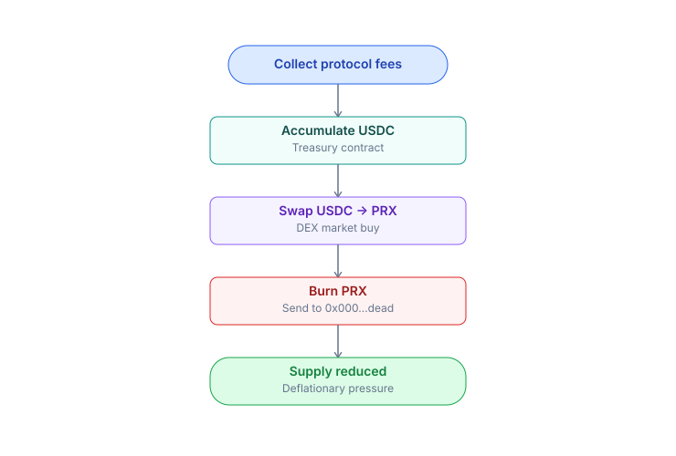

# Deflationary & Treasury

PrediX buys PRX from the open market using protocol fees and burns it permanently.

## Mechanism

Event `BuybackExecuted(usdcSpent, prxBurned)` is emitted on-chain. Burns are irreversible.

## Net deflationary

PRX becomes **net deflationary** when annual burns exceed annual emissions. Emissions approach zero after year 4 once vesting completes -> post-Y4 net deflationary if volume is sustained.

## Insurance fund

A portion of protocol revenue flows to the insurance treasury. Coverage: partial reimbursement in the event of a contract exploit. Payouts require a DAO vote only — no automatic disbursement.

## Treasury

The treasury fund serves 4 use cases:

| Use case             | Detail                                                      |
| -------------------- | ----------------------------------------------------------- |
| **Dev funding**      | Post-vest team compensation, contributor grants, hackathons |
| **Audit**            | External audit firms, >= 1 round/year                       |
| **LP subsidy**       | Gauge voting — pools receiving vePRX votes receive subsidy  |
| **Insurance top-up** | Replenish the insurance fund when needed                    |

Management:

* On-chain multisig 2/3 (Gnosis Safe)
* Spend > $10k -> governance vote
* Quarterly report published publicly

## Track

Public dashboard:

* Weekly buyback amount + PRX burned
* Cumulative burn since TGE
* Treasury balance + spend history
* Insurance fund balance
