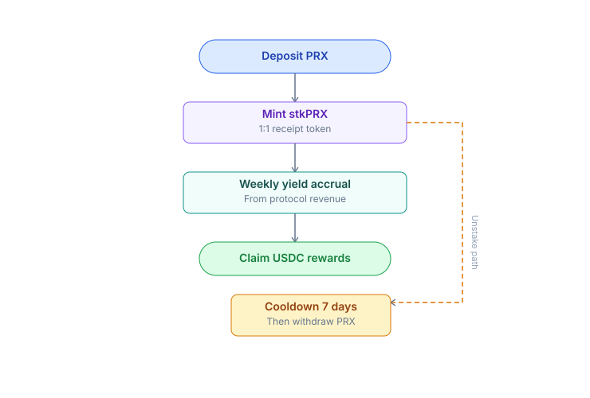
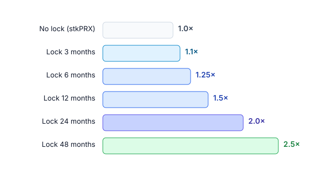
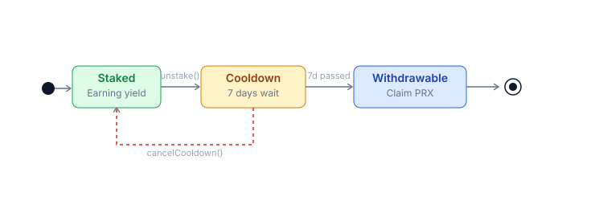

# Staking real yield

Lock PRX to receive a share of protocol fees in **real USDC**. No emissions.

## Mechanism



1. Deposit N PRX into `StakingVault`.
2. Vault mints N **stkPRX** (non-transferable) representing your fee share.
3. Each week (epoch), the protocol collects its fee share in USDC and distributes it to the vault pro-rata.
4. Claim USDC at any time, or auto-compound (convert to PRX and re-stake).
5. Unstake: 7-day cooldown (prevents front-running around major events).

## Yield calculation

```
your_yield = staker_share × (your_stake / total_staked)
APY_USDC   = (weekly_yield × 52) / your_stake_USD_value
```

Yield floats with actual volume. Volume up = yield up. Volume down = yield down.

## Lock boost

Lock PRX to receive **boosted yield + governance weight**:



| Lock             | Yield boost | vePRX weight |
| ---------------- | ----------- | ------------ |
| No lock (stkPRX) | 1.0x        | 0            |
| 3 months         | 1.1x        | 0.25x        |
| 6 months         | 1.25x       | 0.5x         |
| 12 months        | 1.5x        | 1.0x         |
| 24 months        | 2.0x        | 2.0x         |
| 48 months (max)  | 2.5x        | 4.0x         |

The longer the lock, the higher your USDC yield and governance power.

Governance details: [vePRX & gauge](veprx-gauge.md).

## Staker risks

| Risk                                            | Mitigation                                                                                        |
| ----------------------------------------------- | ------------------------------------------------------------------------------------------------- |
| **Volume drops** -> yield drops                 | Diversify across multiple income streams (LP, content)                                            |
| **PRX price drops** -> USD value of yield drops | Stake for the long term, not short-term trading                                                   |
| **Smart contract risk**                         | Vault audited alongside core protocol. Bug bounty active                                          |
| **Slashing**                                    | Vault staking is **not** subject to slashing (only oracle dispute bonds in Phase 2 have slashing) |

## Unstake flow


