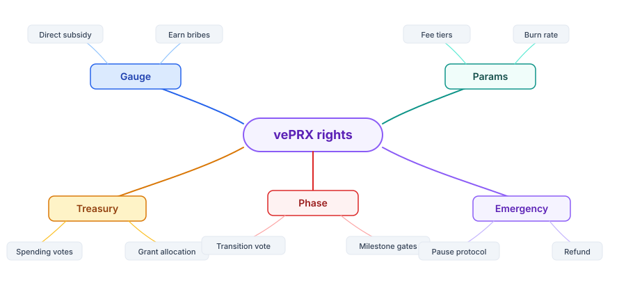
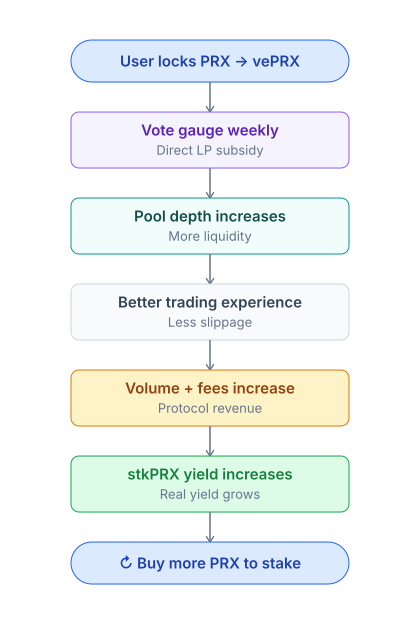
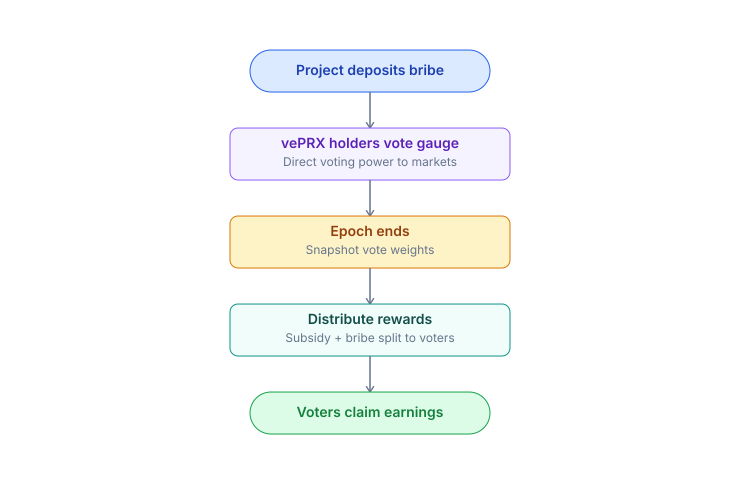

# vePRX & gauge voting

Lock PRX -> vePRX (vote-escrowed) -> vote on gauges + boost yield + governance.

## What is vePRX

**vePRX** = "vote-escrowed PRX". Lock PRX and receive vePRX (non-transferable) representing your governance weight.

* **No additional tokens are issued** — it only records your rights.
* **Weight decays linearly** over time — as the lock nears expiry, weight decreases.
* **Lock expires**: vePRX = 0, PRX unlocks and becomes withdrawable.

## Weight formula

```
vePRX_weight = PRX_locked × (remaining_lock_time / max_lock_time)
max_lock_time = 4 years (48 months)
```

Example:

| Lock amount | Lock duration | vePRX initial |
| ----------- | ------------- | ------------- |
| 1000 PRX    | 4 years (max) | 1000          |
| 1000 PRX    | 2 years       | 500           |
| 1000 PRX    | 1 year        | 250           |
| 1000 PRX    | 6 months      | 125           |

After 6 months pass (4-year lock with 3.5 years remaining) -> weight decays from 1000 -> 875 vePRX.

Decay is linear per block. No steps.

## vePRX rights



## Gauge voting — flywheel

Each market has a **gauge**. vePRX holders vote on which gauges receive LP subsidy from the treasury.



A gauge corresponds to the YES-USDC (or NO-USDC) pool of a specific market. Pools with more votes = LPs earn more.

## Who votes for what

* **LPs providing liquidity** -> vote for their own pool to receive more subsidy.
* **Project owners who created a market** -> vote for their market to attract LPs + traders.
* **Traders interested in a market** -> vote for that market to deepen liquidity.

## Bribe market



External projects pay PRX/USDC to vePRX holders who vote for their pool — creating a liquid vote market.

PrediX will self-host the bribe layer (Phase 2).

## Boost USDC yield

vePRX holders are also stkPRX holders -> they receive boosted USDC yield:

| Lock        | Yield boost | Vote weight |
| ----------- | ----------- | ----------- |
| No lock     | 1.0x        | 0           |
| 4-year lock | 2.5x        | 4x          |

Longer lock = higher yield + voting power. They go hand in hand.

Details: [Staking](staking.md).

## Restrictions

* **vePRX is non-transferable**. Buy PRX -> lock -> receive vePRX.
* **Extend lock**: 1-year lock with 3 months remaining, extend by 9 months -> new 1-year lock (clock resets).
* **Early unlock**: Phase 2 will allow early unlock with a **50% PRX penalty** sent to the treasury. Currently: hard lock.

## Protocol parameter governance

vePRX votes on changes to:

| Param                  | Default          | Range                                     |
| ---------------------- | ---------------- | ----------------------------------------- |
| Oracle approve list    | ...              | Add/remove adapter                        |
| Market creation bond   | TBA              | 1k-100k PRX                               |
| Stake unstake cooldown | 7 days           | 1-30 days                                 |
| Buyback frequency      | Weekly           | Daily-Monthly                             |
| **Phase transition**   | Bootstrap @ TGE  | Bootstrap -> Scale -> Mature -> Dominance |
| **Revenue split**      | Per-phase preset | DAO-adjustable                            |

### Phase transition + S6 Reserve

vePRX votes on phase upgrades (Bootstrap -> Scale -> Mature -> Dominance) based on publicly available metrics (volume, runway). S6 Reserve (60M PRX) is DAO-locked — unlockable only via vePRX vote.

Proposal flow:

1. vePRX holder proposes a change (requires > 100k vePRX to propose, anti-spam).
2. 7-day discussion window on forum.
3. 5-day voting period (Snapshot off-chain or on-chain).
4. Quorum: > 4% total vePRX voted.
5. Pass: > 50% YES of votes cast.
6. Execute: 48h timelock + multisig execution.

## Treasury spend governance

vePRX votes on treasury spending:

* Audit funding (e.g. $200k for Spearbit).
* Grants for devs / contributors ($5k-100k typical).
* Marketing initiatives.
* Insurance fund top-up.

Same proposal process applies.

## Quadratic voting (TBA)

Phase 2 will experiment with quadratic voting for large proposals:

```
voting_power = sqrt(vePRX_weight)
```

Reduces whale dominance. Only applies to proposals > $100k spend.

## Risks

| Risk                                                            | Mitigation                                                            |
| --------------------------------------------------------------- | --------------------------------------------------------------------- |
| **Vote concentration** (whale locks large amount)               | Quadratic voting in Phase 2                                           |
| **Bribe corruption** (voters choose based on bribes, not merit) | Accepted trade-off — bribes create market demand for vePRX            |
| **Low participation** (few voters)                              | Default fallback (equal across pools) + small PRX emission for voters |

## Timeline rollout

| Phase          | Feature                                              |
| -------------- | ---------------------------------------------------- |
| **TGE**        | Lock PRX -> vePRX. Basic gauge voting.               |
| **TGE + 3m**   | Yield boost tiers activated.                         |
| **TGE + 6m**   | Bribe market Phase 1.                                |
| **TGE + 12m**  | Protocol parameter voting.                           |
| **TGE + 18m**  | Treasury spend governance.                           |
| **TGE + 24m+** | Quadratic voting experiment, cross-chain governance. |

All milestones are TGE-relative; exact dates are **TBA** after TGE is confirmed.
