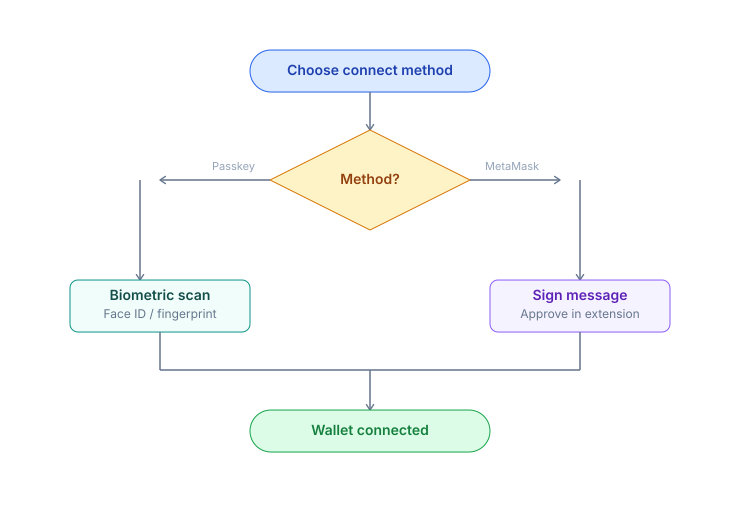
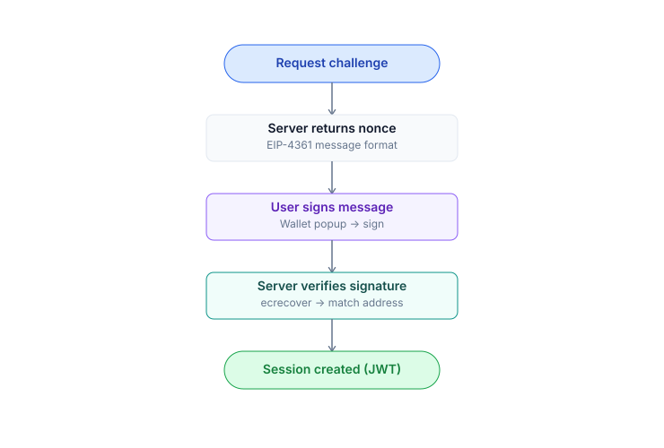

# Connect Wallet

PrediX offers **2 sign-in methods**. Both are **non-custodial** — nobody (including PrediX) holds your private key.

## Quick Selection

## Comparison

| | Passkey + Smart Account | Crypto Wallet (EOA) |
|---|---|---|
| **Experience** | Web2-like, biometric | Traditional web3, sign each tx |
| **Browser extension** | Not required | Required (MetaMask, Rainbow...) |
| **Backup & recovery** | Cloud sync (iCloud / Google), or a second device | BIP-39 seed phrase (12-24 words) |
| **Hardware wallet** | No (private key in Secure Enclave) | Yes (Ledger, Trezor) |
| **Gas fees** | Pay via paymaster (USDC) | Pay ETH directly (Unichain is cheap ~$0.001-0.01/tx) |
| **Batch transactions** | Yes (1-click `[approve, swap]` atomic) | No (2 separate txs) |
| **First-time sign-up** | ~5 seconds biometric | Already have a wallet → instant |
| **Best for** | New users · fast onboarding | DeFi users · large custody · hardware wallets |

> **Gas note**: By default, both methods require users to pay their own gas. PrediX has a **gas sponsorship program** for eligible users (e.g., new user onboarding, stakers above a certain threshold, campaign-eligible events) — **applies to both account types**, regardless of wallet type. Mechanism: smart account → paymaster covers directly; EOA → off-chain rebate/refund (details announced pre-launch). Eligibility criteria and sponsorship duration may change via governance vote.

## Passkey + Smart Account

Passkeys use the **WebAuthn** standard — biometric (Touch ID, Face ID, Windows Hello) or your device PIN for authentication. The private key is generated and stored in the **Secure Enclave / TPM** and cannot be exported.

On sign-up, the app deploys a **Kernel smart account (ERC-4337)** — an on-chain wallet contract that validates via passkey signature. All actions go through UserOps.

### Create New

1. Open [app.predix.app](https://app.predix.app) → **Sign up**.
2. Select **Continue with passkey**.
3. Browser prompts biometric authentication. Confirm.
4. Smart account counterfactual address appears immediately (deployed on-chain on first action).

### Backup

- **iCloud Keychain** (iPhone, Mac) — passkey syncs across Apple devices with the same Apple ID.
- **Google Password Manager** (Android, Chrome) — syncs across devices.
- **Hardware key** (YubiKey, Titan) — passkey stored on hardware key, plug-in to authenticate.

> **Warning**: If you only have 1 device + no cloud sync + no hardware key backup → losing the device = losing the wallet. We recommend enabling cloud sync or adding a second device right after sign-up.

### Recovery (Lost Device)

Current: Re-create the passkey on a new device via cloud sync (if enabled).

Roadmap: **Social recovery** with guardians — designate N trusted contacts, M of N can restore access (TBA).

## Crypto Wallet (EOA)

Use a traditional wallet you already own — MetaMask, Rainbow, Coinbase Wallet, or any wallet that supports WalletConnect / hardware wallet.

### Steps

1. Click **Connect wallet** in the header.
2. Select your wallet (MetaMask / Rainbow / WalletConnect / Ledger...).
3. Approve the connection request in your wallet.
4. Sign the **SIWE message** (Sign-In With Ethereum) — off-chain, no gas cost.
5. Trade directly — each tx pays gas in ETH.

### When to Use

- You already have a DeFi workflow with MetaMask + hardware wallet.
- Large custody balance — want standard BIP-39 seed phrase backup.
- Integration with other tooling (Frame, Rabby, Safe multisig).
- Prefer full control with no paymaster dependency.

## SIWE Session

Both methods use **SIWE** (EIP-4361) to create a session with the backend:

