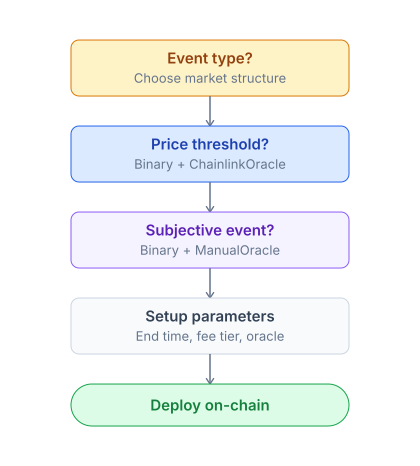
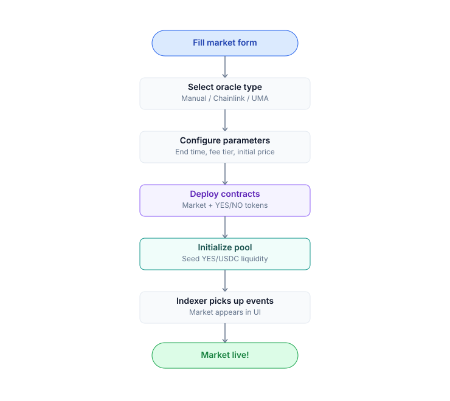

# Create market

Guide for **creators** (holders of `CREATOR_ROLE`) to create a market or multi-outcome event.

## Who can create

| Phase | Who | Requirements |
|---|---|---|
| **Phase 1** (current) | Addresses with `CREATOR_ROLE` | Whitelisted via governance proposal |
| **Phase 3** (TBA) | Permissionless | Stake a bond of **10,000 PRX** (refunded if the market resolves cleanly, slashed if malformed) |

Apply for `CREATOR_ROLE`: submit a form on [Discord](../resources/links.md) #creator-application + governance vote.

## Decisions before creating



## Parameters to decide

### Question

The main question for the market — it must be:
- **Specific**: "Will BTC exceed $100,000 (USD) on CoinGecko close 2027-01-01 UTC?" — not "Will BTC go high?"
- **Falsifiable**: Can be answered definitively YES/NO using an objective source.
- **Time-bound**: Has a clear endTime.
- **Unambiguous**: Avoid "maybe", "approximately", "around".

### endTime

The timestamp when trading closes and the oracle resolution window opens.

- Format: Unix seconds (UTC).
- Min: 1 hour from creation (prevents front-running).
- Max: 5 years (UI cap).

### Oracle

| Oracle | When to use | Setup cost |
|---|---|---|
| **ChainlinkOracle** | Price threshold | Free, register feed + threshold |
| **ManualOracle** | Subjective event | Free, 2/3 multisig resolves |
| **UMAOracle** (TBA) | Decentralized resolution | Bond $500-$50,000 USDC |
| **Custom adapter** | On-chain event (governance, TVL) | Deploy adapter, approve via Diamond |

### Per-market cap (optional)

Limits the total collateral locked in the market. Default = global cap (protocol config).

- Set 0 = unlimited.
- Set X = max X USDC collateral. Provides protection when a market is high-risk.

### Category + metadata

Off-chain metadata for a polished UI display:
- **Title** (LocalizedString — vi/en/ja/ko)
- **Description**
- **Category**: crypto, sports, politics, weather, AI, ...
- **Featured**: boolean
- **Image / icon**

Set via the admin BE endpoint after on-chain creation.

## Steps — create a binary market with Chainlink



### Details

1. **Create the on-chain market**:
   ```
   diamond.createMarket(
     question: "Will BTC exceed $100k before 2027-01-01?",
     endTime: 1798752000,  // Unix sec
     oracle: ChainlinkOracle.address
   )
   ```
   Returns `marketId` + addresses of the YES and NO ERC-20 tokens.

2. **Register the Chainlink feed**:
   ```
   chainlinkOracle.register(marketId, {
     feed: 0xA39434A63A52E749F02807ae27335515BA4b07F7,  // BTC/USD Unichain
     threshold: 100_000_000_000_000,  // $100k with 6 decimals + 8 decimals feed
     gte: true,                        // YES if price >= threshold
     snapshotAt: 1798752000            // = endTime
   })
   ```

3. **Register the pool with Hook**:
   ```
   hook.registerMarketPool(marketId, {
     currency0: USDC,
     currency1: yesToken,
     fee: DYNAMIC_FEE_FLAG,            // hook decides
     tickSpacing: 60,
     hooks: PrediXHook.address
   }, yesIsCurrency0: false)
   ```

4. **Initialize the v4 pool** (handled automatically by the hook during registration).

5. **Seed initial liquidity** (see [Liquidity provider](provide-liquidity.md)).

6. **Set metadata** (UI title, category, image) via the BE admin endpoint:
   ```
   POST /api/v2/admin/markets/:id/display
   {
     title: { vi: "...", en: "...", ja: "...", ko: "..." },
     category: "crypto",
     image: "ipfs://...",
     isFeatured: false
   }
   ```

## Steps — create a multi-outcome event

An event is a container holding N child markets. Upon resolution, exactly 1 member resolves YES = true; the rest resolve YES = false.

```
diamond.createEvent(
  name: "FIFA WC 2026 Winner",
  candidateQuestions: [
    "Will Argentina win?",
    "Will Brazil win?",
    "Will France win?",
    ...  // 48 teams
  ],
  endTime: 1789300000,  // after the final match
  oracle: ManualOracle.address
)
```

Returns `eventId` + an array of `marketIds`. Each member is a standard binary YES/NO market that belongs to the event.

After event resolution:
```
eventFacet.resolveEvent(eventId, winningIndex: 0)  // Argentina wins
```

Atomic — all members resolve in the same block; exactly 1 outcome = true.

## Best practices

- **Question wording**: Test with 5 people unfamiliar with the context. Can they answer YES/NO?
- **endTime buffer**: Set at least 1-2 hours after the actual event so data can finalize before resolution.
- **Oracle source**: For ManualOracle, document the primary source in the description.
- **Liquidity seeding**: Minimum $500-$1000 USDC + corresponding YES/NO. A pool that is too shallow drives users away.
- **Featured marketing**: Coordinate with the community team before launching a large market.

## Resolve dispute — you are the creator

If a market resolves incorrectly:
- **Phase 1 ManualOracle**: You are not a multisig member — flag on Discord and the multisig will review. If incorrect → refund mode is enabled.
- **Phase 2 UMAOracle**: Anyone can propose a dispute with a bond.
- **Phase 1 ChainlinkOracle**: Resolution is automatic — disputes are only possible if the Chainlink feed was manipulated; escalate via Chainlink directly.

## Revenue for creators (Phase 3 — TBA)

Phase 3 will introduce **creator revenue share** — a portion of the protocol fees from that market goes to the creator. Details will be announced per the roadmap.
