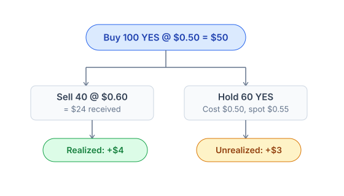

# Portfolio & P&L

View all your positions, history, and P&L at `/portfolio`.

## Overview screen


## Active positions

Each row:

| Market | Side | Balance | Avg cost | Spot | Unrealized P&L | Action |
|---|---|---|---|---|---|---|
| BTC > $100k before 2027 | YES | 205.30 | $0.483 | $0.62 | +$28.20 | Sell / Redeem |
| ETH > $5k in 2026 | NO | 50.00 | $0.380 | $0.42 | +$2.00 | Sell |

- **Balance**: on-chain token count of YES/NO (the indexer hydrates cost basis).
- **Avg cost**: weighted-average purchase cost.
- **Spot**: blended price from AMM v4 + best bid/ask on the CLOB (pricing layer).
- **Unrealized P&L**: `(spot - avgCost) × balance`.

## Realized vs unrealized P&L



- **Realized** = P&L from closed positions or redeemed tokens.
- **Unrealized** = not yet locked in; depends on the current spot price.

## History — 6 types

| Type | Description | Source event |
|---|---|---|
| **Trade** | Buy/sell via Router | `Router.Trade` |
| **Order** | Place/cancel/fill limit order | `Exchange.OrderPlaced/OrderMatched/OrderCancelled` |
| **Split** | Mint a YES+NO pair | `MarketFacet.PositionSplit` |
| **Merge** | Burn YES+NO → USDC | `MarketFacet.PositionMerged` |
| **Claim** | Redeem or refund | `TokensRedeemed / MarketRefunded` |
| **LP** | Add/remove/collect liquidity | `PoolManager.ModifyLiquidity` |

Click any row → tx hash on the explorer.

## Calibration — measure prediction accuracy

Applies to markets that have already resolved.

### Brier score

The mean squared deviation between the price at which you bought and the actual outcome.

```
Brier = mean[(outcome - your_buy_price)²]
```

Example:
- You buy YES @ $0.70 → event occurs (outcome=1) → Brier = `(1 - 0.7)² = 0.09`
- You buy NO @ $0.30 → event occurs → Brier = `(0 - 0.3)² = 0.09`

Low score = accurate pricing. High score = frequently wrong.

### Accuracy band

A chart measuring: when you buy at price range X, what percentage of events actually occur?

| Your buy price | Actual win rate | Assessment |
|---|---|---|
| `$0.30` (low confidence) | 30% | Well-calibrated |
| `$0.30` (low confidence) | 70% | **Underconfident** — you are too cautious; consider trading larger |
| `$0.70` (high confidence) | 70% | Well-calibrated |
| `$0.70` (high confidence) | 30% | **Overconfident** — you are too confident; consider trading smaller |

The app plots your points on a scatter chart against the ideal diagonal (buy at $0.X → win X%). The closer to the diagonal, the more accurate your pricing.

## Performance replay

Re-watch your trading decisions over time:

- Select a period (7 days / 30 days / 90 days).
- Use the slider to time-travel.
- Each trade shows: market state at that moment, your decision, and the subsequent outcome.
- Insight: did you enter well or too early/late? Did you sell at the top or panic out?

A tool to help you recognize your own biases.

## Streaks & badges


Badges are NFTs — shareable and serve as profile signatures. Details: [Rewards & gamification](../economics/rewards.md).

## LP positions

The **Liquidity** tab in your portfolio:
- Each row = 1 LP NFT.
- Displays: pool, range, deposit value, current value, accrued fees, APR.
- Actions: **Collect** fees, **Add more**, **Remove**.

Details: [Liquidity provider](provide-liquidity.md).

## Export & API

- **Export** tab → download a CSV of all history (for tax / accounting purposes).
- Developers can access directly:
  - Indexer: `GET /api/users/:address/portfolio`
  - BE: `GET /api/v2/users/:address/portfolio`

## After endTime, not yet resolved

When a market passes endTime but has not been resolved:
- Trading is closed; you cannot sell.
- Unrealized = `cost basis × balance` (hold until resolution).
- The UI shows a **Pending resolve** badge.
- After resolution → winning YES = $1, losing NO = $0 → P&L is settled.

## Rebalance suggestions

The app analyzes your portfolio and suggests:
- Which positions have excessive exposure (concentration risk)?
- Which markets are approaching endTime — should you close beforehand?
- Which limit orders are stale (price far from the market)?

Notifications can be toggled in [Settings](../resources/settings-i18n.md).
