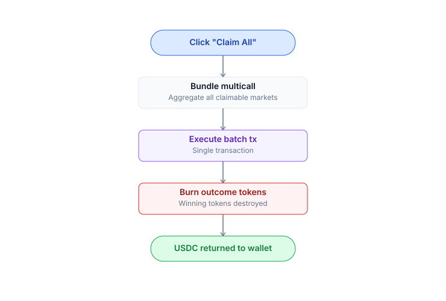
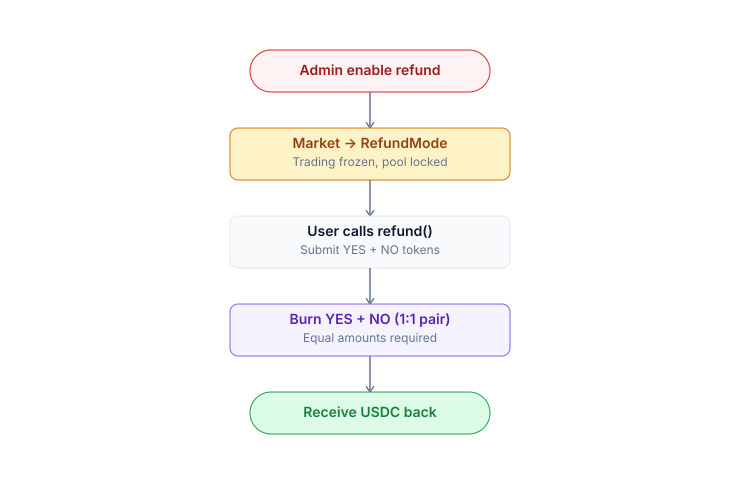

# Redeem & refund

After a market resolves, exchange winning tokens for USDC. If a market cannot be resolved, use the refund flow.

## Redeem — market has resolved

**Conditions**:

* `market.isResolved == true`
* You hold the winning token (YES if outcome=true, NO if outcome=false)

### Steps

1. [Portfolio](portfolio.md) → filter **Resolved markets**.
2. Each market shows a **Redeem** button if you hold the winning token.
3. Click → preview: token count, USDC to receive.
4. Confirm in your wallet → \~2s transaction complete.
5. USDC arrives in your wallet. Winning tokens are burned; losing tokens = $0.

### Batch redeem

Multiple resolved markets → click **Claim All** → batched via **passkey smart account** (1 click, 1 tx, gas via paymaster). EOA users: each market requires a separate tx (wallets do not support native batching). Both account types receive sponsor coverage if the user qualifies for the program.



### Losing tokens

* **No longer have value**.
* Cannot be redeemed or traded (pool is drained).
* They still appear in your wallet with a balance, but market value = $0. Hide them by removing from your watchlist.

## Refund mode — market cannot be resolved

**When**: Oracle is down, dispute is hung, multisig is unresponsive → admin enables refund mode via a 48h timelock.

**Conditions**:

* `market.refundModeActive == true`
* You hold **both YES and NO**

### Steps

1. Portfolio → the market displays a **Refund available** badge.
2. Click **Refund** → preview: `min(yesBalance, noBalance)`, USDC to receive.
3. Confirm → tx \~2s.
4. USDC returns to your wallet. The YES+NO pair is burned.

### Formula

```
refundAmount = min(yesBalance, noBalance)
payout       = refundAmount USDC (1:1)
```

Example: you hold 100 YES + 80 NO:

* Refund 80 pairs → receive 80 USDC.
* 20 YES remaining → **no NO to pair with**, cannot be refunded.

### Note: refund is pair-based only

If you hold only one side (e.g. bought 100 YES via the Router, no NO held), you **cannot claim** USDC through the standard refund flow.

**Workaround**:

* Buy NO from someone still selling (NO price typically drops near $0 when refund mode is active since no one expects a win).
* Pair with your YES to refund.
* Your loss is the NO purchase price.

### This is a design trade-off

Refund mode prioritizes **pro-rata fairness** over first-come-first-serve. This prevents a scenario where early claimers drain all USDC, leaving nothing for later users.

Phase 2 (TBA): A **single-sided refund** with a 50% haircut may be introduced — burn 100 YES → receive 50 USDC. Currently under governance discussion.

## Who decides to enable refund


