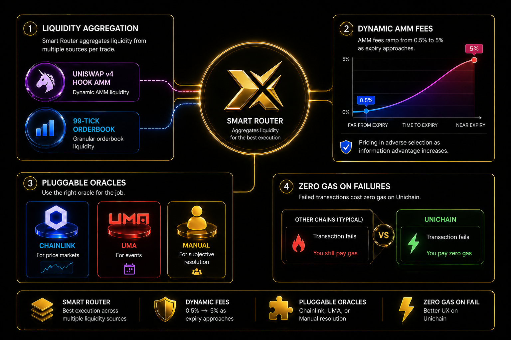

# Core Innovations & MOAT

PrediX introduces a vertically integrated stack of innovations that together form a defensible protocol moat. Each layer reinforces the others — liquidity enables composability, composability attracts liquidity, and consumer access amplifies both.

---

## Hybrid CLOB + AMM Routing

Traditional prediction markets force users to choose between order book precision and AMM liquidity. PrediX eliminates this tradeoff with a **Smart Router** that unifies both execution venues:

- **Priority routing to CLOB** — limit orders on the on-chain order book get first-fill priority, giving makers the tightest spreads and lowest slippage.
- **Automatic overflow to Uniswap v4** — when the order book cannot fully fill, the remaining size routes to the Uniswap v4 AMM pool in the same transaction.
- **Atomic settlement** — the entire fill (CLOB portion + AMM portion) settles in a single atomic transaction. No partial fills across blocks, no front-running between venues.

The result is **institutional-grade execution** with the liquidity depth of an AMM and the precision of a central limit order book.

---

## LP Protection & Anti-Toxic Flow

Providing liquidity to prediction markets carries unique risks — as expiry approaches, informed traders exploit LPs who hold stale positions. PrediX protects liquidity providers with:

- **Dynamic fee scaling (0.5% to 5%)** — swap fees automatically increase as the market approaches expiry, compensating LPs for the rising adverse selection risk near resolution.
- **EIP-1153 transient storage anti-sandwich** — uses transient storage to detect and block sandwich attacks within a single transaction bundle, protecting both LPs and traders from MEV extraction.

LPs earn real yield from trading fees while the protocol actively defends them against the toxic flow that plagues prediction market liquidity.

---

## ERC-20 Composable Outcome Assets

Every market position in PrediX is a fully standard ERC-20 token. This is not a wrapper or a receipt — it is the position itself, composable across the entire DeFi ecosystem:

- **LP provision** — pair outcome tokens with USDC in Uniswap v4 pools to earn trading fees.
- **Lending collateral** — use outcome tokens as collateral in lending protocols, borrowing against your conviction.
- **Vault strategies** — build structured products from baskets of correlated outcome tokens.
- **Cross-protocol integration** — any protocol that accepts ERC-20 tokens can integrate PrediX outcome assets without custom adapters.

Outcome tokens transform prediction markets from isolated venues into **composable financial primitives**.

---

## Permissionless Market Creation & Oracle Multi-Modular

Anyone can create a prediction market on PrediX. The protocol supports a multi-modular oracle system to resolve markets across different trust and automation profiles:

- **Manual Oracle** — market creator resolves the outcome, suitable for community-governed or niche events with a built-in dispute window.
- **Chainlink Oracle** — automated resolution using Chainlink data feeds for verifiable, objective data (price feeds, sports scores, weather data).
- **UMA Oracle** — optimistic oracle with an economic dispute mechanism, ideal for subjective or complex resolution criteria.

Market creators choose the oracle type at creation time. The protocol enforces resolution finality and handles payouts regardless of which oracle module is used.

---

## vePRX Gauge Voting

PrediX implements a vote-escrow governance model inspired by Curve's proven mechanism:

- **Lock PRX to receive vePRX** — longer lock periods yield higher voting power (up to 4 years).
- **Direct liquidity incentives** — vePRX holders vote on gauge weights to direct PRX emission incentives toward specific markets or pools.
- **Protocol fee share** — vePRX holders receive a share of protocol trading fees (real USDC yield).
- **Bribe markets** — third parties can offer incentives to vePRX voters, creating an efficient market for liquidity direction.

The gauge system aligns long-term token holders with protocol growth — those who lock longest have the most influence over where liquidity flows.

---

## Consumer-Grade Onboarding

The most powerful infrastructure is useless if users cannot access it. PrediX eliminates every friction point in the onboarding journey:

- **Passkey authentication** — sign in with biometrics (Face ID, fingerprint) or device PIN. No seed phrases, no browser extensions.
- **Smart account (ERC-4337)** — every user gets a smart contract wallet with batched transactions, session keys, and social recovery.
- **Sponsored transactions** — eligible users trade with zero gas fees. The protocol sponsors gas through a paymaster.
- **Circle CCTP V2** — bridge USDC from any major chain (Ethereum, Arbitrum, Base, Optimism) to Unichain in a single step, directly within the app.

From first visit to first trade in under 60 seconds — no wallet download, no bridging confusion, no gas management.
