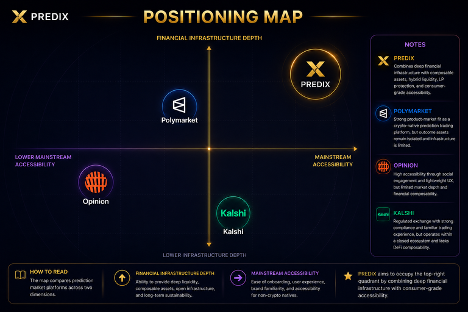

# Market Landscape

## Why Existing Prediction Markets Break

Prediction markets have proven product-market fit — Polymarket processed billions in volume during the 2024 US election cycle, and Kalshi achieved regulatory approval as a CFTC-regulated exchange. But despite this momentum, **existing platforms share structural limitations** that prevent prediction markets from reaching their full potential as financial infrastructure.

### Liquidity Fragmentation

Every platform builds its own siloed liquidity pool. Outcome tokens on Polymarket cannot interact with Kalshi positions. Liquidity is locked within each platform, resulting in wider spreads, thinner books, and worse execution for users — especially in long-tail markets.

### Non-Composable Positions

Positions on existing platforms are internal accounting entries, not portable financial assets. Users cannot use their prediction market positions as collateral, provide them as LP, or integrate them into broader DeFi strategies. The capital is productive only within the prediction market itself.

### Consumer Access Barriers

Crypto-native platforms require wallet setup, bridging, and gas management. Regulated platforms require KYC, bank transfers, and geographic restrictions. Neither delivers the frictionless experience that mainstream adoption demands.

### Centralized Resolution Risk

Most platforms rely on a single resolution mechanism — either a centralized operator or a single oracle provider. This creates a single point of failure for market integrity and limits the types of events that can be reliably resolved.

---

## Market Positioning

The prediction market landscape is evolving rapidly. Each platform has carved out a distinct positioning, but none has built the full-stack infrastructure required for prediction markets to function as composable financial primitives.

| Platform | Current Valuation | Trading Experience | Financial Composability | Liquidity Infrastructure | Consumer Accessibility | Core Positioning |
|---|---|---|---|---|---|---|
| Kalshi | ~$22B | ⭐⭐⭐⭐ | ⭐⭐ | ⭐⭐ | ⭐⭐⭐⭐ | Regulated event exchange |
| Polymarket | ~$9B-15B | ⭐⭐⭐⭐ | ⭐⭐⭐⭐ | ⭐⭐⭐ | ⭐⭐⭐ | Crypto-native trading layer |
| Opinion | ~$55M | ⭐⭐ | ⭐⭐ | ⭐⭐ | ⭐⭐⭐ | AI-powered prediction platform |
| **PrediX** | N/A | ⭐⭐⭐⭐⭐ | ⭐⭐⭐ | ⭐⭐⭐⭐ | ⭐⭐⭐⭐⭐ | **Financialization of information** |

**Kalshi** dominates regulated markets with CFTC approval and traditional finance UX, but operates as a closed exchange with no DeFi composability and centralized infrastructure.

**Polymarket** proved massive demand for crypto-native prediction trading and pioneered on-chain settlement, but outcome tokens remain largely siloed within its own UX and liquidity is fragmented across its CLOB.

**Opinion** explores AI-assisted market creation and analysis, but lacks the trading infrastructure depth and financial composability needed for institutional-grade operations.

**PrediX** is purpose-built to fill the infrastructure gap — hybrid execution, ERC-20 composable outcome assets, multi-modular oracle resolution, and consumer-grade access from day one.

---

## Market Evolution & Infrastructure Transition

The prediction market industry is undergoing a structural transition:

**Phase 1 — Proof of Concept** (2014-2020): Augur, Gnosis, and early platforms proved on-chain prediction markets were technically feasible. Low liquidity, poor UX, and high gas costs limited adoption to crypto-native early adopters.

**Phase 2 — Consumer Breakthrough** (2021-2025): Polymarket and Kalshi demonstrated mainstream demand. Billions in volume proved that people will trade on real-world events when the experience is good enough. But both platforms operate as **closed venues** — liquidity stays inside, positions are not composable, and infrastructure is vertically integrated but not extensible.

**Phase 3 — Financial Infrastructure** (2025+): The next evolution is not another prediction market app. It is the **infrastructure layer** that makes predictive information a first-class financial primitive — composable, liquid, and accessible. This is the phase PrediX is built for.

---

## PrediX — The Future of Predictive Finance

PrediX is positioned at the intersection of three converging trends:

**DeFi composability demand** — the DeFi ecosystem increasingly values assets that can flow freely between protocols. ERC-20 outcome tokens unlock entirely new categories of structured products, hedging strategies, and yield opportunities.

**Consumer UX expectations** — users expect Web2-grade onboarding. Passkey auth, sponsored gas, and smart accounts are not optional features — they are table stakes for the next wave of adoption.

**Unichain ecosystem growth** — building natively on Unichain with deep Uniswap v4 integration positions PrediX at the center of the highest-liquidity DEX ecosystem. The hybrid CLOB + AMM architecture leverages Uniswap v4's hook system for atomic cross-venue execution that no other chain or DEX can replicate.

> PrediX is not building a better prediction market. PrediX is building the **financial infrastructure** that transforms predictions into composable, liquid, universally accessible financial instruments.
