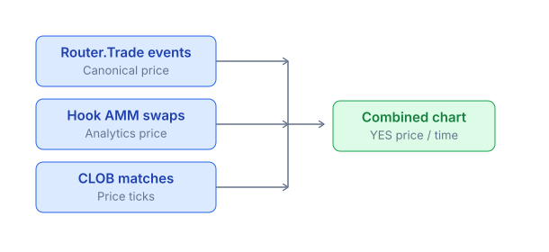

# Chart & timeframe

Every market has a YES price chart over time. Read the chart, change timeframes, and use indicators.

## Basic chart



The chart aggregates prices from:

* **Router.Trade**: canonical source, every market order
* **Hook AMM swaps**: tick-by-tick AMM prices
* **CLOB matches**: price at each limit fill

## Timeframe

| Timeframe   | Use case                           |
| ----------- | ---------------------------------- |
| **1m**      | Scalp, intraday                    |
| **5m**      | Short-term momentum                |
| **15m, 1h** | Day trade                          |
| **4h**      | Swing                              |
| **1D**      | Position trade, multi-day hold     |
| **1W**      | Long market (3+ months to endTime) |

The app defaults based on time-to-end:

* < 24h to endTime → 5m
* 1-7 days → 15m or 1h
* > 7 days → 1h or 4h
* > 30 days → 1D

## OHLC candles

Each candle shows the open / high / low / close for that period.

```
─┬─  high
 │
 ▌   close (green if close > open)
 │
 ▐   open
 │
 │
─┴─  low
```

Volume is displayed as bars at the bottom.

## Indicators

Toggle in the chart settings (gear icon):

* **MA / EMA** — moving average over 7, 25, 99 periods.
* **VWAP** — volume-weighted average price.
* **Bollinger Bands** — volatility envelope.
* **RSI** — momentum oscillator (0-100).
* **Volume profile** — volume distribution by price.

## Compare 2 markets

Click **Compare** + select another market:

* Overlay two YES price lines on the same chart (normalized 0-1 scale, since prices are already probabilities).
* Useful: "Trump win" vs "Biden win" event 2024.

## Multi-outcome event chart

In the event detail view, the chart shows the YES price of **all members** on the same timeline. For example, the event _"FIFA WC 2026 Winner"_ over 6 months:

| Month | Argentina | Brazil | France |
| ----- | --------- | ------ | ------ |
| Jan   | $0.20     | $0.18  | $0.15  |
| Feb   | $0.22     | $0.16  | $0.18  |
| Mar   | $0.25     | $0.15  | $0.22  |
| Apr   | $0.28     | $0.14  | $0.20  |
| May   | $0.32     | $0.12  | $0.18  |
| Jun   | $0.35     | $0.10  | $0.15  |

In the app: a line chart overlays all members. Click a member in the legend to highlight or hide. Useful for tracking probability shifts in real time.

## Order book depth chart

The **Depth** tab next to the chart:

* Bids (BUY orders) on the left, asks (SELL orders) on the right.
* Cumulative volume — walls of liquidity.

Useful: spot a **liquidity wall** (large limit orders) to identify where the price may stall.

## Recent trades

The **Trades** tab:

* Real-time list of every trade: side, size, price, timestamp.
* Filter by size (whale-only).
* Click a row → tx hash on the explorer.

## On mobile

The chart is full-width with gestures:

* Pinch to zoom in/out.
* Drag to pan horizontally.
* Long-press for hover info.
* Double-tap to reset zoom.

## Data source for developers

Chart data from the Indexer endpoint:

```
GET /api/markets/:id/candles?timeframe=1h&from=...&to=...
→ [
  { ts, open, high, low, close, volume },
  ...
]
```

Or just price snapshots:

```
GET /api/markets/:id/price-history?from=...&to=...
→ [{ ts, yesPrice, source }]
```

Details: [Indexer API](../../developers-guide/api-reference.md#indexer-endpoints).

## Tips for reading prediction market charts

* **Volume spike after endTime**: Unusual activity — may be arbitrage as resolution approaches.
* **Price pinned at $0.50**: The market lacks conviction; information is unclear.
* **Sharp move**: New information — check the news.
* **Price near $0.95-$0.99**: Approaching YES resolution. Low risk-reward (gain only 5%, risk losing 95%).
* **Price near $0.01-$0.05**: Tail event — high risk-reward but low probability.

Do not confuse this chart with a cryptocurrency chart — a prediction market price represents a **probability**, fixed in the 0-1 range.
