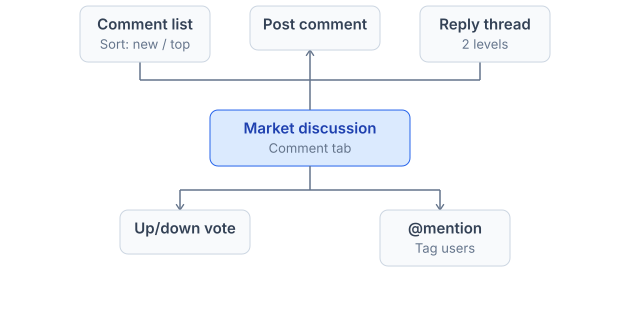
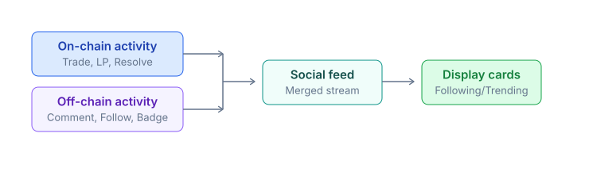
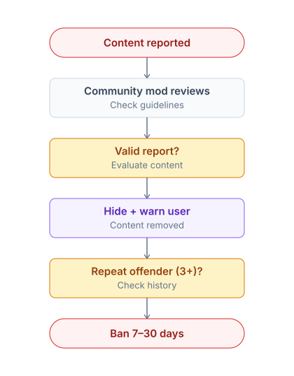

# Discussion & social

***

Prediction markets price information, but information rarely arrives in clean numerical form. Traders need a place to share thesis, debate resolution criteria, and surface signal that on-chain activity alone cannot express.

PrediX embeds social infrastructure at the protocol layer — discussion lives next to the market it shapes, with anti-spam and moderation enforced through economic rather than purely centralized mechanisms.

### Comments per market

> Every market has its own comment thread under the **Discussion** tab on the market detail page.



#### <mark style="color:orange;">Features</mark>

* **Threaded** 2 levels (`comment` + `reply`).
* **Voting** — `up vote`/`down voty`; top comments rise to the top.
* **Mention** `@username` to notify another user.
* **Markdown support**: `bold`, `italics`, `code`, `link`, `quote`.
* **Image embed** — paste an image URL and the app renders it inline.
* **TX share** — paste a `txhash` and the app renders an explorer `link` + `summary`.

#### <mark style="color:orange;">Anti-spam</mark>

Anti-spam is enforced through an economic gate rather than **CAPTCHA** alone:

* **Min stake** of 10 PRX (post-TGE) to post.
* **Cooldown** of 30 seconds between comments.
* **Rate limit** of 50 comments / day / user.
* **Report button** — flag inappropriate content.
* **Mod tools** (community moderator role): hide comments, ban users for 24h.

#### <mark style="color:orange;">Trader badges in comments</mark>

Usernames in comments display badges that surface the commenter's track record:

* Verified (ENS / Lens / Twitter linked)
* Top trader (top 100 leaderboard)
* High accuracy (Brier < 0.15 with > 50 trades)
* PRX whale (stake > 10k PRX)

Helps assess the credibility of a comment.

### Social feed

> The `/feed` page — a global activity stream that merges on-chain transactions with off-chain social actions.



#### <mark style="color:orange;">Filters</mark>

| Filter         | Description                                             |
| -------------- | ------------------------------------------------------- |
| **Following**  | Activity from users you follow                          |
| **Trending**   | Comments + markets with high engagement in the last 24h |
| **Latest**     | Everything, newest first                                |
| **Markets**    | Trade / LP activity only, no social                     |
| **Discussion** | Comments only, no transactions                          |

#### <mark style="color:orange;">Card types</mark>

Feed items are rendered as typed cards, each linking back to its source object:

* **Trade card**: User X bought $Y YES on market Z. Click → market detail.
* **LP card**: User X provided $Y liquidity to pool Z.
* **Resolve card**: Market Z resolved YES, $Y total volume traded.
* **Comment card**: User X commented on market Z: "...". Click → discussion thread.
* **Badge card**: User X earned the "Prophet" badge (80% accuracy).

### Posts (write-ups)

Users can publish **posts** — Twitter thread-style long-form content for deeper analysis:

* Full Markdown support.
* Tag market references (auto-linked).
* Embed charts and images.
* Long-form analysis (e.g. _"Why I'm buying YES on the BTC market"_).

Posts appear in:

* The author's profile (**Posts** tab).
* Followers' feeds.
* Market detail (if a market is tagged).

> #### <mark style="color:orange;">Tip jar (TBA Phase 2)</mark>
>
> Readers will be able to tip USDC / PRX to the author of a useful post.

### Activity feed (per market)

The **Activity** tab on the market detail page — a realtime activity stream scoped to that specific market.

* Trade ticker (size, price, side).
* Order book changes (large limit orders).
* LP add/remove events.
* New comments.

Useful: monitor hot markets and spot whale moves.

### DM & private chat (TBA)

Phase 2: direct messaging between users. Planned features:

* E2E encryption (XMTP protocol).
* Group chat (DAO subgroups).

### Moderation

> PrediX uses a **community moderation** model — moderators are recruited from vePRX holders, not appointed centrally.



* **Mod recruitment**: vePRX holders in good standing can apply.
* **Mod compensation**: PRX from treasury.
* **Appeal process**: banned users can appeal via governance.

### Censorship resistance

Comments and posts are stored **off-chain** (MongoDB) for fast UI rendering. A hash of the content is stored **on-chain** (post Phase 2) — proof of existence + censorship resistance.


If PrediX UI hides a comment, the content still exists via the on-chain hash and users can publish independently on IPFS / Arweave.&#x20;


### Wallet-to-wallet messaging

Phase 2: integration with **XMTP** — messages between addresses. Decentralized, end-to-end encrypted.

Use cases:

* Negotiate OTC trades.
* Coordinate liquidity provision.
* Private discussions within working groups.

### API

For developers building social integrations or external clients:

```
GET  /api/v2/markets/:id/comments?sort=top&limit=50
POST /api/v2/markets/:id/comments        (auth)
GET  /api/v2/users/:address/posts
POST /api/v2/posts                       (auth)
GET  /api/v2/feed?filter=following|trending|latest
POST /api/v2/markets/:id/activity?type=trade|comment
```

Realtime via WebSocket: `wss://api.predix.app/v2/me/feed`.

Details: [Backend API](../../developers-guide/api-reference.md#backend-endpoints-v2).
