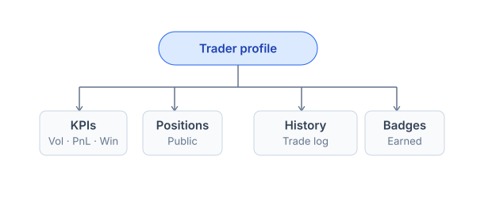
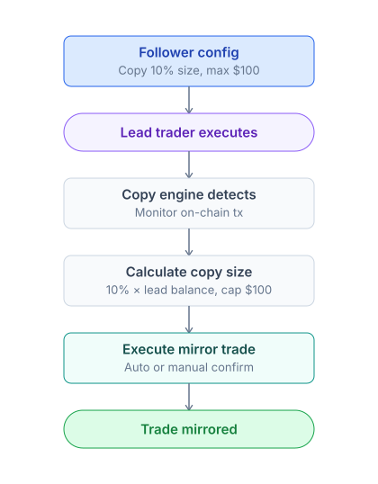

# Leaderboard & traders

***

Prediction markets have a rare property: trader performance is publicly verifiable. Every position, every fill, every resolution is on-chain. This makes reputation objectively measurable rather than self-claimed.

PrediX surfaces this signal across leaderboards, public profiles, follow feeds, and copy trading — turning on-chain history into a discovery and learning layer.

### Leaderboard

> The `/leaderboard` page. Sort and filter by metric.

| Metric             | Description                                   | Update   |
| ------------------ | --------------------------------------------- | -------- |
| **Realized P\&L**  | Profit locked in (USDC)                       | Realtime |
| **Volume**         | Total trade volume                            | Realtime |
| **Win rate**       | % of markets won / total resolved             | Daily    |
| **Accuracy score** | Inverted Brier score (higher = more accurate) | Daily    |
| **Streak**         | Consecutive winning streak                    | Realtime |

Filters:

* **Period**: 24h / 7d / 30d / 90d / all-time
* **Min trades**: 5 / 10 / 50 (filters out accounts that got lucky by chance)
* **Category**: crypto / sports / politics / ...

### Trader profile

Click a trader's name → `/profile/[address]` page.



#### Public vs private

<details>

<summary><mark style="color:orange;">By default, trader profiles are <strong>public</strong>:</mark></summary>

* Active positions are visible (size, market, side, avg cost).
* History is visible.
* Aggregate stats are shown.

</details>


Users can **opt out** in [Settings](../../resources/faq.md) **→ Privacy**:

* Hide active positions.
* Hide history.
* Hide identity (anonymous + pseudonym).



**Note**: Even when hidden, the address is still public on-chain. The app only hides data at the UI level. Technically savvy users can still query the indexer.&#x20;


### Follow a trader

Click **Follow** on a profile.

* Notifications when this trader:
  * Opens a new position (size > threshold you set)
  * Closes a large position
  * Reaches a milestone (badge, streak)
* A dedicated feed in the app showing your followed traders' activity.

### Copy trading

> Mirror a lead trader's positions automatically, with risk controls applied per follower.



#### Setup copy trading

1. Find the trader you want to copy.
2. Click **Copy Trading** → settings:
   * **Size %**: what percentage of the lead's size to copy.
   * **Max per trade**: absolute cap (e.g. $100).
   * **Categories**: only copy trades in categories you care about (e.g. crypto only).
   * **Auto vs manual**: auto-execute or confirm each order.
3. Pre-fund USDC into a copy sub-account (separate from your main wallet to limit risk).
4. Activate.

#### Copy trading risks


**Risks to understand before activating:**

* **Lead trader may underperform later** — past performance does not guarantee future results.
* **Slippage gap**: The lead enters at $0.50; you copy 30s later when the price is already $0.55.
* **Fee accumulation**: Copying many small leads = each lead = 1tx → gas fees add up (significantly reduced if the user qualifies for the sponsor program — applies to both account types; otherwise normal fees apply).&#x20;



Start small ($50-100) and test for 1 week before scaling.


### Trader directory

The `/traders` page — a directory of active traders with filters:

* Sort by metric (same as leaderboard).
* Filter by category, activity period (active in 24h/7d).
* Search by address or pseudonym.

Each trader card shows:

* Avatar (gravatar or custom)
* Pseudonym (self-set) or truncated address
* Top metric (e.g. \~$12k 30d)
* Win rate / Accuracy badge
* Quick actions: Follow / Copy / View profile

### Verified traders

Traders with verified social identity get a verification badge — used as anti-impersonation:

* ENS / Lens / Farcaster verified.
* Twitter linked.
* Optional KYC (for institutional traders).

Verify in [Settings](../../resources/faq.md).

### Privacy & data

* Trader stats are computed from on-chain data → public by default.
* App overlay: pseudonym, avatar, follow graph (off-chain MongoDB).
* If you opt out the app **does not expose** your data, but on-chain data remains public.
* **GDPR / CCPA**: the right to be forgotten applies only to off-chain data (pseudonym, avatar). On-chain data is immutable.

### Anti-sybil

To prevent leaderboard spam from bots:

* **Min activity**: > 5 resolved markets to appear on the leaderboard.
* **Stake gate**: Top 100 leaderboard requires staking >= 100 PRX.
* **Behavior detection**: Wash trading patterns and copy bots are flagged and filtered.

### API

For developers integrating leaderboard or trader data:

```
GET /api/v2/leaderboard?metric=pnl&period=30d&min=10-100
GET /api/v2/users/:address/profile
GET /api/v2/users/:address/follows    (followed by whom)
GET /api/v2/users/:address/following  (following whom)
```

Details: [Backend API](../../developers-guide/api-reference.md#backend-endpoints-v2).
