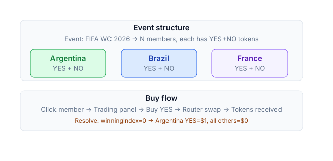

# Multi-outcome events

Most prediction market protocols only support binary markets — YES or NO on a single proposition. But real-world questions are rarely binary: a tournament has dozens of possible winners, an election has multiple candidates, a regulatory decision can land in several states.

PrediX introduces a native **event** primitive — a container that links N binary markets under a single mutual-exclusion constraint, enforced on-chain.

### How events work

An event is a container holding N child markets (called **members**). The members share three properties:

* **Common endTime** — all members resolve together.
* **Mutually exclusive** — exactly one member's YES = true at resolution; all others YES = false.
* **groupSplit / groupMerge** — YES tokens of all members can be minted or burned atomically.



> ### Example
>
> <mark style="color:orange;">Event:</mark> <mark style="color:orange;"></mark>_<mark style="color:orange;">"FIFA WC 2026 Winner"</mark>_ <mark style="color:orange;"></mark><mark style="color:orange;">with 48 teams.</mark>
>
> * Each team = 1 binary market: "Will Argentina win?", "Will Brazil win?", ...
> * The sum of all 48 YES prices should be approximately $1 (probabilities sum to 100%).
>
> When the event resolves (Argentina wins):
>
> * Argentina YES = $1, NO = $0.
> * The remaining 47 teams: YES = $0, NO = $1.

### Trading on events

#### <mark style="color:orange;">Buy YES for one team</mark>



### <mark style="color:orange;">Step 1: Open the Trading Panel</mark>

* Locate and click on a specific member within the Event UI.
* The trading panel will automatically open, pre-configured for that selection (e.g., Buy YES Argentina), functioning exactly like a standard market.



### <mark style="color:orange;">Step 2: Execute the Swap</mark>

* Once you confirm your trade, the Router intelligently handles the transaction.
* It automatically swaps your USDC to execute the purchase.



### <mark style="color:orange;">Step 3: Liquidity Routing</mark>

* The system sources the best available price by buying YES tokens through a combination of the CLOB (Central Limit Order Book) and the AMM (Automated Market Maker).



### <mark style="color:orange;">Step 4: Receive Tokens</mark>

Upon successful execution, you will receive the specific outcome tokens (e.g., YES Argentina tokens) directly into your wallet.



#### <mark style="color:orange;">Buy NO (short one team)</mark>

Bet that a team **will not** win. Payout = 1 USDC if that team loses or does not reach the final.

#### groupSplit — mint YES for every member at once

`groupSplit` is an action exclusive to events. Deposit 1 USDC and atomically mint 1 YES for every member:

```
Deposit 1 USDC →
   Mint 1 YES Argentina + 1 YES Brazil + ... + 1 YES Netherlands (all 48)
```

This is a bet on **"some team will win"** — exactly one of the 48 tokens is guaranteed to be worth $1 at resolution. Use cases:

* **Hedging strategies.**
* **Market-making** across multiple teams simultaneously.
* **Providing liquidity** for the entire event.

#### <mark style="color:orange;">groupMerge — burn YES across all members for collateral</mark>

The reverse of `groupSplit`. If you hold exactly 1 YES for all 48 members, burn them all → receive 1 USDC.

### Why this design

Events create an **on-chain constraint**: exactly one member resolves YES = true. This ensures:

* **Solvency** — total YES payout = collateral deposited; no insolvency, no incorrect wins.
* **Price coherence** — arbitrage forces the sum of member YES prices to exactly $1, reflecting true probabilities.
* **Independent trading** — users can trade an individual member without knowing the overall event structure; just look at the team's price.

### Resolution

Event oracle resolves differently from a single market — all members resolve in one atomic call:

```solidity
eventFacet.resolveEvent(eventId, winningIndex: 0)  // Argentina
```

* `winningIndex` is in \[0, N-1] — exactly 1 member is marked YES.
* Atomic: all members resolve in the same block. There is no case where 2 members both resolve YES.

### Event refund

If an event fails (e.g. the tournament is cancelled):

```solidity
eventFacet.enableEventRefundMode(eventId)
```

* All members enter refund mode.
* Users `groupMerge` (if they hold YES for every member) → receive USDC pro-rata.
* Or refund individual members separately (if you only hold some).

### Event UI

The [Events page](https://app.predix.app/events) displays a grid of events with total volume + deadline. Click an event → detail page with three sections:

* **Combined chart**: YES prices of all members on the same timeline.
* **Members table**: each team in a row showing YES price, volume, and a Buy button.
* **Right panel**: trading panel for the selected member.

URL sync: `/events/42?outcome=3` → pre-selects member index 3.

### Limits

| Trait                                             | Value                      |
| ------------------------------------------------- | -------------------------- |
| Max members / event                               | 50                         |
| Min members / event                               | 2                          |
| Nested events                                     | Not supported              |
| Weighted outcome (member 30% / member 70% payout) | No — winner-takes-all only |

### Events vs separate binary markets

Do not confuse an event with multiple standalone binary markets. The mutual-exclusion constraint changes everything:

| Approach                                                 | Sum of YES prices enforced at \~$1? | Automatic arbitrage?          |
| -------------------------------------------------------- | ----------------------------------- | ----------------------------- |
| 2 separate binary markets (Argentina win? + Brazil win?) | No                                  | No                            |
| **Event with Argentina + Brazil as members**             | Yes (enforced on-chain)             | Yes, propagates automatically |

Use an **event** when there is a genuine mutually-exclusive constraint. Use **separate binary markets** when the events are independent.

### Trading strategies

#### <mark style="color:orange;">Single-favourite</mark>

Buy YES for the team you believe will win. The simplest approach with one-directional exposure.

#### <mark style="color:orange;">Spread bet</mark>

Buy YES for multiple teams you think have a chance. If any one of them wins, you profit. Lower risk than single-favourite, but lower payout.

#### <mark style="color:orange;">Long shots</mark>

Buy YES for teams few people expect (low price). Rarely correct but the payout is enormous (10–100x).

#### <mark style="color:orange;">Dutch book / arbitrage</mark>

If the sum of all member YES prices exceeds $1 → `groupSplit` USDC, sell each YES individually → earn the spread. Rare, but opportunities do arise.
