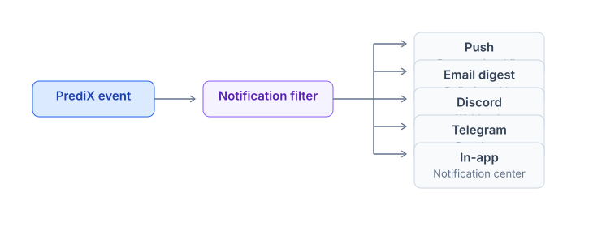
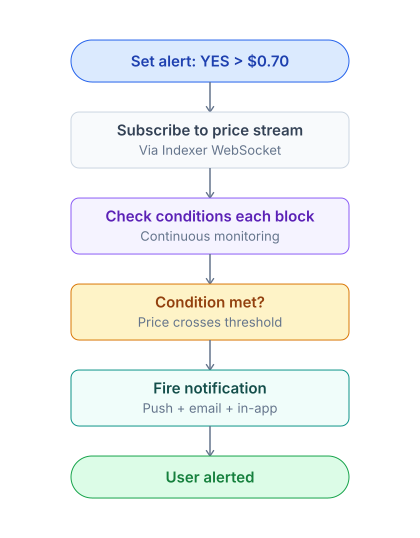

# Notifications & alerts

PrediX delivers notifications across multiple channels — push, email, Discord, Telegram, and in-app — with granular controls for every event type.

### How notifications work

PrediX groups notifications into six categories: **trading**, **market events**, **LP**, **social**, **rewards**, and **governance**. Each category can be toggled independently per channel, so you can receive order fills via push, rewards as a weekly email, and skip the rest.

All notifications respect a strict per-channel preferences matrix. Marketing is **off by default** and only sent if you explicitly opt in.

### Channels

> PrediX supports five delivery channels covering web, mobile, and external messaging platforms.



| Channel             | Realtime    | Setup              | Best for                 |
| ------------------- | ----------- | ------------------ | ------------------------ |
| **In-app**          | Yes         | Default ON         | All users                |
| **Browser push**    | Yes         | Allow permission   | Active web users         |
| **Mobile push**     | Yes         | Install PWA / app  | Mobile-first users       |
| **Email**           | No (digest) | Add email + verify | Passive monitoring       |
| **Discord webhook** | Yes         | Paste URL          | Power users, communities |
| **Telegram bot**    | Yes         | `/connect` command | Primary mobile alerts    |


In-app notifications are ON by default and require no setup. All other channels are opt-in.&#x20;


### Notification types

PrediX groups notifications into six categories. Each category can be toggled independently per channel — for example, order fills via push, rewards via email only.

#### <mark style="color:orange;">Trading</mark>

Events tied to your orders and open positions.

* **Order fill** — limit order matched (full or partial).
* **Order cancel** — cancelled by you or due to market resolution.
* **Slippage exceeded** — transaction failed due to slippage.
* **Position underwater** — position > $50 with unrealized loss > 20%.

#### <mark style="color:orange;">Market events</mark>

Lifecycle changes on markets where you hold tokens.

* **Resolve** — a market you hold tokens in has resolved.
* **Refund mode enabled** — a market you hold tokens in has entered refund mode.
* **Pause** — a market you hold tokens in has been paused.
* **EndTime warning** — a market you hold tokens in is < 24h, < 1h, or < 10 minutes from endTime.

#### <mark style="color:orange;">LP</mark>

Events for liquidity provider positions.

* **Fee accrued** — uncollected fees exceed $X.
* **Out of range** — a concentrated LP position has moved out of its price range.
* **Pool paused** — pool closed due to market resolution.

#### <mark style="color:orange;">Social</mark>

Interactions from other users.

* **New follower**
* **A trader you follow** opened a large position.
* **Comment / reply** on a market you commented on.
* **Mention** in a discussion.

#### <mark style="color:orange;">Rewards</mark>

Incentive and program milestones.

* **Badge earned**
* **Streak milestone** (7/30/100 days).
* **Weekly PRX distribution** ready to claim.
* **Referral commission** received.

#### <mark style="color:orange;">Governance</mark>

Protocol-level voting and decision events.

* **New vePRX proposal** (if you are a voter).
* **Voting deadline** approaching.
* **New gauge vote epoch**.

### Price alerts

> Price alerts let you set custom triggers on any market. Conditions are evaluated every block by the indexer, and the alert fires the moment the condition becomes true.



#### <mark style="color:orange;">Setting up an alert</mark>



### <mark style="color:orange;">Step 1: Access the Alert Menu</mark>

* Navigate to the Market Detail Page.
* Click on the Bell Icon to open the notification settings.



### <mark style="color:orange;">Step 2: Choose a Condition</mark>

Select the specific market trigger you want to monitor:

* Price above $X: Triggers when the price rises above your set target.
* Price below $X: Triggers when the price drops below your set target.
* Price change >= Y%: Triggers if the price fluctuates by $$ $Y\%$ $$ or more within a 2-hour window.
* Volume spike >= X%: Triggers if the trading volume increases by $$ $X\%$ $$ compared to the 24h average.



### <mark style="color:orange;">Step 3: Select a Notification Channel</mark>

Choose where you would like to receive your alerts:

* Push: Real-time mobile notifications.
* Email: Direct alerts to your inbox.
* Telegram: Instant messages via the Telegram bot.



### <mark style="color:orange;">Step 4: Save and Activate</mark>

* Review your settings to ensure accuracy.
* Click Save to activate your alert.




#### Managing alerts

`/settings/alerts` — lists all active alerts.

* Edit, pause, or delete individually.
* **Bulk actions** — delete all alerts for a resolved market.


#### <mark style="color:orange;">Limits</mark>

Active alert capacity scales with PRX stake:

| Tier           | Active alerts |
| -------------- | ------------- |
| Free           | 50            |
| Stake 1k+ PRX  | 200           |
| Stake 10k+ PRX | Unlimited     |

### <mark style="color:orange;">Notification preferences</mark>

Visit `/settings/notifications` for the full granular control matrix.

| Type           | In-app | Push | Email | Discord | Telegram |
| -------------- | ------ | ---- | ----- | ------- | -------- |
| Order fill     | Yes    | Yes  | No    | Yes     | Yes      |
| Market resolve | Yes    | Yes  | Yes   | Yes     | Yes      |
| Price alert    | Yes    | Yes  | Yes   | Yes     | Yes      |
| Daily digest   | No     | No   | Yes   | No      | No       |
| Marketing      | No     | No   | No    | No      | No       |


Granular customization per type. **Marketing is OFF by default** — only ON if you explicitly opt in.&#x20;


### <mark style="color:orange;">Email digest</mark>

Two digest formats deliver passive monitoring without continuous attention.

<mark style="color:orange;">**Daily digest**</mark> arrives at 08:00 local time with:

* Portfolio overnight summary (P\&L change).
* Markets approaching endTime in your portfolio.
* Recent activity from traders you follow.
* Top 5 movers (24h price change).
* Rewards earned.

<mark style="color:orange;">**Weekly digest**</mark> arrives every Monday with:

* Weekly performance.
* Suggested markets based on your interests.
* Calibration update.
* New features / governance updates.

Every email includes a one-click unsubscribe link.

### <mark style="color:orange;">Discord webhook</mark>

Route notifications to any Discord channel via webhook — no bot install required.



### Step 1: Create a Webhook in Discord

* Open your Discord server and go to Settings.
* Navigate to the Integrations tab.
* Select Webhooks and click the New Webhook button.



### Step 2: Copy the Webhook URL

* Customize the name and channel for your webhook if desired.
* Click the Copy Webhook URL button to save the link to your clipboard.



### Step 3: Connect to PrediX

* Switch over to the PrediX platform.
* Open Settings and find the Discord Webhook field.
* Paste your copied URL into the designated box.



### Step 4: Test the Connection

* Click the Send Test button.
* Check your Discord channel to confirm the test message was delivered successfully.



#### <mark style="color:orange;">Notification format</mark>

```
ORDER FILLED
Market: BTC > $500k 2027
Side:   BUY YES
Filled: 100 USDC @ $0.43
P&L:    —
TX:     unichain.xyz/tx/0x...
```

### <mark style="color:orange;">Telegram bot</mark>

Connect via the official PrediX bot for realtime mobile alerts and quick portfolio commands.



### <mark style="color:orange;">Step 1: Find the Bot</mark>

* Open the Telegram app.
* Search for the handle `@predix_alert_bot` and select it to open the chat



### <mark style="color:orange;">Step 2: Initiate Connection</mark>

* Start a chat with the bot.
* Enter the command `/connect` followed by your wallet address (e.g., `/connect 0x123...`).



### <mark style="color:orange;">Step 3: Verify Ownership</mark>

* Switch to the PrediX app to find the unique verification code generated for you.
* Paste that code directly into the Telegram bot chat.



### <mark style="color:orange;">Step 4: Confirmation</mark>

Once the code is processed, the setup is Done and your wallet is successfully linked for alerts.



#### Commands

* `/portfolio` — quick P\&L summary
* `/alerts` — list active alerts
* `/help` — full command list

### Privacy


**Privacy guarantees:**

* Email and phone are optional. Your address is the primary identifier.
* Notifications are encrypted in transit (TLS).
* Discord/Telegram channels use only the webhook URL — your auth tokens are never stored.
* Unsubscribe = delete data at any time.


### API integration

For developers integrating PrediX notifications into external systems:

```
GET    /api/v1/users/:address/notifications?unread=true
POST   /api/v1/users/:address/notifications/:id/read
POST   /api/v1/users/:address/alerts
DELETE /api/v1/users/:address/alerts/:id
```

Realtime updates via WebSocket: `wss://api.predix.app/v2/me/notifications` with an auth header.

Details: [API reference](../../developers-guide/api-reference.md).
