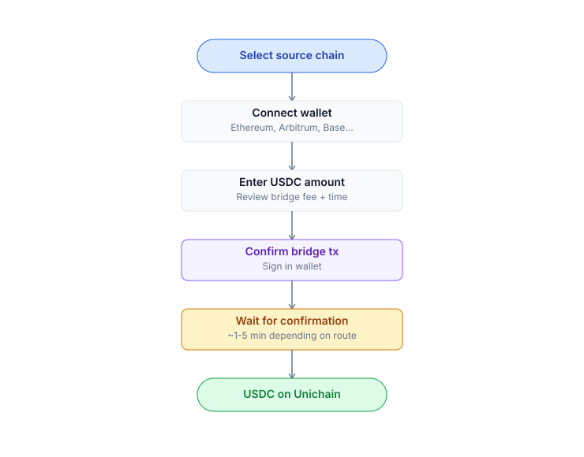

# Bridge to Unichain

PrediX uses USDC on Unichain as collateral. If your USDC is on another chain, you need to bridge it over.

## Supported Source Chains

| Chain                               | Default bridge in app                                                                                 | Time         | Estimated fee         |
| ----------------------------------- | ----------------------------------------------------------------------------------------------------- | ------------ | --------------------- |
| **Ethereum**                        | Across, Stargate                                                                                      | 5-15 min     | $2-8 (depends on gas) |
| **Base**                            | Across, Superbridge                                                                                   | 2-5 min      | $0.5-2                |
| **Arbitrum**                        | Across, Stargate                                                                                      | 2-5 min      | $0.5-2                |
| **Optimism**                        | Across, Superbridge                                                                                   | 2-5 min      | $0.5-2                |
| **Polygon**                         | LayerZero, Across                                                                                     | 5-10 min     | $1-3                  |
| **CEX** (Binance, Coinbase, OKX...) | Withdraw directly to Unichain (if supported by your CEX) or withdraw to Ethereum/Arbitrum then bridge | See CEX docs | CEX withdrawal fee    |

> **Tip**: Coinbase and Binance have added or are adding Unichain network support. Direct withdrawal saves you a bridge step.

## Bridge Widget (in-app)

PrediX UI has an integrated **Bridge widget** — no need to open Across/Stargate in a separate tab.

## Steps

1. Go to **Deposit** in the app header.
2. Select **Bridge from another chain**.
3. Choose source chain + USDC amount.
4. Quote: see fee + time estimate + final amount received.
5. **Approve USDC** on the source chain (once per token, uses Permit2 if supported).
6. **Deposit** — sign the tx on the source chain.
7. App switches network to Unichain and polls status.
8. Once complete → USDC arrives in your Unichain wallet. Ready to trade.

## Bridge Directly from CEX

Many CEXs now support Unichain withdrawal natively. This saves you a bridge step. Withdrawal flow:

1. On the CEX, select USDC → Withdraw.
2. Network: choose **Unichain** (if available). If not yet available → withdraw to Ethereum or Arbitrum, then bridge.
3. Paste your Unichain wallet address (PrediX UI has a copy button).
4. Confirm 2FA / email.
5. Wait for CEX processing (5-30 min depending on the CEX).

> **Important**: Test with a small amount ($10) the first time. Wrong network = lost funds with no recovery.

## Gas Fees (native ETH)

To pay transaction fees on Unichain you need a small amount of **ETH on Unichain**:

| Wallet type                 | Gas mechanism                                                                        |
| --------------------------- | ------------------------------------------------------------------------------------ |
| **Passkey + Smart Account** | Paymaster auto-pays in USDC. Sponsorship covers gas if eligible — no ETH needed.     |
| **Crypto Wallet (EOA)**     | You pay ETH directly. Bridge ETH using the same widget — select ETH instead of USDC. |


**Unichain gas is extremely cheap** — typical trade tx costs **\~$0.001–0.01**. A one-time bridge of $5 worth of ETH lasts thousands of transactions for EOA users.


## Reverse Bridge (Unichain → another chain)

Same UI, opposite direction:

1. Click **Withdraw** in the app header
2. Select **Bridge to another chain**
3. Choose destination + amount
4. Sign tx on Unichain
5. Wait for bridge completion (2–15 min)

***

## Slippage & Quote

Bridges involve **slippage** (USDC prices across chains have a small spread).

* **Across, Stargate**: typically 0.05-0.2% slippage.
* The app quote shows: amount out **after deducting fees + slippage**.
* If prices move significantly during the bridge, you may receive a refund to the source chain (Across/LayerZero handle this case).

## If the Bridge Gets Stuck

* Across, Stargate: usually auto-complete within 1-30 minutes. If nothing after 1 hour: check the source chain explorer (tx confirmed?), check the destination chain (UserOp/relay arrived?).
* Contact bridge support directly — PrediX does not operate bridges, only integrates the UI.
* Need help: [Discord](../../resources/links.md) #bridge-support.

## Reverse Bridge (Unichain → Another Chain)

Same UI:

1. **Withdraw** in the header.
2. **Bridge to another chain**.
3. Choose destination + amount.
4. Sign tx on Unichain.
5. Wait for bridge completion.

## Native ETH for Gas

If you use a **crypto wallet (EOA)**, you need ETH on Unichain to pay gas:

* Bridge using the same widget: select **ETH** instead of USDC.
* Only a small amount needed — Unichain gas is very cheap (\~$0.001-0.01 / tx).
* **Passkey + Smart Account users**: gas is paid via paymaster (auto-pay in USDC, or covered by sponsorship if eligible). The sponsorship program applies to both account types.

## Safety Questions

* **Is bridging safe?** PrediX integrates bridges with billions in TVL that have undergone multiple audit rounds (Across, Stargate, LayerZero). However, cross-chain bridges are **the largest attack vector in DeFi history** ($2B+ exploited 2022-2024). Only bridge the amount you need — do not hold funds long-term on bridge contracts.
* **Does PrediX hold my funds during bridging?** No. The bridge contracts belong to third parties (Across, Stargate). PrediX only provides the UI for convenience.
* **Where do bridge fees go?** To the relayers / LPs of the respective bridge protocol. PrediX does not charge bridge fees.

### Troubleshooting

Bridge stuck — nothing after 1 hour

Across and Stargate usually auto-complete within 1–30 minutes. If nothing happens after 1 hour:

1. Check the **source chain explorer** with your tx hash — is the tx confirmed?
2. Check the **destination chain** — has the UserOp / relay arrived?
3. Contact the bridge support directly (PrediX integrates the UI but does not operate bridges)
4. Or ask in the PrediX Discord `#bridge-support` channel

Sent CEX withdrawal to wrong network

❌ Funds are likely unrecoverable. PrediX has no access to CEX-originated transactions. Contact your CEX support immediately with the tx hash — some CEXs can recover funds sent to a network they support, but this is rare and slow.

**Prevention**: always test with a $10 transaction the first time.

Slippage too high — quote unfavorable

Bridge slippage above 0.5% usually means low liquidity at that moment. Try:

* Wait 5–10 minutes and re-quote
* Use a smaller amount (less slippage on smaller trades)
* Switch source chain if you have USDC on multiple chains

USDC arrived but not showing in app

1. Refresh the page (the app polls every 10s but a manual refresh forces re-fetch)
2. Verify your wallet is connected to **Unichain** (Chain ID `130` mainnet / `1301` testnet)
3. Check the USDC contract address matches the one in Network Info
4. If still missing after 5 minutes, check the destination explorer — the relay may still be in flight

Need ETH for gas but don't have any

EOA users need a tiny amount of ETH on Unichain. Options:

* **Bridge ETH** using the same Bridge widget — select ETH instead of USDC
* **Direct CEX withdrawal** of ETH to Unichain (if your CEX supports it)
* **Switch to Passkey** — Smart Account users pay gas in USDC via paymaster, no ETH needed

Bridge widget shows "no routes available"

The bridge aggregator could not find a route at this moment. Try:

* Switch source chain
* Wait 1–2 minutes and retry (liquidity replenishes)
* Use a different bridge directly (Across, Stargate UI) and send to your Unichain address manually

***
