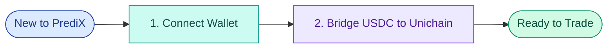

# Get Ready

Set up your wallet and fund your account — everything you need before placing your first trade.

### Overview

Before you can trade on PrediX, you need to complete two one-time setup steps:

1. **Connect a wallet** — choose between Passkey (recommended for new users) or a crypto wallet like MetaMask
2. **Get USDC on Unichain** — bridge from another chain, or deposit directly from a CEX

The whole setup takes **\~2 minutes**. After this, you're ready to trade and won't need to repeat these steps unless you switch wallets or run out of USDC.

### What You'll Need

| Requirement                        | Why                                                                                                              |
| ---------------------------------- | ---------------------------------------------------------------------------------------------------------------- |
| **A wallet**                       | To sign transactions and hold your shares. Choose Passkey (web2 UX) or a crypto wallet (MetaMask, Rainbow, etc.) |
| **USDC on Unichain**               | All trading on PrediX uses USDC as collateral. Markets are denominated in USDC                                   |
| **A small ETH balance** (EOA only) | For gas fees. Passkey users have gas covered by paymaster — no ETH needed                                        |


**No crypto background needed.** If you're new to crypto, use **Passkey** — sign in with Face ID or Touch ID, no seed phrase, no browser extension. You can buy USDC directly in the app.


### Setup Steps

#### Step 1 — Connect Wallet

Choose how you want to sign in:

* **Passkey** — biometric authentication (Face ID, Touch ID, Windows Hello). Web2-like UX, no seed phrase.
* **Crypto wallet** — MetaMask, Rainbow, Coinbase Wallet, or any WalletConnect-compatible wallet.

#### Step 2 — Bridge to Unichain

Get USDC on the Unichain network. Two options:

* **Bridge from another chain** — if you have USDC on Ethereum, Base, Arbitrum, Optimism, or Polygon
* **Direct CEX withdrawal** — withdraw USDC directly from Binance, Coinbase, OKX, or other CEXs that support Unichain network.

### After Setup

Once you've connected a wallet and have USDC on Unichain, you're ready to trade:

| Next                              | What you'll do                                  |
| --------------------------------- | ----------------------------------------------- |
| **Read the Trading Overview**     | Understand how PrediX's hybrid CLOB + AMM works |
| **Place your first Market Order** | Buy YES or NO at the best available price       |
| **Try a Limit Order**             | Set your own price and earn maker rebates       |
