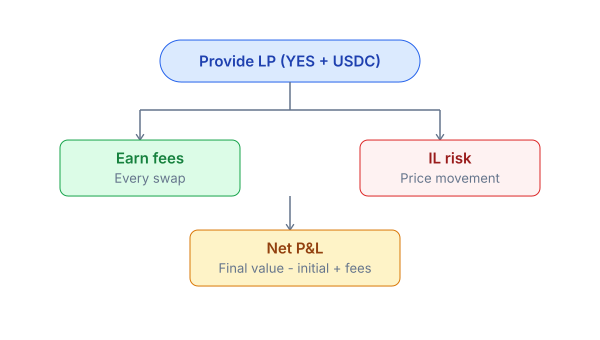
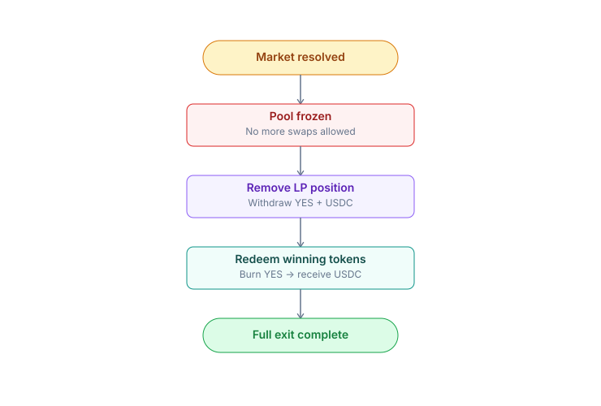

# Provide liquidity (LP)

Provide liquidity to market pools and earn fees from every swap executed through the AMM. PrediX uses Uniswap v4 pools where LPs deposit **YES/USDC** or **NO/USDC** liquidity within a selected price range and receive a **Uniswap v4 LP** position NFT.

> * The YES-USDC pool (and optionally NO-USDC) is a standard Uniswap v4 pool.
> * You deposit a pair of tokens into a specific price range → receive an **LP NFT** (Uniswap v4 PositionManager).
> * For each swap through the pool, you earn fees pro-rata based on your share.
> * You can remove liquidity at any time (except after a market resolves and the pool closes).

Unlike traditional AMMs, liquidity in prediction markets carries directional outcome risk. LP profitability depends not only on swap fees, but also on how the market resolves. PrediX supports concentrated liquidity ranges, LP protection hooks, dynamic fees, and optional gauge incentives through vePRX voting.

***

### Risk vs Reward

Being an LP is a **directional bet** — you lose if the market resolves toward the side you did not expect. Make sure you understand impermanent loss (IL) and outcome risk before providing liquidity.



***

### How to Provide LP



<mark style="color:$warning;">**Step 1: Open Liquidity Tab**</mark>

* Go to the market detail page and open the **Liquidity tab.**



<mark style="color:$warning;">**Step 2: Choose Pool**</mark>

* Select a liquidity pool: **YES-USDC** or **NO-USDC** (if both are available).



<mark style="color:$warning;">**Step 3: Select Price Range**</mark>

Choose between:

* **Full range**: $0.01 - $0.99. Safest option, lower fee earnings.
* **Concentrated**: e.g. $0.40 - $0.60. Higher earnings, higher IL risk if the price moves out of range.



<mark style="color:$warning;">**Step 4: Enter Deposit Amount**</mark>

* Enter the USDC amount + YES amount (the UI auto-balances based on the current price).



<mark style="color:$warning;">**Step 5: Auto Split (Optional)**</mark>

* If you lack YES: the app suggests **Split USDC → YES + NO** (minting both from USDC), and auto-fills the amount.



<mark style="color:$warning;">**Step 6: Preview Position**</mark>

Need Review:

* total deposit
* estimated APR
* selected price range



<mark style="color:$warning;">**Step 7: Add Liquidity**</mark>

* Click **Add Liquidity** and **Confirm** the transaction.



<mark style="color:$warning;">**Step 8: Receive LP Position**</mark>

* Your LP position NFT appears in your wallet and can be managed from the **Portfolio → Liquidity** tab.



***

### How to Claim Fees



<mark style="color:$warning;">**Step 1: Open Liquidity Portfolio**</mark>

* Go to **Portfolio → Liquidity** to view your active LP positions.



<mark style="color:$warning;">**Step 2: Check Unclaimed Fees**</mark>

* Each position card displays accumulated fees in USDC + outcome tokens (USDC + YES).



<mark style="color:$warning;">**Step 3: Collect Fees**</mark>

* Click **Collect** → fees are claimed to your wallet. No protocol fee. Gas is paid by the user by default
* Sponsor coverage applies if the user qualifies for the program (applies to both account types).




**You can compound by re-depositing the claimed fees into the pool to increase your position.**


***

### How to Remove LP



<mark style="color:$warning;">**Step 1: Select LP Position**</mark>

* Go to **Portfolio → Liquidity** and choose a position.



<mark style="color:$warning;">**Step 2: Choose Remove Amount**</mark>

* Click **Remove** and select the withdrawal percentage (25% / 50% / 100%).



<mark style="color:$warning;">**Step 3: Preview Withdrawal**</mark>

* Review the USDC and outcome tokens (USDC + YES) you will receive.



<mark style="color:$warning;">**Step 4: Confirm Removal**</mark>

* Confirm the transaction.&#x20;
* Tokens are returned to your wallet in the same transaction; the LP NFT is burned (or its liquidity is reduced for partial withdrawals).



***

### After Market Resolution

The pool closes — no more trading or adding liquidity.



You can:

* **Remove liquidity** to retrieve USDC + any remaining outcome tokens.
* **Redeem** the winning outcome token → 1 USDC per token.
* The losing token = $0.

***

### Impermanent loss (IL) in prediction markets

Unlike standard AMM pairs (ETH/USDC), outcome token prices are bounded between $0.01 and $0.99. IL follows a distinct pattern:

```
YES-USDC pool created when YES = $0.50:
- Deposit: 100 USDC + 200 YES = total $200 (200 YES × $0.50 + 100 USDC)
- Suppose YES → $0.80 (new information leads the market to believe the event will occur)
- AMM rebalances: fewer YES, more USDC (constant product k)
- After rebalance: e.g. 150 USDC + 125 YES
- Total = 150 + 125 × 0.80 = 150 + 100 = $250

If you had held instead of LP:
- Held 100 USDC + 200 YES = 100 + 160 = $260

IL = $260 - $250 = $10 (3.85% vs hold)
```


IL is offset by earned fees. If volume is high enough → fees > IL → net profit.


***

### LP strategies

<details>

<summary><mark style="color:$primary;"><strong>Concentrated Narrow</strong></mark></summary>

* Set a tight range ($0.40-$0.60) when you believe the price will fluctuate within that range. Highest earnings when the price sits in the middle of the range. Risk: if the price moves out of range, the position becomes entirely one token and earns no fees until the price returns.

</details>

<details>

<summary><mark style="color:$primary;"><strong>Concentrated Wide</strong></mark></summary>

* Range $0.20-$0.80. Safer, moderate earnings.

</details>

<details>

<summary><mark style="color:$primary;"><strong>Full Range</strong></mark></summary>

* $0.01-$0.99. Safest, lowest earnings. Best suited for passive LPs.

</details>

<details>

<summary><mark style="color:$primary;"><strong>Single-sided LP</strong></mark></summary>

* Deposit only USDC into a range above the current YES price. When the price rises into your range, USDC converts to YES. This tactic functions like a "scale buy".

</details>

<details>

<summary><mark style="color:$primary;"><strong>Boost from</strong></mark> <a href="../../economics/prx-economy/"><mark style="color:$primary;"><strong>Gauge Voting</strong></mark></a><mark style="color:$primary;"><strong>.</strong></mark></summary>

LPs can receive **subsidies** from the treasury via [gauge voting](../../economics/veprx-gauge.md):

1. vePRX holders vote on which pools receive subsidies.
2. The treasury distributes subsidies proportional to vote share.
3. Pools with more votes → LPs earn fees + PRX subsidies → higher APR.

_Track gauge rankings in **Liquidity** → **Gauge** tab._

</details>

<details>

<summary><mark style="color:$primary;"><strong>Tax &#x26; Accounting</strong></mark></summary>

* LP fees are collected in USDC + outcome tokens. Each claim event counts as income (for tax purposes, depending on jurisdiction).&#x20;
* Export CSV from your portfolio.

</details>

***

### API Integration

LP positions are accessible via:

* Indexer: `GET /api/users/:address/lp-positions`
* BE: `GET /api/v1/users/:address/lp-positions`


Details: [Indexer API](../../developers-guide/api-reference.md#indexer-endpoints).

