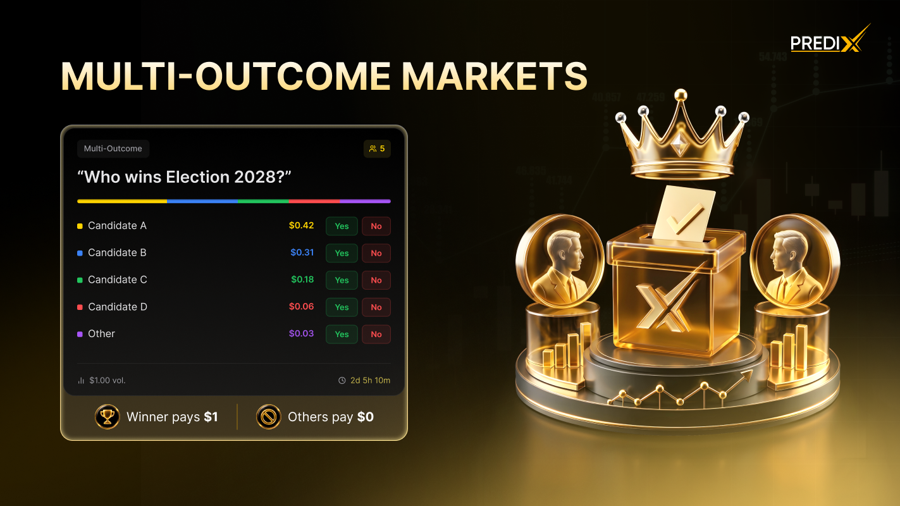
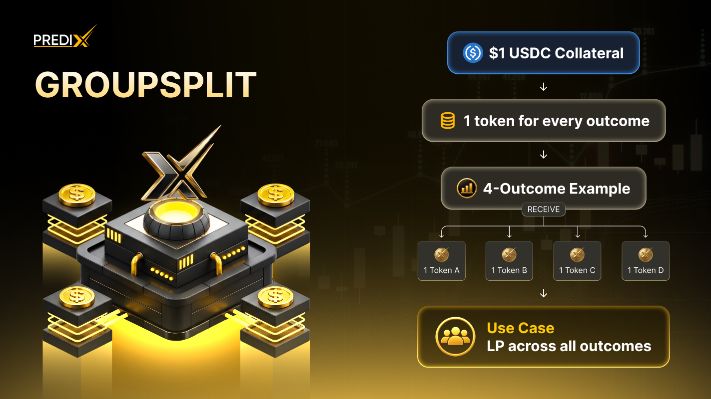
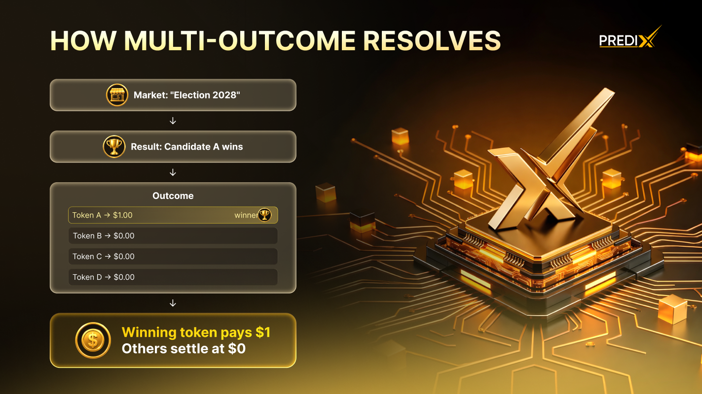

# Multi-Outcome Markets

<figure><figcaption></figcaption></figure>

Not every question has a yes/no answer. **"Who wins the 2026 FIFA World Cup?"** has 32 possible answers, not 2. Multi-outcome markets let you trade events where exactly **one out of many** possible outcomes will be true.

PrediX implements multi-outcome markets as a **group of binary markets** — each outcome is its own YES/NO market, all linked under one **MarketGroup**. When the event resolves, the winning outcome's YES pays `$1`, every other outcome's NO pays `$1`, and the rest pay `$0`.

<figure><figcaption></figcaption></figure>

This design has a key property: **only one outcome wins**. If Brazil wins, Brazil-YES = `$1`, all other countries' YES = `$0`. The MarketGroup contract enforces this — you can't have two winners.

***

### How It's Different from Binary Markets

| Feature                  | Binary Market                | Multi-Outcome Market          |
| ------------------------ | ---------------------------- | ----------------------------- |
| **Question shape**       | "Will X happen?"             | "Which of N will happen?"     |
| **Outcomes**             | 2 (YES/NO)                   | N (one YES, rest NO)          |
| **Token pairs**          | 1 (YES + NO)                 | N (YES + NO per outcome)      |
| **AMM pools**            | 1                            | N (one per outcome)           |
| **Resolution**           | Outcome = `true` or `false`  | Outcome = `winning_index`     |
| **Price sum constraint** | YES + NO = `$1` (per market) | All YES prices ≈ `$1` (total) |

The biggest mental shift: in a multi-outcome market, the **sum of all YES prices ≈ $1** (it represents 100% probability distributed across outcomes).

### Example — 2026 FIFA World Cup

Imagine a market: **"Which country wins the 2026 World Cup?"**

| Outcome              | YES Price | Implied Probability |
| -------------------- | --------- | ------------------- |
| **Brazil**           | `$0.22`   | 22%                 |
| **France**           | `$0.18`   | 18%                 |
| **Argentina**        | `$0.16`   | 16%                 |
| **England**          | `$0.12`   | 12%                 |
| **Spain**            | `$0.10`   | 10%                 |
| **Germany**          | `$0.08`   | 8%                  |
| **Netherlands**      | `$0.05`   | 5%                  |
| **Other (25 teams)** | `$0.09`   | 9% (combined)       |
| **Total**            | `$1.00`   | 100%                |

You can:

<table data-view="cards"><thead><tr><th></th><th></th></tr></thead><tbody><tr><td><mark style="color:orange;"><strong>Buy Brazil-YES at</strong><strong> </strong><strong><code>$0.22</code></strong></mark></td><td>if Brazil wins, pays <code>$1</code> (4.5× return)</td></tr><tr><td><mark style="color:orange;"><strong>Buy France-NO at</strong><strong> </strong><strong><code>$0.82</code></strong></mark></td><td>if France doesn't win, pays <code>$1</code> (1.22× return)</td></tr><tr><td><mark style="color:orange;"><strong>Sell shares of any outcome</strong></mark></td><td>the same way you would on a binary marke</td></tr></tbody></table>

Each outcome trades on its own Market Order, Limit Order, or via the AMM — exactly like binary markets.

***

### GroupSplit & GroupMerge

For multi-outcome markets, PrediX provides **GroupSplit** and **GroupMerge** — capital-efficient versions of Split & Merge for multiple outcomes at once.

#### <mark style="color:orange;">GroupSplit</mark>

<figure><figcaption></figcaption></figure>

**Deposit `$1 USDC` → receive `1 YES + 1 NO` for every outcome in the group.**

<figure><figcaption></figcaption></figure>

But wait — that doesn't sum to `$1`. Why?

Because **only the winning YES + 31 losing NO** pay. The 31 losing YES = `$0`, and the 1 winning NO = `$0`. Net effect: you get exactly your `$1 USDC` back (minus the winning YES which is the one you'd actually "want").

In practice, traders use GroupSplit to **sell the YES tokens they don't believe in** at market prices and hold the YES they do believe in.

#### <mark style="color:orange;">GroupMerge</mark>

**Deposit `1 YES on every outcome` → receive `$1 USDC` back.**

If you hold equal amounts of YES across all outcomes (e.g., `1 Brazil-YES + 1 France-YES + ... + 1 Other-YES`), you can burn them all and reclaim `$1 USDC`.

This is useful for:

* **Exit liquidity**: get out of a multi-outcome position without selling each leg
* **Arbitrage cleanup**: after exploiting price discrepancies, reset to USDC
* **Capital recycling**: redeem unused outcome positions back to cash

***

### Arbitrage in Multi-Outcome Markets

Because **all YES prices should sum to `$1`** (probabilities total to 100%), any deviation creates **risk-free profit**.

<mark style="color:$primary;"><strong>Scenario 1 — Sum &#x3C; $1 (Undervalued)</strong></mark>

If sum of all YES prices = `$0.92`:

1. Buy `1 YES of every outcome` → costs `$0.92`
2. At resolution, exactly one of those pays `$1`
3. **Profit: `$0.08`** (less gas)

<mark style="color:$primary;"><strong>Scenario 2 — Sum > $1 (Overvalued)</strong></mark>

If sum of all YES prices = `$1.07`:

1. **GroupSplit** `$1 USDC` → get `1 YES + 1 NO` per outcome
2. Sell every YES at market = `$1.07 received`
3. **Profit: `$0.07`** (you keep the NO tokens, but they collectively are worth `~$0` after resolution since only 1 NO loses)

These arbitrages keep prices honest. Bots run them continuously, so manual opportunities last seconds.

***

### Trading on Multi-Outcome Markets

Trading each outcome works **exactly like a binary market** — same Market Order, Limit Order, Split, Merge operations:

| Action                          | What happens                                                                |
| ------------------------------- | --------------------------------------------------------------------------- |
| **Buy Brazil-YES**              | Buy YES shares on Brazil's binary sub-market (its own orderbook + AMM pool) |
| **Sell Brazil-NO**              | Sell NO shares on Brazil's binary sub-market                                |
| **Limit order on France-YES**   | Rest on France's CLOB at your price                                         |
| **Split on a specific outcome** | Convert USDC → YES + NO on one outcome (not all)                            |
| **GroupSplit**                  | Convert USDC → YES + NO on every outcome at once                            |

You can also place orders **across multiple outcomes simultaneously** — for example, "Buy Brazil-YES AND France-YES" as a diversified position.

***

### Resolution Behavior

When a multi-outcome market resolves, the MarketGroup contract settles **all sub-markets in a single transaction**:

<figure><figcaption></figcaption></figure>

<figure><figcaption></figcaption></figure>

After resolution:

| Token type                                             | Final value | Action                         |
| ------------------------------------------------------ | ----------- | ------------------------------ |
| **Winner's YES** (e.g., Brazil-YES)                    | `$1`        | Redeem for USDC                |
| **Winner's NO** (e.g., Brazil-NO)                      | `$0`        | Worthless; hide from watchlist |
| **Loser's YES** (e.g., France-YES, Argentina-YES, ...) | `$0`        | Worthless                      |
| **Loser's NO** (e.g., France-NO, Argentina-NO, ...)    | `$1`        | Redeem for USDC                |
|                                                        |             |                                |

***

### Use Cases

<mark style="color:$primary;"><strong>1. Concentrated bet on a favorite</strong></mark>

You think Brazil is significantly undervalued at `$0.22`. Real probability is `~35%` in your view.

**Strategy**: Buy `$1,000` of Brazil-YES at `$0.22` = `4,545 shares`.

* If Brazil wins: receive `$4,545` (4.5× return)
* If Brazil loses: lose `$1,000`

Expected value = `0.35 × $4,545 - 0.65 × $1,000 = $1,591 - $650 = +$941`

This is a high-conviction directional bet.

<mark style="color:$primary;"><strong>2. Diversified portfolio across favorites</strong></mark>

You think the top 4 favorites are all reasonable but you can't pick one. Spread `$1,000` across them.

* `$250` Brazil-YES at `$0.22` → `1,136 shares` → pays `$1,136` if Brazil wins
* `$250` France-YES at `$0.18` → `1,389 shares` → pays `$1,389` if France wins
* `$250` Argentina-YES at `$0.16` → `1,562 shares` → pays `$1,562` if Argentina wins
* `$250` England-YES at `$0.12` → `2,083 shares` → pays `$2,083` if England wins

If any one of them wins, you profit. Combined probability `~68%`. Lower variance, lower upside.

<mark style="color:$primary;"><strong>3. Fade the longshot</strong></mark>

You think Germany has zero chance at `$0.08`. Sell Germany-YES (or equivalently, buy Germany-NO).

**Buy `$1,000` of Germany-NO at `$0.92`** → `1,087 shares`.

* If Germany loses (or doesn't win): receive `$1,087` (+`$87` = +8.7%)
* If Germany wins: lose `$1,000`

Low-upside high-conviction fade. Effective when the longshot is overpriced.

<mark style="color:$primary;"><strong>4. Group arbitrage</strong></mark>

After scanning all outcomes, you notice the sum of all YES prices is `$0.96` (instead of `$1`).

**Strategy**: Buy `$1` worth of each outcome's YES (total cost `$0.96` for the group).

At resolution, exactly one of those YES tokens pays `$1`. Risk-free profit `$0.04` per dollar of group bought (less gas).

Note: this requires buying many small positions — only profitable at significant size or with low gas (Unichain).

<mark style="color:$primary;"><strong>5. Hedging an existing concentrated bet</strong></mark>

You bought `$1,000` of Brazil-YES. As tournament progresses, Brazil narrowly survives Round of 16 — you want to lock in some profit without selling Brazil-YES (price has moved to `$0.45`).

**Strategy**: GroupSplit `$300` → get YES + NO on every outcome.

* Sell the 31 YES tokens you don't want (Brazil-YES you keep)
* Net: you've reduced exposure while keeping upside on Brazil

***

### Common Multi-Outcome Market Types

PrediX supports several multi-outcome formats, each follows the same MarketGroup pattern under the hood.:

<table data-view="cards"><thead><tr><th></th><th></th></tr></thead><tbody><tr><td><mark style="color:orange;"><strong>Tournament winner</strong></mark></td><td>FIFA World Cup, NBA Finals, Wimbledon,...</td></tr><tr><td><mark style="color:orange;"><strong>Election outcome</strong></mark></td><td>US Presidential 2028, EU Parliament 2029,...</td></tr><tr><td><mark style="color:orange;"><strong>Award winners</strong></mark></td><td>Oscars Best Picture, MVP Awards,...</td></tr><tr><td><mark style="color:orange;"><strong>Price ranges</strong></mark></td><td>BTC price on Dec 31, 2026" with brackets <code>&#x3C;$50k</code>, <code>$50k-100k</code>, <code>$100k-150k</code>, <code>>$150k</code></td></tr><tr><td><mark style="color:orange;"><strong>Categorical</strong></mark></td><td>"Which K-pop group has #1 album in Q4?"</td></tr></tbody></table>

***

### How PrediX Differs from Polymarket's NegRisk

Polymarket implements multi-outcome markets using their **NegRisk** adapter on top of Conditional Token Framework (ERC-1155). PrediX uses **MarketGroup** with pure ERC-20 outcome tokens.

| Feature                       | Polymarket NegRisk           | PrediX MarketGroup                          |
| ----------------------------- | ---------------------------- | ------------------------------------------- |
| **Token standard**            | ERC-1155                     | ERC-20                                      |
| **Native Uniswap v4 trading** | ❌ Requires wrapper           | ✅ Direct                                    |
| **DeFi composability**        | ❌ Limited (ERC-1155 support) | ✅ Full (collateral, vaults, indices)        |
| **Liquidity per outcome**     | Shared via NegRisk AMM       | Independent (each outcome has its own pool) |
| **Multi-outcome resolution**  | Atomic via CTF               | Atomic via MarketGroup                      |

**PrediX outcome tokens are fully composable** — you can use Brazil-YES as collateral on Aave, wrap it in an index, or trade it on any DEX that supports ERC-20.
