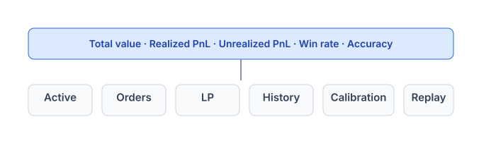
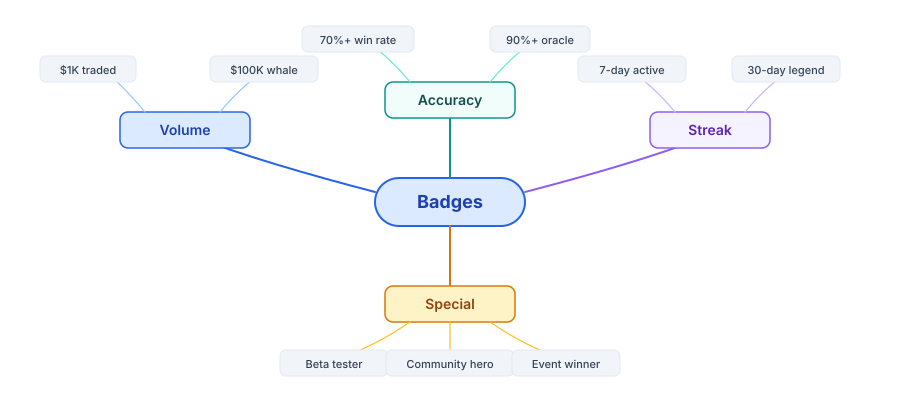

# Portfolio & P\&L

View all your positions, history, and P\&L at `/portfolio`.

## Overview screen



## Active positions

Each row:

<table><thead><tr><th>Market</th><th width="69">Side</th><th width="100">Balance</th><th width="105">Avg cost</th><th width="82">Spot</th><th width="118">Unrealized P&#x26;L</th><th>Action</th></tr></thead><tbody><tr><td>BTC > $100k before 2027</td><td>YES</td><td>205.30</td><td>$0.483</td><td>$0.62</td><td>+$28.20</td><td>Sell / Redeem</td></tr><tr><td>ETH > $5k in 2026</td><td>NO</td><td>50.00</td><td>$0.380</td><td>$0.42</td><td>+$2.00</td><td>Sell</td></tr></tbody></table>

* **Balance**: on-chain token count of YES/NO (the indexer hydrates cost basis).
* **Avg cost**: weighted-average purchase cost.
* **Spot**: blended price from AMM v4 + best bid/ask on the CLOB (pricing layer).
* **Unrealized P\&L**: `(spot - avgCost) × balance`.

## Realized vs unrealized P\&L


* **Realized** = P\&L from closed positions or redeemed tokens.
* **Unrealized** = not yet locked in; depends on the current spot price.

## History — 6 types

<table data-view="cards"><thead><tr><th></th><th></th><th></th></tr></thead><tbody><tr><td><mark style="color:orange;"><strong>Trade</strong></mark></td><td>Buy/sell via Router</td><td><code>Router.Trade</code></td></tr><tr><td><mark style="color:orange;"><strong>Order</strong></mark></td><td>Place/cancel/fill limit order</td><td><code>Exchange.OrderPlaced/OrderMatched/OrderCancelled</code></td></tr><tr><td><mark style="color:orange;"><strong>Split</strong></mark></td><td>Mint a YES+NO pair</td><td><code>MarketFacet.PositionSplit</code></td></tr><tr><td><mark style="color:orange;"><strong>Merge</strong></mark></td><td>Burn YES+NO → USDC</td><td><code>MarketFacet.PositionMerged</code></td></tr><tr><td><mark style="color:orange;"><strong>Claim</strong></mark></td><td>Redeem or refund</td><td><code>TokensRedeemed / MarketRefunded</code></td></tr><tr><td><mark style="color:orange;"><strong>LP</strong></mark></td><td>Add/remove/collect liquidity</td><td><code>PoolManager.ModifyLiquidity</code></td></tr></tbody></table>

Click any row → tx hash on the explorer.

## Calibration — measure prediction accuracy

Applies to markets that have already resolved.

### <mark style="color:orange;">Brier score</mark>

The mean squared deviation between the price at which you bought and the actual outcome.

```
Brier = mean[(outcome - your_buy_price)²]
```

Example:

* You buy YES @ $0.70 → event occurs (outcome=1) → Brier = `(1 - 0.7)² = 0.09`
* You buy NO @ $0.30 → event occurs → Brier = `(0 - 0.3)² = 0.09`

Low score = accurate pricing. High score = frequently wrong.

### <mark style="color:orange;">Accuracy band</mark>

A chart measuring: when you buy at price range X, what percentage of events actually occur?

| Your buy price            | Actual win rate | Assessment                                                          |
| ------------------------- | --------------- | ------------------------------------------------------------------- |
| `$0.30` (low confidence)  | 30%             | Well-calibrated                                                     |
| `$0.30` (low confidence)  | 70%             | **Underconfident** — you are too cautious; consider trading larger  |
| `$0.70` (high confidence) | 70%             | Well-calibrated                                                     |
| `$0.70` (high confidence) | 30%             | **Overconfident** — you are too confident; consider trading smaller |

The app plots your points on a scatter chart against the ideal diagonal (buy at $0.X → win X%). The closer to the diagonal, the more accurate your pricing.

## Performance replay

Re-watch your trading decisions over time:

* Select a period (7 days / 30 days / 90 days).
* Use the slider to time-travel.
* Each trade shows: market state at that moment, your decision, and the subsequent outcome.
* Insight: did you enter well or too early/late? Did you sell at the top or panic out?

A tool to help you recognize your own biases.

## Streaks & badges



Badges are NFTs — shareable and serve as profile signatures. Details: [Rewards & gamification](../economics/rewards.md).

## LP positions

The **Liquidity** tab in your portfolio:

* Each row = 1 LP NFT.
* Displays: pool, range, deposit value, current value, accrued fees, APR.
* Actions: **Collect** fees, **Add more**, **Remove**.

Details: [Liquidity provider](liquidity-and-market/provide-liquidity.md).

## Export & API

* **Export** tab → download a CSV of all history (for tax / accounting purposes).
* Developers can access directly:
  * Indexer: `GET /api/users/:address/portfolio`
  * BE: `GET /api/v1/users/:address/portfolio`

## After endTime, not yet resolved

When a market passes endTime but has not been resolved:

* Trading is closed; you cannot sell.
* Unrealized = `cost basis × balance` (hold until resolution).
* The UI shows a **Pending resolve** badge.
* After resolution → winning YES = $1, losing NO = $0 → P\&L is settled.

## Rebalance suggestions

The app analyzes your portfolio and suggests:

* Which positions have excessive exposure (concentration risk)?
* Which markets are approaching endTime — should you close beforehand?
* Which limit orders are stale (price far from the market)?

Notifications can be toggled in [Settings](../resources/faq.md).

### Troubleshooting

<details>

<summary><mark style="color:orange;">Balance shows zero but I just bought shares</mark></summary>

**Reason:** Indexer lag. After a successful tx, the indexer typically catches up within 5–15 seconds.

**Fix:**

* Wait 15 seconds and refresh
* If still missing after 1 minute, check the explorer with your tx hash — confirm the trade actually executed
* Force a fresh fetch with `?nocache=1` URL param

</details>

<details>

<summary><mark style="color:orange;">Unrealized P&#x26;L looks wrong</mark></summary>

**Reason:** Spot price may have just updated, or your cost basis includes a recent trade that's still being indexed.

**Fix:**

* Check the **Avg Cost** field — does it match what you'd compute from your fills?
* If Avg Cost is wrong, the indexer is rebuilding — wait 30 seconds and refresh
* If still wrong after 5 minutes, report on Discord `#bug-reports` with your wallet address

</details>

<details>

<summary><mark style="color:orange;">Cannot sell — "trading closed"</mark></summary>

**Reason:** The market has passed `endTime` and is in the resolution window.

**Fix:** Wait for resolution. After the oracle posts the outcome, you can redeem winning shares for $1 each via the **Claim** action.

</details>

<details>

<summary><mark style="color:orange;">"Pending resolve" badge stuck for >48 hours</mark></summary>

**Reason:** Oracle dispute or delay (UMA markets can take longer if disputed).

**Fix:**

* Check the market's resolution status on its detail page
* For UMA markets: see if a dispute is open on the [UMA dApp](https://oracle.uma.xyz)
* For Chainlink markets: typically resolves within minutes — long delay means oracle issue
* Discord `#resolution` for status updates

</details>

<details>

<summary><mark style="color:orange;">CSV export missing recent trades</mark></summary>

**Reason:** Export uses the indexer which may lag by a few seconds.

**Fix:** Wait 30 seconds after your most recent trade and re-download. The CSV is generated on-demand from the latest indexer snapshot.

</details>

***
