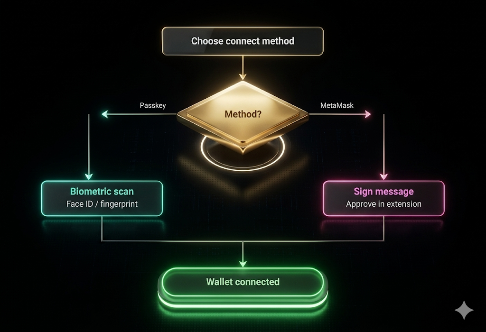
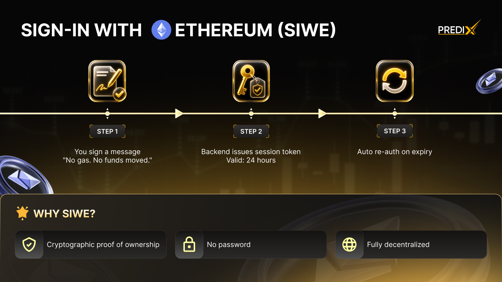

# Connect wallet

PrediX offers 2 sign-in methods, you maintain full control of your assets while trading at the best market prices.


**Both are non-custodial — nobody (including PrediX) holds your private key.**


<figure><figcaption></figcaption></figure>

### Choose connect method

|                        | Passkey + Smart Account                          | Crypto Wallet (EOA)                                   |
| ---------------------- | ------------------------------------------------ | ----------------------------------------------------- |
| **Experience**         | Web2-like, biometric                             | Traditional web3, sign each tx                        |
| **Browser extension**  | Not required                                     | Required (MetaMask, Rainbow...)                       |
| **Backup & recovery**  | Cloud sync (iCloud / Google), or a second device | BIP-39 seed phrase (12-24 words)                      |
| **Hardware wallet**    | No (private key in Secure Enclave)               | Yes (Ledger, Trezor)                                  |
| **Gas fees**           | Pay via paymaster (USDC)                         | Pay ETH directly (Unichain is cheap \~$0.001-0.01/tx) |
| **Batch transactions** | Yes (1-click `[approve, swap]` atomic)           | No (2 separate txs)                                   |
| **First-time sign-up** | \~5 seconds biometric                            | Already have a wallet → instant                       |
| **Best for**           | New users · fast onboarding                      | DeFi users · large custody · hardware wallets         |

<figure><figcaption></figcaption></figure>

Choose connect method: Passkey or Crypto Wallet — both non-custodial

***

### Method 1: Passkey + Smart Account

Passkeys use the **WebAuthn** standard — biometric (Touch ID, Face ID, Windows Hello) or your device PIN for authentication. The private key is generated and stored in the **Secure Enclave / TPM** and cannot be exported.

<mark style="color:yellow;background-color:yellow;">**\[Insert Video Here]**</mark>

#### <mark style="background-color:$warning;">1. How to login?</mark>



<mark style="color:$warning;">**Step 1: Access the Portal**</mark>

* Open your browser and navigate to [_app.predix.app_](https://app.predix.app).
* Click the "**Sign up"** button to begin.



<mark style="color:$warning;">**Step 2: Choose Authentication Method**</mark>

* From the available options, select "**Continue with Passkey**".



<mark style="color:$warning;">**Step 3: Biometric Verification**</mark>

* Your browser will trigger a system prompt for biometric authentication (such as FaceID, TouchID, or Windows Hello).
* Confirm the prompt to verify your identity securely.



<mark style="color:$warning;">**Step 4: Smart Account Generation**</mark>

* Your Smart account counterfactual address will appear immediately.




**Note:**

* [x] Your account is officially deployed on-chain the moment you perform your first action.
* [x] On sign-up, the app deploys a **Kernel smart account (ERC-4337)** — an on-chain wallet contract that validates via passkey signature. All actions go through UserOps.


#### <mark style="background-color:$warning;">**2. Backup your account**</mark>

Choose at least one **backup method** on sign-up:



**Apple-native passkey sync**

Using the same Apple ID via iCloud Keychain.Passkeys automatically sync across:

* iPhone
* iPad
* Mac

**Best for:**

* Apple ecosystem users
* seamless multi-device login
* Face ID / Touch ID authentication



**Cross-device passkey access**

Allowing fast sign-in across desktop and mobile, Passkeys sync automatically across:

* Android devices
* Chrome browsers
* Google accounts

**Best for:**

* Android users
* Chrome-first workflows
* Multi-device convenience



**Physical security authentication**

Authentication requires plugging in or tapping the hardware key, Passkeys are stored directly on:

* YubiKey
* Titan Key
* Other FIDO hardware devices

**Best for:**

* Maximum account security
* Cold authentication
* Advanced users & institutions




**Single point of failure:**

* If you only have 1 device + no cloud sync + no hardware key backup → **Losing the device = losing the wallet**. Enable cloud sync or add a second device immediately after sign-up.


#### <mark style="background-color:$warning;">**3. Recovery - Lost Device**</mark>

| SCENARIO                                         | WHAT TO DO?                                                                                        |
| ------------------------------------------------ | -------------------------------------------------------------------------------------------------- |
| <ol><li>Cloud sync enabled</li></ol>             | ✅ Sign in on a new device with the same Apple ID / Google account — Passkey restores automatically |
| <ol start="2"><li>Second device paired</li></ol> | ✅ Use the second device to authenticate, then re-pair a new device                                 |
| <ol start="3"><li>Hardware key backup</li></ol>  | ✅ Plug in the Hardware Key on any device to restore access                                         |
| <ol start="4"><li>None of the above</li></ol>    | ❌ Wallet is unrecoverable                                                                          |


**Social recovery — TBA post-mainnet**

* Designate N trusted guardians; any M-of-N can co-sign to restore access.


### Method 2: Crypto Wallet (EOA)

Use your existing Web3 wallet — MetaMask, Rainbow, Coinbase Wallet, or any wallet that supports WalletConnect/Hardware Wallet.

#### <mark style="background-color:$warning;">1. How to connect Web3 wallet?</mark>



<mark style="color:$warning;">**Step 1: Initiate Connection**</mark>

* Navigate to the app header and click the "Connect Wallet" button.



<mark style="color:$warning;">**Step 2: Select Your Provider**</mark>

* Choose your preferred wallet from the list (e.g., MetaMask, Rainbow, WalletConnect, or Ledger).



<mark style="color:$warning;">**Step 3: Approve the Request**</mark>

* Your wallet extension or app will trigger a pop-up.
* Approve the connection request to link your wallet to the platform.



<mark style="color:$warning;">**Step 4: Secure Sign-In (SIWE)**</mark>

* Sign the SIWE (Sign-In With Ethereum) message to verify ownership of your address.


Note: This is an off-chain signature and incurs no gas cost.




#### <mark style="background-color:$warning;">2. When to use Web3 Wallet ?</mark>

* You already have a DeFi workflow with MetaMask + hardware wallet.
* Large custody balance — want standard BIP-39 seed phrase backup.
* Integration with other tooling (Frame, Rabby, Safe multisig).
* Prefer full control with no paymaster dependency.

***

### SIWE Session

Both methods use **SIWE (EIP-4361)** to create authenticated backend sessions through wallet signatures.

<figure><figcaption></figcaption></figure>

The client requests a challenge, the user signs the EIP-4361 message, and the backend verifies the ECDSA signature before creating a secure HTTP Only session cookie valid for 7 days.

<figure><figcaption></figcaption></figure>

SIWE Authentication Flow


**Additional Gas Fee:**

* By default, both methods require users to **pay their own gas**. Please ensure you have sufficient funds, as each transaction requires gas fees paid in **ETH on Unichain**.
* PrediX has a **sponsorship program** for eligible users (new user onboarding, stakers above threshold, campaign-eligible events) — applies to both account types:

- [x] Paymaster covers gas directly
- [x] Off-chain rebate/refund (mechanism announced pre-launch)

_**→ Eligibility criteria and sponsorship duration may change via governance vote.**_

