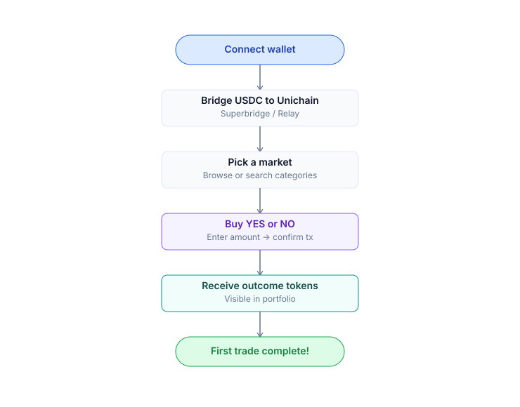

# Yes/No Markets

### How to Trade (Buy YES/NO Tokens)



<mark style="color:$warning;">**Step 1: Find a Market**</mark>

* Navigate to the [Markets page](https://app.predix.app/markets).
* Browse the list or use the search bar to find an event you are interested in.
* Click on the market card to open the Detail Page.



<mark style="color:$warning;">**Step 2: Access Trading Panel**</mark>

* On the right-hand side of the page, ensure the Buy tab is selected.



<mark style="color:$warning;">**Step 3: Choose Your Position**</mark>

Select your side based on your prediction:

* [x] YES: You believe the event will happen.
* [x] NO: You believe the event will not happen.



<mark style="color:$warning;">**Step 4: Enter USDC Amount**</mark>

* Input the USDC amount you want to spend (e.g., $$ $100$ $$).



<mark style="color:$warning;">**Step 5: Preview the Trade**</mark>

* Before confirming, check the preview details:

<mark style="color:$primary;"><strong>Tokens Received</strong></mark>

* The total amount of YES or NO tokens you will get.

<mark style="color:$primary;"><strong>Average Price</strong></mark>

* The cost per token based on current liquidity.

<mark style="color:$primary;"><strong>Slippage Estimate</strong></mark>

* The expected price impact of your trade.

<mark style="color:$primary;"><strong>Execution Split</strong></mark>

* The ratio of the trade filled via CLOB vs. AMM.




<mark style="color:$warning;">**Step 6: Confirm and Execute**</mark>

* Click the Buy button.
* Confirm the request in your wallet:
  * [Passkey Wallet](../wallet-setup/connect-wallet.md#method-1-passkey--smart-account): Use Touch ID / Face ID.
  * [EOA Wallet](../wallet-setup/connect-wallet.md#method-2-crypto-wallet-eoa): Approve the MetaMask (or other wallet) popup.



<mark style="color:$warning;">**Step 7: Completion**</mark>

* The transaction typically confirms in \~2 seconds on Unichain.
* Your new position will immediately appear in your [Portfolio](../portfolio.md).



***

### How to Sell a Position



<mark style="color:$warning;">**Step 1: Switch to the Sell Tab**</mark>

* Open the trading panel on the right side of the market detail page.
* Select the Sell tab.



<mark style="color:$warning;">**Step 2: Select Your Asset**</mark>

* Choose the specific tokens you currently hold (YES or NO) that you wish to liquidate.



<mark style="color:$warning;">**Step 3: Enter the Amount**</mark>

* Input the quantity of tokens you want to sell.
* You can also use the percentage shortcuts (e.g., 25%, 50%, Max) to quickly fill the amount.



<mark style="color:$warning;">**Step 4: Review and Confirm**</mark>

* Preview USDC received: Check the estimated amount of USDC that will be credited to your wallet after the sale.
* Confirm: Click the Sell button and approve the transaction in your wallet to complete the trade.




**The Router finds the best reverse path — drains CLOB bid orders first, swaps the remainder through AMM via**[ **CLOB & AMM Hybrid**](../../core-concepts/clob-amm-hybrid.md)**.**


***

### Exit or Hold Until Resolution

You can close your position anytime by [selling YES/NO tokens](./#how-to-sell-a-position) on the market before resolution. Profit or loss depends on the current market price relative to your entry price.

If you choose to **hold until the market resolves**, winning outcome tokens can be redeemed 1:1 for USDC, while losing tokens become worthless.


[**How to Redeem & Refund.**](../redeem-refund.md)


***

### Yes/No Markets Example

* Market context: _"BTC above $100k before 2027-01-01?"_.
* Current **YES price = $0.48**.
* You spend **100 USDC** to buy YES:

| Path                         | Amount in    | Avg price  | YES out       |
| ---------------------------- | ------------ | ---------- | ------------- |
| CLOB (existing limit orders) | 40 USDC      | $0.480     | 83.3 YES      |
| AMM swap                     | 60 USDC      | $0.485     | 122.7 YES     |
| **Total**                    | **100 USDC** | **$0.483** | **\~205 YES** |

If BTC exceeds $100k before the deadline:

* Market resolves YES = true.
* You redeem 205 YES → receive USDC. Profit > 100 USDC.

If the event doesn't happen:

* YES tokens = $0. Loss of 100 USDC.

***

### Trading Order Types

<table data-view="cards"><thead><tr><th></th><th></th></tr></thead><tbody><tr><td><a href="market-order.md">Market Order</a></td><td>Enter immediately at current price</td></tr><tr><td><a href="limit-order.md">Limit Order</a></td><td>Set a price and wait for it to fill</td></tr><tr><td><a href="split-and-merge.md">Split &#x26; Merge</a></td><td>Mint / Burn a YES+NO pair for market-making or reclaim USDC</td></tr></tbody></table>
