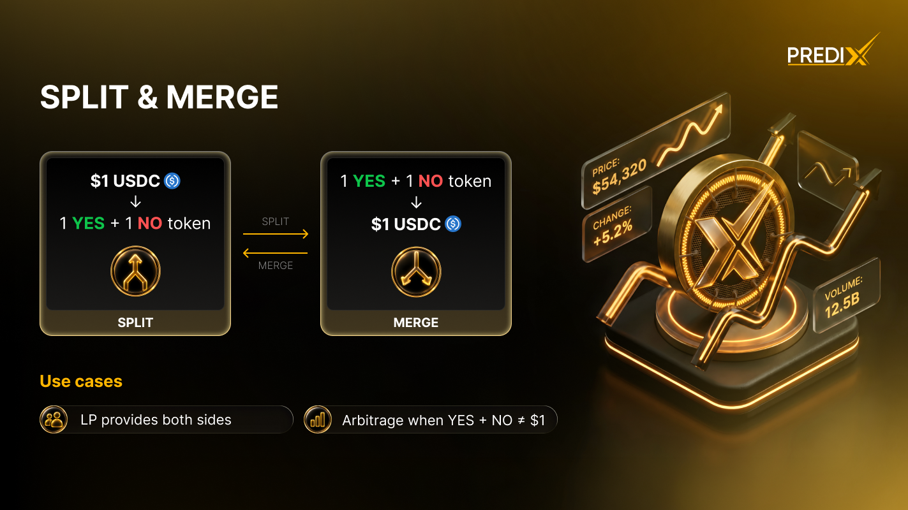

# Split & Merge

<figure><figcaption></figcaption></figure>

Prediction markets have two **native mechanisms** that don't exist in traditional financial instruments: **Splitting** and **Merging** shares. They're the protocol-level primitives that make prediction markets work - and they give you a way to enter or exit positions **without touching the orderbook**.

<figure><figcaption></figcaption></figure>

Both operations are **zero-fee** and **zero-slippage** - the protocol mints or burns shares 1:1 against USDC collateral locked in the Diamond contract.

***

### Splitting

**Split `$1 USDC` into `1 YES share` + `1 NO share`.**

This is useful when you want to take a position on one side without buying from the orderbook - split collateral, then sell the side you don't want at your own price (via Limit Order) or instantly (via Market Order).

<figure><figcaption></figcaption></figure>

#### How It Works



<mark style="color:orange;">**Step 1: Open the Utility Panel**</mark>

* Navigate to the specific Market Page you are interested in.
* Click on the Split / Merge tab (usually found in the trading or tools section).



<mark style="color:orange;">**Step 2: Enter Collateral Amount**</mark>

* Input the amount of USDC you wish to split (e.g., 100).



<mark style="color:orange;">**Step 3: Execute the Split**</mark>

* Click the Split button.
* Confirm the transaction in your wallet (e.g., Touch ID for passkey or MetaMask popup).



<mark style="color:orange;">**Step 4: Receive Tokens**</mark>

* The system will mint the outcome tokens based on your collateral.
* You will immediately receive an equal amount of both sides: `100 YES` + `100 NO`



<mark style="color:orange;">**Step 5: Manage Your Position (Optional)**</mark>

If you only wanted to hold one side, you can now Sell the side you don't want using a Market or Limit order to recoup a portion of your USDC.




**No fee, no slippage.** Splitting always gives you exactly 1:1 - `$100 USDC` becomes exactly `100 YES + 100 NO`, no matter the orderbook state.


***

### Merging

**Merge `1 YES share` + `1 NO share` back into `$1 USDC`.**

This lets you exit both sides of a position and recover your collateral **without selling on the orderbook**.

<figure><figcaption></figcaption></figure>

#### How It Works



<mark style="color:orange;">**Step 1: Open the Utility Panel**</mark>

* Navigate to the specific Market Page.
* Click on the Split / Merge tab.



<mark style="color:orange;">**Step 2: Switch Modes**</mark>

* By default, the panel may show "Split." Click to switch to Merge mode.



<mark style="color:orange;">**Step 3: Enter the Merge Quantity**</mark>

* Input the number of pairs you wish to merge (e.g., 50).


Note: To merge 50 pairs, you must hold at least `50 YES` tokens and `50 NO` tokens for that specific market.




<mark style="color:orange;">**Step 4: Execute the Merge**</mark>

* Click the Merge button.
* Confirm the transaction in your wallet (e.g., via FaceID/TouchID for passkeys or a signature for EOA).



<mark style="color:orange;">**Step 5: Completion**</mark>

* The `50 YES` + `50 NO` tokens are burned (removed from circulation).
* 50 USDC is immediately returned to your wallet balance.




**Merge requires equal amounts.** If you hold `100 YES + 80 NO`, you can only merge `80 pairs` (= `80 USDC`). The extra `20 YES` cannot be merged - sell them on the orderbook or hold to resolution.


***

### The Math - Why YES + NO = $1

Every market on PrediX is **fully collateralized**. For each `$1 USDC` locked in the Diamond, exactly `1 YES + 1 NO` exists in circulation. This creates a mathematical guarantee:

```
At resolution, exactly ONE side pays $1:
  - If event happens: YES = $1, NO = $0
  - If event doesn't: NO = $1, YES = $0

Before resolution:
  - YES_price + NO_price = $1 (always)
```

**Why?** Because anyone can split or merge at 1:1, the prices stay tied. If `YES = $0.40` and `NO = $0.50`, the total is `$0.90` - below `$1`. An arbitrageur can:

1. Buy `1 YES + 1 NO` for `$0.90`
2. Merge into `$1 USDC`
3. Profit `$0.10` risk-free

Arbitrage forces the prices back to `YES + NO = $1`. This is the foundation of prediction market pricing - and it's enforced by the **Split/Merge primitives** at the protocol level.

### Why Use Split / Merge?

| Benefit                       | Description                                                           |
| ----------------------------- | --------------------------------------------------------------------- |
| **Capital efficiency**        | Open and close positions without relying on orderbook liquidity       |
| **Better execution**          | Avoid paying the spread (no maker/taker fees on split/merge)          |
| **Always available**          | Works even when the orderbook is empty or the AMM has thin liquidity  |
| **Liquidity defragmentation** | Under the hood, enables better orderbook matching across YES/NO sides |
| **Arbitrage opportunities**   | Exploit `YES + NO ≠ $1` pricing inefficiencies                        |

### Real-World Use Cases

<details>

<summary><mark style="color:$primary;">1. Market-Making (provide liquidity both sides)</mark></summary>

You want to be a maker on both YES and NO sides of a market. Instead of:

* Buying YES separately
* Buying NO separately
* Paying spread + fees twice

You can:

1. Split `$1,000 USDC` → `1,000 YES + 1,000 NO`
2. Place limit sell orders on both sides at your target prices
3. As fills come in, you earn the spread

This is **how professional market makers on PrediX operate**. The split is free and instant, vs paying market spreads to acquire both sides.

</details>

<details>

<summary><mark style="color:$primary;">2. Cheap exit from a directional position</mark></summary>

You bought `100 YES` for `$45` (avg `$0.45/share`). Market moves to `YES = $0.70`. You want to take profit, but the orderbook depth is thin and selling will move the price down.

**Option A — Sell on orderbook**: receive less than `$70` due to slippage\
**Option B — Buy NO + Merge**:

1. Buy `100 NO` from the orderbook at `~$0.30/share` = `$30 cost`
2. Now hold `100 YES + 100 NO`
3. Merge into `$100 USDC`
4. Net P\&L: `$100 - $45 - $30 = +$25`

Option B avoids selling YES (which would push the price down). Useful when **YES has thin sell-side depth** but **NO has plenty of supply**.

</details>

<details>

<summary><mark style="color:$primary;">3. Hedging an existing position</mark></summary>

You hold `100 YES @ $0.60`. Big news drops that could push the market either direction. You want to **lock in your gain temporarily** without selling.

1. Split `$100 USDC` → `100 YES + 100 NO`
2. Sell the extra `100 YES` immediately at current price
3. You now hold: `100 YES (original) + 100 NO (from split) - 100 YES (sold) = 100 NO`
4. Your position is now **opposite** — you've fully hedged

Reverse the process to un-hedge. Useful for short-term tactical hedging during volatile news.

</details>

<details>

<summary><mark style="color:$primary;">4. Arbitrage when YES + NO ≠ $1</mark></summary>

You notice on a market:

* `YES_price = $0.42`
* `NO_price = $0.48`
* **Total = $0.90** (below $1 — arbitrage opportunity)

**Execute:**

1. Buy `100 YES` for `$42`
2. Buy `100 NO` for `$48`
3. Merge `100 YES + 100 NO` → `$100 USDC`
4. **Profit: $10** (less gas)

Arbitrage bots run this continuously on PrediX, which keeps prices honest. If you spot it manually, the opportunity usually lasts seconds.

The reverse arbitrage exists when `YES + NO > $1`:

1. Split `$100 USDC` → `100 YES + 100 NO`
2. Sell `100 YES` at `$0.55` = `$55`
3. Sell `100 NO` at `$0.50` = `$50`
4. **Profit: $5** (less gas)

</details>

<details>

<summary><mark style="color:$primary;">5. Bootstrap liquidity for a new market</mark></summary>

A market just launched with no orderbook depth and no AMM liquidity yet. Even the AMM hook can quote prices, but spreads are wide.

You believe in this market and want to seed it:

1. Split `$1,000 USDC` → `1,000 YES + 1,000 NO`
2. Place limit orders on **both sides** with tight spreads (`YES @ $0.49`, `NO @ $0.49`)
3. Earn the spread as takers arrive
4. Bonus: earn LP rewards if the market is in a Liquidity Provider campaign

This is one of the highest-PRX-earning activities during a market's launch phase.

</details>

***

### Where to Find Split / Merge in the App

In the market detail page, the right panel has 4 tabs:

| Tab       | What it does                             |
| --------- | ---------------------------------------- |
| **Buy**   | Buy YES or NO via Market or Limit order  |
| **Sell**  | Sell YES or NO via Market or Limit order |
| **Split** | Convert USDC → YES + NO pair             |
| **Merge** | Convert YES + NO pair → USDC             |

Click **Split** or **Merge** to use the respective flow.

### GroupSplit / GroupMerge (Multi-Outcome Markets)

For Multi-Outcome Markets with 3+ possible outcomes (e.g., "Who wins the 2028 election?"), PrediX provides **GroupSplit** and **GroupMerge** for capital-efficient multi-position operations.

| Operation      | Mechanism                                                                                |
| -------------- | ---------------------------------------------------------------------------------------- |
| **GroupSplit** | `$1 USDC` → `1 YES on every outcome` in the group (you get N YES tokens, one per market) |
| **GroupMerge** | `1 YES on every outcome` → `$1 USDC` (requires owning all sides)                         |

This is useful for arbitrage in event markets where the sum of all outcome probabilities should equal `1`. See Multi-Outcome Markets for details.

### No Protocol Fee, No Slippage


Split and Merge operations are **always 1:1**:

* `$N USDC` ↔ `N YES + N NO`
* **No protocol fee** on either operation
* **No slippage** - the rate is fixed by smart contract math
* Gas is paid by the user (or paymaster if eligible)


This is structurally different from buying YES or NO on the orderbook/AMM, where you pay the spread + fees + slippage.
