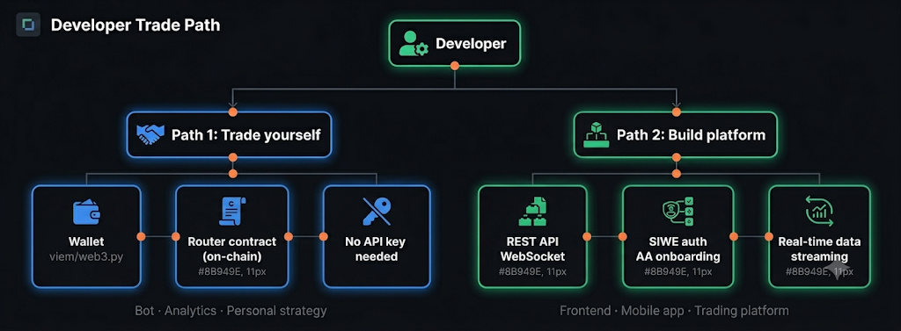

# Introduction

PrediX provides two paths for programmatic integration, depending on your use case.

<figure><figcaption></figcaption></figure>

Two developer paths: Path 1 Trade yourself (wallet + viem, Router contract, no API key) for bots/analytics. Path 2 Build platform (REST API + WebSocket, SIWE auth + AA, real-time streaming) for frontends/mobile apps.

## Path 1 - Trade for yourself

Build a trading bot, analytics tool, or personal strategy that interacts directly with PrediX smart contracts on Unichain.

**What you need:**

* A wallet (EOA or smart account) with test-USDC on Unichain mainnet (beta)
* The Router contract address
* viem (TypeScript) or web3.py (Python) to call contract functions

**Workflow:**

1. Connect wallet to Unichain mainnet (chain `130`)
2. Claim 10,000 test-USDC from the faucet UI (one-shot, per address)
3. Approve test-USDC to Router via Permit2
4. Call `Router.buyYes()` / `sellYes()` / `buyNo()` / `sellNo()`
5. Monitor positions via Indexer API

No API key required for on-chain trading. Start immediately.

> **Coming soon**: API key authentication for programmatic trading (24/7 bot operation without browser wallet) is planned for a future release.

-> [Quickstart - TypeScript](getting-started/quickstart-typescript.md) , [Quickstart - Python](getting-started/quickstart-python.md)

## Path 2 - Build a platform

Build a frontend, mobile app, or trading platform where other users trade through your interface.

**What you need:**

* REST API for market data, portfolio, pricing quotes
* WebSocket for real-time orderbook, prices, trades
* SIWE authentication for user sessions
* Account Abstraction endpoints for passkey/smart account onboarding

**Workflow:**

1. Fetch markets via `GET /api/markets`
2. Get pricing quotes via `POST /api/markets/:id/pricing/quote`
3. User signs tx via wallet -> Router contract executes on-chain
4. Track positions via `GET /api/portfolio/:address`

-> [API reference](integration/api-reference.md) , [WebSocket](integration/websocket.md) , [Bots & mobile](integration/bots-mobile.md)

## Stack overview

| Layer           | Technology                              | Purpose                                             |
| --------------- | --------------------------------------- | --------------------------------------------------- |
| Smart contracts | Solidity 0.8.34 , Foundry , Unichain L2 | On-chain execution: Diamond, Hook, Exchange, Router |
| Indexer         | Ponder , PostgreSQL , Hono REST         | Index on-chain events -> queryable REST API         |
| Backend         | NestJS , Fastify , MongoDB              | View model: cache + metadata + auth + social        |
| Frontend        | Next.js , React , viem , wagmi          | Web app UI                                          |
| Paymaster       | ERC-4337 v0.7 , Pimlico bundler         | Gas sponsorship for eligible users                  |

## Contract addresses - Beta (Unichain mainnet, chain `130`)

| Contract            | Address                                      |
| ------------------- | -------------------------------------------- |
| **Router**          | `0xf7D11488B6B0DAc511aE637AB02876dbE36cAdD6` |
| **Diamond**         | `0xC8F12AF2a396c9C906ac36Bc0AC2279BBb69Ef96` |
| **Exchange**        | `0x506367C7c48C95A4843F45d5C2F177B35e69594E` |
| **Hook**            | `0x2EA5EaC8A4E31F0889e86fc135C5eAE8e0b16AE0` |
| **ManualOracle**    | `0x8EDD86CC637FA1ca178ac16f85b6777F05AC0ca7` |
| **ChainlinkOracle** | `0x87c425523Bc2890Ec624D39492CdBbBd9E74eaA2` |
| **TestUSDC (beta)** | `0xB3FCA863dD0F6b496cCDDf6497Da5Dad67857F56` |
| **Permit2**         | `0x000000000022D473030F116dDEE9F6B43aC78BA3` |
| **Faucet**          | `0x335166bb5cf402b02b58904de5b8bf18c92ba10e` |
| **MarketFactory**   | `0x360fbf66dac5ca90c4e9fe1e57b6025192fa10cc` |
| **Paymaster**       | `0x569ff8c104dc03651777a8c85b7f98722ab68135` |
| **PoolManager**     | `0x1F98400000000000000000000000000000000004` |

> **Production mainnet addresses** (real Circle USDC) will be published when production launches. The beta uses a walled-garden TestUSDC so anyone can experiment without holding real USDC; the contracts themselves are identical to production.

## API base URLs

| Environment          | Indexer | Backend |
| -------------------- | ------- | ------- |
| **Beta** (live)      | TBA     | TBA     |
| **Production** (TBA) | TBA     | TBA     |

## Next steps

* [Quickstart - TypeScript](getting-started/quickstart-typescript.md) - buy YES in 5 minutes
* [Quickstart - Python](getting-started/quickstart-python.md) - full working example
* [Router integration](integration/router-integration.md) - deep dive on-chain trading
* [API reference](integration/api-reference.md) - REST endpoints
* [Beta info](getting-started/beta.md) - faucet, RPC, deploy flow
