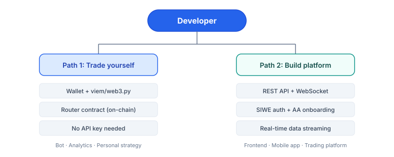

# Introduction

PrediX provides two paths for programmatic integration, depending on your use case.

## Path 1 — Trade for yourself

Build a trading bot, analytics tool, or personal strategy that interacts directly with PrediX smart contracts on Unichain.

**What you need:**

* A wallet (EOA or smart account) with USDC on Unichain Sepolia
* The Router contract address
* viem (TypeScript) or web3.py (Python) to call contract functions

**Workflow:**

1. Connect wallet to Unichain Sepolia (chain `1301`)
2. Approve USDC to Router via Permit2
3. Call `Router.buyYes()` / `sellYes()` / `buyNo()` / `sellNo()`
4. Monitor positions via Indexer API

No API key required for on-chain trading. Start immediately.

> **Coming soon**: API key authentication for programmatic trading (24/7 bot operation without browser wallet) is planned for a future release.

→ [Quickstart — TypeScript](getting-started/quickstart-typescript.md) · [Quickstart — Python](getting-started/quickstart-python.md)

## Path 2 — Build a platform

Build a frontend, mobile app, or trading platform where other users trade through your interface.

**What you need:**

* REST API for market data, portfolio, pricing quotes
* WebSocket for real-time orderbook, prices, trades
* SIWE authentication for user sessions
* Account Abstraction endpoints for passkey/smart account onboarding

**Workflow:**

1. Fetch markets via `GET /api/v1/markets`
2. Get pricing quotes via `POST /api/v1/markets/:id/pricing/quote`
3. User signs tx via wallet → Router contract executes on-chain
4. Track positions via `GET /api/v1/users/:address/portfolio`

→ [API reference](integration/api-reference.md) · [WebSocket](integration/websocket.md) · [Bots & mobile](integration/bots-mobile.md)

## Stack overview

| Layer           | Technology                              | Purpose                                             |
| --------------- | --------------------------------------- | --------------------------------------------------- |
| Smart contracts | Solidity 0.8.34 · Foundry · Unichain L2 | On-chain execution: Diamond, Hook, Exchange, Router |
| Indexer         | Ponder · PostgreSQL · Hono REST         | Index on-chain events → queryable REST API          |
| Backend         | NestJS · Fastify · MongoDB              | View model: cache + metadata + auth + social        |
| Frontend        | Next.js · React · viem · wagmi          | Web app UI                                          |
| Paymaster       | ERC-4337 v0.7 · Pimlico bundler         | Gas sponsorship for eligible users                  |

## Contract addresses — Staging (Unichain Sepolia, chain `1301`)

| Contract          | Address                                      |
| ----------------- | -------------------------------------------- |
| **Router**        | `0x1267723f500C0437295698d36d521bd060Bed0EB` |
| **Diamond**       | `0xa7a35F11e184Bde540702083160647518f5Be302` |
| **Exchange**      | `0x95a5Db0694c7C185b152E24b7d58D527af236b85` |
| **Hook**          | `0xc167a6bD746a5a884b3C0546B0115D0FdC04aAe0` |
| **ManualOracle**  | `0x9ffbf61f9481D71BB6F40e1955F4096De4c52cF6` |
| **USDC (test)**   | `0x5a9153c368946B5b252c32921EbB3c16c692D7D4` |
| **Permit2**       | `0x000000000022D473030F116dDEE9F6B43aC78BA3` |
| **Faucet**        | `0x76C951B6185A2B44e44c98E7A0E9Ee59b08760da` |
| **MarketFactory** | `0xf1cF0Ae6d8C5073244FED485824D1a6624F75451` |
| **Paymaster**     | `0x6bBeeb1255a25e6a57b87D9d88fBE24c3a1Ba9e7` |
| **PoolManager**   | `0x00b036b58a818b1bc34d502d3fe730db729e62ac` |

> **Mainnet addresses** will be published after external audit completes.

## API base URLs

| Environment        | Indexer                                                | Backend                                                |
| ------------------ | ------------------------------------------------------ | ------------------------------------------------------ |
| **Testnet** (live) | Gated — see [Testnet info](getting-started/testnet.md) | Gated — see [Testnet info](getting-started/testnet.md) |
| **Mainnet** (TBA)  | `https://indexer.predix.app`                           | `https://api.predix.app`                               |

## Next steps

* [Quickstart — TypeScript](getting-started/quickstart-typescript.md) — buy YES in 5 minutes
* [Quickstart — Python](getting-started/quickstart-python.md) — full working example
* [Router integration](integration/router-integration.md) — deep dive on-chain trading
* [API reference](integration/api-reference.md) — REST endpoints
* [Testnet info](getting-started/testnet.md) — faucet, RPC, deploy flow
