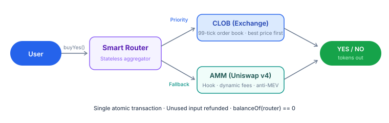

# PrediX vs alternatives

How PrediX compares to other prediction market protocols from a developer perspective.

## Architecture comparison

| Feature                 | PrediX                             | Polymarket                               | Limitless           | Kalshi                         |
| ----------------------- | ---------------------------------- | ---------------------------------------- | ------------------- | ------------------------------ |
| **Chain**               | Unichain L2                        | Polygon                                  | Base                | Off-chain (centralized)        |
| **Outcome tokens**      | ERC-20 (composable)                | ERC-1155 (limited)                       | ERC-1155 (CTF)      | No tokens (centralized ledger) |
| **Liquidity**           | Hybrid CLOB + AMM (Uniswap v4)     | CLOB only                                | CLOB (CTF Exchange) | CLOB (centralized)             |
| **Execution**           | On-chain Router (atomic CLOB+AMM)  | Off-chain matching + on-chain settlement | On-chain CLOB       | Fully centralized              |
| **Oracle**              | Pluggable (Manual, Chainlink, UMA) | UMA                                      | UMA                 | Internal                       |
| **Gas on failed tx**    | Zero (Unichain)                    | Paid                                     | Paid                | N/A                            |
| **Account abstraction** | Passkey + smart account (ERC-4337) | Magic Link                               | EOA only            | Email/password                 |
| **Gas sponsorship**     | Paymaster for eligible users       | None                                     | None                | N/A                            |

## Trading API comparison

|                   | PrediX                                          | Polymarket                             | Limitless                              |
| ----------------- | ----------------------------------------------- | -------------------------------------- | -------------------------------------- |
| **Trade entry**   | Router contract (`buyYes/sellYes`)              | CLOB API (EIP-712 signed orders)       | CLOB API (EIP-712 signed orders)       |
| **Order signing** | Wallet signs tx (standard)                      | EIP-712 typed data (off-chain signing) | EIP-712 typed data (off-chain signing) |
| **Limit orders**  | Exchange contract (`placeOrder`)                | API submission                         | API submission                         |
| **Quote**         | On-chain `quoteBuyYes()` (eth\_call)            | REST API                               | REST API                               |
| **REST API**      | Indexer (raw data) + Backend (enriched)         | REST API                               | REST API                               |
| **WebSocket**     | Topic-based subscribe (orderbook, trades, user) | WebSocket streaming                    | WebSocket streaming                    |
| **SDKs**          | TypeScript + Python (TBA)                       | Python + TypeScript                    | TypeScript + Python + Go + Rust        |

## Key differentiators for developers

### Hybrid execution



PrediX Router aggregates liquidity from both CLOB (on-chain order book) and AMM (Uniswap v4 pool) in a single atomic transaction. Other protocols typically use one or the other.

```
User → Router.buyYes()
         ├── CLOB: try fill limit orders (best price first)
         └── AMM: swap remainder via Uniswap v4 Hook
         → Combined output in 1 tx
```

### ERC-20 composability

Outcome tokens are standard ERC-20 — they can be used as collateral, added to lending pools, or composed with other DeFi protocols. Most other platforms use ERC-1155 which has limited DeFi integration.

### On-chain CLOB

PrediX Exchange runs fully on-chain with 99 price ticks ($0.01–$0.99). Three matching types: complementary (BUY↔SELL), mint synthetic (both BUY ≥ $1), merge synthetic (both SELL ≤ $1).

### LP protection

Uniswap v4 Hook dynamically adjusts AMM fees as markets approach expiry, protecting liquidity providers from informed trading (toxic flow).

### Zero gas on reverts

Unichain does not charge gas for failed transactions — developers and users never lose ETH on reverted trades.

## Migration notes

### From Polymarket

| Polymarket concept     | PrediX equivalent                                                     |
| ---------------------- | --------------------------------------------------------------------- |
| CTF Exchange contract  | PrediX Exchange (`placeOrder`, `cancelOrder`)                         |
| CLOB API order         | Exchange `placeOrder(marketId, side, price, amount, builder)`         |
| EIP-712 signed order   | Standard wallet tx signing (no off-chain signature needed for Router) |
| `positionIds[0]` = YES | `marketId` + `Side.BUY_YES (0)`                                       |
| UMA oracle             | ManualOracle (Phase 1) + Chainlink + UMA (Phase 2)                    |

### From Limitless

| Limitless concept     | PrediX equivalent                         |
| --------------------- | ----------------------------------------- |
| Venue contract        | Router contract (single entry point)      |
| EIP-712 order signing | Standard tx via Router (`buyYes/sellYes`) |
| API key (`lmts_`)     | SIWE session token                        |
| Sub-accounts          | Smart account (ERC-4337)                  |
| `GET /markets/:slug`  | `GET /api/markets/:idOrSlug`              |
