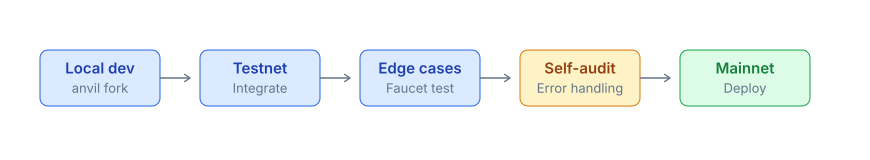

# Beta Information

PrediX runs a public **beta on Unichain mainnet**. The smart contracts are the production code; the USDC is a walled-garden test token so anyone can experiment without holding real funds.

## Network

|                |                                    |
| -------------- | ---------------------------------- |
| **Network**    | Unichain (mainnet)                 |
| **Chain ID**   | `130`                              |
| **RPC public** | `https://mainnet.unichain.org`     |
| **Explorer**   | [uniscan.xyz](https://uniscan.xyz) |
| **Block time** | \~1s                               |

Add to MetaMask:

```javascript
await window.ethereum.request({
  method: 'wallet_addEthereumChain',
  params: [{
    chainId: '0x82', // 130 hex
    chainName: 'Unichain',
    rpcUrls: ['https://mainnet.unichain.org'],
    blockExplorerUrls: ['https://uniscan.xyz'],
    nativeCurrency: { name: 'Ether', symbol: 'ETH', decimals: 18 },
  }],
});
```

## Faucet

PrediX operates a faucet relayed via the backend:

* **10,000 test-USDC** per claim
* **One claim per address** (one-shot)
* Gas is sponsored via the paymaster — no ETH needed to claim or trade

### How to claim

#### Via app

1. Connect your wallet on `app.predix.app`.
2. The UI shows a faucet banner -> click **Claim**.
3. Receive tokens within \~5s.

#### Via API

The faucet endpoint requires an authenticated session (SIWE cookie). After signing in via `/api/auth/challenge` + `/api/auth/verify`:

```bash
curl -X POST ${BACKEND_BASE_URL}/api/faucet \
  -H "Content-Type: application/json" \
  -b session_cookie.txt \
  -d '{}'
```

Body is empty — the destination is always the authenticated user's smart-account address (so a third party cannot burn another user's faucet allocation).

Response:

```json
{
  "address": "0x...",
  "txHash": "0x...",
  "eth":  { "decimal": "0", "raw": "0", "decimals": 18, "unit": "ETH" },
  "usdc": { "decimal": "10000", "raw": "10000000000", "decimals": 6, "unit": "USDC" },
  "nextClaimAt": 99999999999
}
```

#### Check claim status

```
GET /api/faucet/status?address=0x...
```

## API endpoints (beta)

|             | URL |
| ----------- | --- |
| Indexer API | TBA |
| Backend API | TBA |
| WebSocket   | TBA |

Schema and endpoint shape will stay identical from beta to production — switching only requires changing the base URL.

## Contract addresses (beta)

Latest deploy addresses:

```json
{
  "diamond": "0xC8F12AF2a396c9C906ac36Bc0AC2279BBb69Ef96",
  "router": "0xf7D11488B6B0DAc511aE637AB02876dbE36cAdD6",
  "exchange": "0x506367C7c48C95A4843F45d5C2F177B35e69594E",
  "hookProxy": "0x2EA5EaC8A4E31F0889e86fc135C5eAE8e0b16AE0",
  "marketFactory": "0x360fbf66dac5ca90c4e9fe1e57b6025192fa10cc",
  "manualOracle": "0x8EDD86CC637FA1ca178ac16f85b6777F05AC0ca7",
  "chainlinkOracle": "0x87c425523Bc2890Ec624D39492CdBbBd9E74eaA2",
  "timelock": "0xC5c64967CAA46e588cCe3eA97F761B5282e98882",
  "paymaster": "0x569ff8c104dc03651777a8c85b7f98722ab68135",
  "faucet": "0x335166bb5cf402b02b58904de5b8bf18c92ba10e",
  "testUsdc": "0xB3FCA863dD0F6b496cCDDf6497Da5Dad67857F56",
  "poolManager": "0x1F98400000000000000000000000000000000004",
  "permit2": "0x000000000022D473030F116dDEE9F6B43aC78BA3",
  "deployBlock": 48614667
}
```

## Beta vs production differences

|                  | Beta (live)                                          | Production (TBA)        |
| ---------------- | ---------------------------------------------------- | ----------------------- |
| Chain            | Unichain mainnet (`130`)                             | Unichain mainnet (`130`) |
| USDC             | Walled-garden TestUSDC from faucet                   | Circle USDC on Unichain |
| ETH gas          | Sponsored via paymaster (gasless)                    | User-paid (real ETH)    |
| PRX token        | Not deployed                                         | TBA after TGE           |
| Staking          | Disabled                                             | Live                    |
| Chainlink oracle | Live (round-pinned, sequencer-aware)                 | Live                    |
| Bug bounty       | Limited                                              | Full $50k-500k          |
| Persistence      | May reset before production launch                   | Permanent               |

## Beta limits

* **Faucet**: 1 claim / address, 10,000 test-USDC per claim.
* **Per-market collateral cap**: 5,000 test-USDC (conservative beta cap).
* **Market creation fee**: 10 test-USDC (anti-spam).
* **API rate limit**: same as the planned production free tier (60 req/min/IP).

## Development flow



### Recommended sequence

1. **Local fork**: `anvil --fork-url https://mainnet.unichain.org` for unit testing.
2. **Beta integrate**: deploy your bot/app against the beta addresses on Unichain mainnet, test for 1-2 weeks.
3. **Edge cases**: trigger failure scenarios (slippage, market pause, oracle revert).
4. **Production cutover**: swap to the production addresses + Circle USDC, smoke test with small amounts.

## Reset notice

The beta deployment **may be reset** in the following cases:

* Major contract upgrade incompatible with existing storage.
* Pre-production final cleanup.
* Critical bug fix requiring fresh state.

Resets are announced **2 weeks** in advance via Discord + Twitter. Previous state is not migrated; balances reset to 0.

## Beta bug reports

* Logic / data bugs: Discord #beta-bugs.
* Security bugs: same channel as production — [security@predix.app](mailto:security@predix.app). Bounty is lower (10-20% of production rate) since beta holds no real funds, but payouts are still issued.

## Get beta access

The web app and faucet are open to anyone. The REST + WebSocket endpoints will be public at launch; until then they are coordinated via Discord:

1. Join Discord.
2. Channel #beta-access — share your use case + GitHub.
3. Receive beta API endpoint + key.

Free for any legitimate development use case (bot, integration test, learning).

## Beta sunset after production launch

When production launches:

* Beta endpoints will remain live for at least 6 months for developers testing production contract changes.
* After 6 months: the beta may migrate to a fresh deployment or be deprecated, with prior notice.

Back up your data beforehand if needed:

* Export portfolio / order history via API.
* Save contract events via RPC `getLogs`.

## Production readiness checklist

Before switching to production, verify:

* [ ] Tested all happy paths on beta.
* [ ] Tested error handling (slippage, paused, oracle fail).
* [ ] API key scope minimized.
* [ ] Webhook + monitoring setup.
* [ ] Gas estimation buffer.
* [ ] Emergency stop button in bot.
* [ ] Funded production wallet with buffer.
* [ ] Reviewed audit reports + understand risks.
* [ ] Liability + legal compliance for your jurisdiction.
