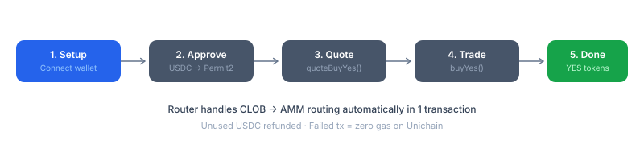

# Quickstart — TypeScript

Buy YES tokens on a PrediX market in under 5 minutes using viem.



## Prerequisites

```bash
npm install viem
```

You need:

* A wallet private key on Unichain mainnet — gas is sponsored via paymaster for eligible users, so no ETH balance required for the beta path
* test-USDC on Unichain (get from [Faucet](beta.md), 10,000 per address)

## 1. Setup client

```typescript
import { createPublicClient, createWalletClient, http, parseUnits } from 'viem';
import { privateKeyToAccount } from 'viem/accounts';
import { unichain } from 'viem/chains';

const RPC = 'https://mainnet.unichain.org';

const publicClient = createPublicClient({
  chain: unichain,
  transport: http(RPC),
});

const account = privateKeyToAccount('0x...');  // your private key
const walletClient = createWalletClient({
  chain: unichain,
  transport: http(RPC),
  account,
});
```

## 2. Contract addresses

```typescript
const ROUTER  = '0xf7D11488B6B0DAc511aE637AB02876dbE36cAdD6' as const;
const USDC    = '0xB3FCA863dD0F6b496cCDDf6497Da5Dad67857F56' as const;  // beta TestUSDC
const PERMIT2 = '0x000000000022D473030F116dDEE9F6B43aC78BA3' as const;
```

## 3. Approve USDC (one-time)

```typescript
import { erc20Abi } from 'viem';

// Approve USDC to Permit2 (one-time, max amount)
const approveTx = await walletClient.writeContract({
  address: USDC,
  abi: erc20Abi,
  functionName: 'approve',
  args: [PERMIT2, parseUnits('1000000', 6)],  // 1M USDC max
});
await publicClient.waitForTransactionReceipt({ hash: approveTx });
console.log('USDC approved to Permit2');
```

## 4. Quote before trading

```typescript
const routerAbi = [
  {
    name: 'quoteBuyYes',
    type: 'function',
    stateMutability: 'nonpayable',  // NOT view — use eth_call
    inputs: [
      { name: 'marketId', type: 'uint256' },
      { name: 'usdcIn', type: 'uint256' },
      { name: 'maxFills', type: 'uint256' },
    ],
    outputs: [
      { name: 'expectedYesOut', type: 'uint256' },
      { name: 'clobPortion', type: 'uint256' },
      { name: 'ammPortion', type: 'uint256' },
    ],
  },
] as const;

const marketId = 1n;  // market ID (uint256)
const usdcIn = parseUnits('100', 6);  // 100 USDC

// Quote is non-view — use simulate (eth_call)
const { result } = await publicClient.simulateContract({
  address: ROUTER,
  abi: routerAbi,
  functionName: 'quoteBuyYes',
  args: [marketId, usdcIn, 10n],  // maxFills = 10
  account,
});

const [expectedYesOut, clobPortion, ammPortion] = result;
console.log(`Expected: ${expectedYesOut} YES (CLOB: ${clobPortion}, AMM: ${ammPortion})`);
```

> **Important**: Quote functions are NOT `view` — they must be called via `eth_call` (simulateContract). They return `(0, 0, 0)` on invalid market state, never revert.

## 5. Execute trade

```typescript
const buyYesAbi = [
  {
    name: 'buyYes',
    type: 'function',
    stateMutability: 'nonpayable',
    inputs: [
      { name: 'marketId', type: 'uint256' },
      { name: 'usdcIn', type: 'uint256' },
      { name: 'minYesOut', type: 'uint256' },
      { name: 'recipient', type: 'address' },
      { name: 'maxFills', type: 'uint256' },
      { name: 'deadline', type: 'uint256' },
    ],
    outputs: [
      { name: 'yesOut', type: 'uint256' },
      { name: 'clobFilled', type: 'uint256' },
      { name: 'ammFilled', type: 'uint256' },
    ],
  },
] as const;

// 0.5% slippage
const minOut = (expectedYesOut * 995n) / 1000n;
const deadline = BigInt(Math.floor(Date.now() / 1000) + 300);  // 5 min

const hash = await walletClient.writeContract({
  address: ROUTER,
  abi: buyYesAbi,
  functionName: 'buyYes',
  args: [marketId, usdcIn, minOut, account.address, 10n, deadline],
});

const receipt = await publicClient.waitForTransactionReceipt({ hash });
console.log('Trade complete:', receipt.transactionHash);
```

## 6. Check position

```typescript
// Via Indexer API
const res = await fetch(
  `${INDEXER_URL}/api/portfolio/${account.address}`
);
const positions = await res.json();
console.log(positions);
```

## Router functions reference

| Function       | Input                                                      | Output                         | Description                     |
| -------------- | ---------------------------------------------------------- | ------------------------------ | ------------------------------- |
| `buyYes`       | marketId, usdcIn, minYesOut, recipient, maxFills, deadline | yesOut, clobFilled, ammFilled  | Buy YES tokens with USDC        |
| `sellYes`      | marketId, yesIn, minUsdcOut, recipient, maxFills, deadline | usdcOut, clobFilled, ammFilled | Sell YES tokens for USDC        |
| `buyNo`        | marketId, usdcIn, minNoOut, recipient, maxFills, deadline  | noOut, clobFilled, ammFilled   | Buy NO tokens with USDC         |
| `sellNo`       | marketId, noIn, minUsdcOut, recipient, maxFills, deadline  | usdcOut, clobFilled, ammFilled | Sell NO tokens for USDC         |
| `quoteBuyYes`  | marketId, usdcIn, maxFills                                 | expectedOut, clob, amm         | Quote (non-view, use eth\_call) |
| `quoteSellYes` | marketId, yesIn, maxFills                                  | expectedOut, clob, amm         | Quote                           |
| `quoteBuyNo`   | marketId, usdcIn, maxFills                                 | expectedOut, clob, amm         | Quote                           |
| `quoteSellNo`  | marketId, noIn, maxFills                                   | expectedOut, clob, amm         | Quote                           |

Permit2 variants: `buyYesWithPermit`, `sellYesWithPermit`, `buyNoWithPermit`, `sellNoWithPermit` — same params + `permitSingle` + `signature`.

## Limits

| Parameter                 | Value                      |
| ------------------------- | -------------------------- |
| Min trade (Router)        | `1000` ($0.001 USDC)       |
| Min order (Exchange CLOB) | `1e6` ($1.00 USDC)         |
| Max open orders per user  | 50                         |
| Max fills per place order | 20                         |
| Max batch cancel          | 50                         |
| Price range               | $0.01 – $0.99 (step $0.01) |
| Price precision           | `1e6` = 100% = $1.00       |

## Common errors

| Error                    | Cause                      | Fix                        |
| ------------------------ | -------------------------- | -------------------------- |
| `InsufficientOutput`     | Price moved past tolerance | Increase slippage or retry |
| `DeadlineExpired`        | Tx took too long           | Increase deadline          |
| `MarketModulePaused`     | Diamond MARKET module paused | Wait for resume          |
| `MarketResolved`         | Market already resolved    | Cannot trade               |
| `MarketExpired`          | `block.timestamp >= endTime` | Cannot trade             |
| `MarketInRefundMode`     | Refund mode active         | Use redeem/refund instead  |
| `InsufficientLiquidity`  | Not enough depth across CLOB + AMM | Reduce size        |
| `InvalidPermitAmount`    | Permit2 amount != usdcIn   | Sign exact-amount permit   |
| `FinalizeBalanceNonZero` | Internal error             | Report as bug              |

## Next steps

* [Router integration](../integration/router-integration.md) — Permit2 flow, batch with Smart Account, AMM-only / CLOB-only
* [API reference](../integration/api-reference.md) — REST endpoints for market data
* [Beta info](beta.md) — faucet, RPC endpoints
