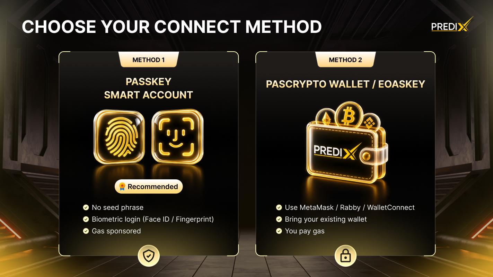

# Wallet Setup

<figure><figcaption></figcaption></figure>

Before you can trade on PrediX, you need to complete 2 setup steps. After this, you're ready to trade and won't need to repeat these steps unless you switch wallets or run out of USDC.

<table data-card-size="large" data-view="cards"><thead><tr><th></th><th></th><th data-type="content-ref"></th></tr></thead><tbody><tr><td><ol><li><mark style="color:orange;"><strong>Connect a wallet</strong></mark></li></ol></td><td>Choose between Passkey (recommended for new users) or a Crypto Wallet like MetaMask</td><td><a href="connect-wallet.md">connect-wallet.md</a></td></tr><tr><td><ol start="2"><li><mark style="color:orange;"><strong>Get USDC on Unichain</strong></mark></li></ol></td><td>Bridge from another chain, or deposit directly from a CEX.</td><td><a href="bridge-to-unichain.md">bridge-to-unichain.md</a></td></tr></tbody></table>

The whole setup takes **\~2 minutes**. After this, you're ready to trade and won't need to repeat these steps unless you switch wallets or run out of USDC.


**No crypto background needed.**

If you're new to crypto, use **Passkey** - Sign in with **Face ID or Touch ID**, no seed phrase, no browser extension. You can buy USDC directly in the app.

