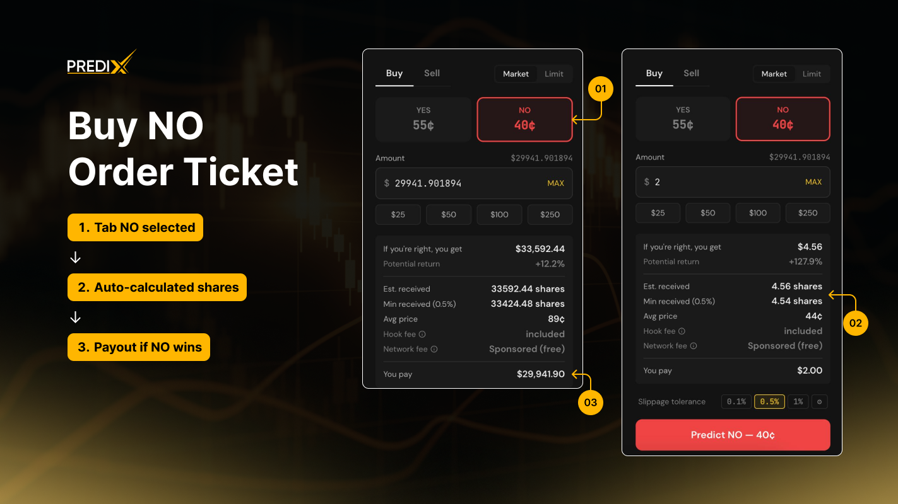
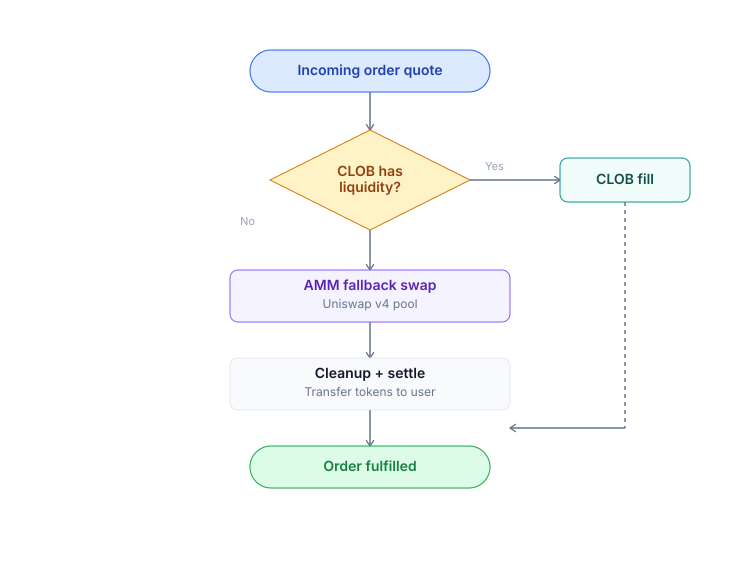

# Market Order

Buy or sell instantly at the current market price. The **Router** automatically finds the best execution path between the CLOB (limit order book) and the AMM (Uniswap v4 pool) via [CLOB & AMM Hybrid mechanism](../../core-concepts/clob-amm-hybrid.md).

### When to use

* ✅ Enter a position **immediately**, accepting the prevailing market price
* ✅ Small trades (< 1% of liquidity) where slippage is acceptable
* ✅ You have no strong view on a better price ahead
* ❌ Avoid for large size in thin markets - use a limit order instead


**Market vs Limit**

Use **Market** when you want to enter/exit a position **now** and are okay with the current price. Use **Limit** when you have a target price and are willing to wait.


### Buy / Sell Semantics

| Action            | What you specify                          | What you receive                   |
| ----------------- | ----------------------------------------- | ---------------------------------- |
| **Buy YES / NO**  | USDC amount to spend (e.g. `100 USDC`)    | Variable number of YES / NO shares |
| **Sell YES / NO** | Number of shares to sell (e.g. `200 YES`) | Variable USDC amount               |


**Asymmetric input.** Buy is denominated in **USDC**, Sell is denominated in **shares**. The UI labels each field correctly - but if you integrate via API, be sure to use `amountIn` (USDC for buy) vs `sharesIn` (shares for sell).


***

### How to Buy YES

<mark style="color:yellow;background-color:yellow;">\[Insert video]</mark>



<mark style="color:$warning;">**Step 1: Access the Trading Panel**</mark>

* Navigate to the Market Detail Page of your chosen event.
* On the right-hand panel, ensure the Buy tab is selected.



<mark style="color:$warning;">**Step 2: Select Your Side & Amount**</mark>

* Choose the YES side (indicating you believe the event will happen).
* Enter the USDC amount you wish to spend (e.g., $$ $100$ $$).



<mark style="color:$warning;">**Step 3: Adjust Slippage Tolerance**</mark>

* Set your preferred slippage tolerance.


Tip: While the default is 0.5%, you may want to increase this to 1-2% when trading in low-liquidity markets to ensure your order fills.




<mark style="color:$warning;">**Step 4: Preview your Trade**</mark>

Before clicking buy, verify the following details:

* [x] Estimated YES received: The total tokens you will get.
* [x] Average price: The projected cost per token.
* [x] Actual slippage: The expected price impact based on current liquidity.
* [x] CLOB / AMM split ratio: How your trade is distributed across the Order Book and Liquidity Pool.



<mark style="color:$warning;">**Step 5: Execute and Confirm**</mark>

* Click the Buy button.
* Confirm the request in your wallet:
  * [Passkey Wallet](../wallet-setup/connect-wallet.md#method-1-passkey--smart-account): Use Touch ID / Face ID.
  * [EOA Wallet](../wallet-setup/connect-wallet.md#method-2-crypto-wallet-eoa): Approve the MetaMask (or other wallet) popup.



<mark style="color:$warning;">**Step 6: Success**</mark>

* Wait approximately 2 seconds for the transaction to process.
* Once confirmed, you can view the trade in your [Portfolio](../portfolio.md) under the History tab.



### How to Sell YES

<mark style="color:yellow;background-color:yellow;">\[Insert video]</mark>

Same flow but under the **Sell** tab:



<mark style="color:$warning;">**Step 1: Switch to the Sell Tab**</mark>

* Navigate to the trading panel on the market detail page.
* Select the Sell tab.



<mark style="color:$warning;">**Step 2: Configure Your Sale**</mark>

* Ensure YES is selected.
* Enter the amount of tokens you wish to sell.



<mark style="color:$warning;">**Step 3: Review and Confirm**</mark>

* Preview: Check the estimated USDC you will receive after fees and slippage.
* Confirm: Click the Sell button and approve the transaction in your wallet.



***

### How to Buy / Sell NO

<figure><figcaption></figcaption></figure>

Buying or selling NO works the same way as YES. The Router automatically searches for the best available execution path between the on-chain order book (CLOB) and Uniswap v4 liquidity pools.

If direct NO liquidity is insufficient, the Router may use an internal "virtual-NO" routing flow to complete the trade through the YES side and settle the final output automatically. This process happens entirely in the background - the UI simply displays the final execution price and amount.


[**How the Execution Router Works?**](../../core-concepts/clob-amm-hybrid.md#how-the-execution-router-works)


Users do not need to manage routing logic manually. PrediX handles liquidity aggregation, fallback execution, and settlement within a single transaction.

***

### Split / merge shortcut

In the same panel, under the [**Split** / **Merge**](split-and-merge.md) tabs:

* **Split**: 100 USDC -> 100 YES + 100 NO. Useful when you want to hold both sides and sell them separately (market making).
* **Merge**: 100 YES + 100 NO -> 100 USDC. Useful when you hold both sides and want to withdraw.


[**Maximize capital efficiency with Split & Merge on PrediX**](split-and-merge.md)


No protocol fee. Gas is paid by the user by default; sponsor coverage applies if the user qualifies for the program (applies to both account types).

***


**Additional Slippage**

Slippage is the difference between the previewed price and the actual execution price.

* **Default 0.5%**: Suitable for liquid markets.
* **1-2%**: Increase for markets with a wide spread.
* **> 5%**: Rarely advisable - the Router will warn you.

If slippage is exceeded the transaction **reverts** and no funds are lost (only gas is consumed - sponsor coverage applies if the user qualifies for the program, regardless of account type).

