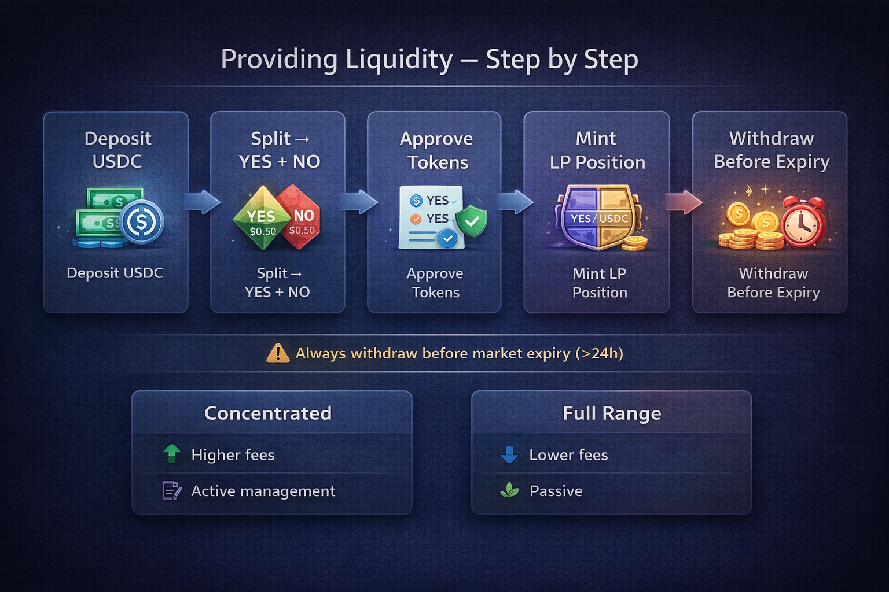

# Providing Liquidity

## Step-by-Step

* Split USDC → YES + NO tokens (qua Diamond)
* Approve YES + USDC cho Position Manager
* Mint LP position (concentrated hoặc full-range)
* Nhận swap fees liên tục
* Rút LP trước market expires

## Concentrated vs Full-Range

* **Concentrated:** LP quanh giá hiện tại → phí cao hơn, nhưng cần rebalance
* **Full-range:** LP toàn bộ $0–$1 → ít phí, nhưng không cần quản lý

## Khi Nào Rút

Luôn rút trước market hết hạn. Sau resolve, 1 token = $0, IL tối đa. Khuyến nghị rút khi còn > 24h.

<figure><figcaption></figcaption></figure>
