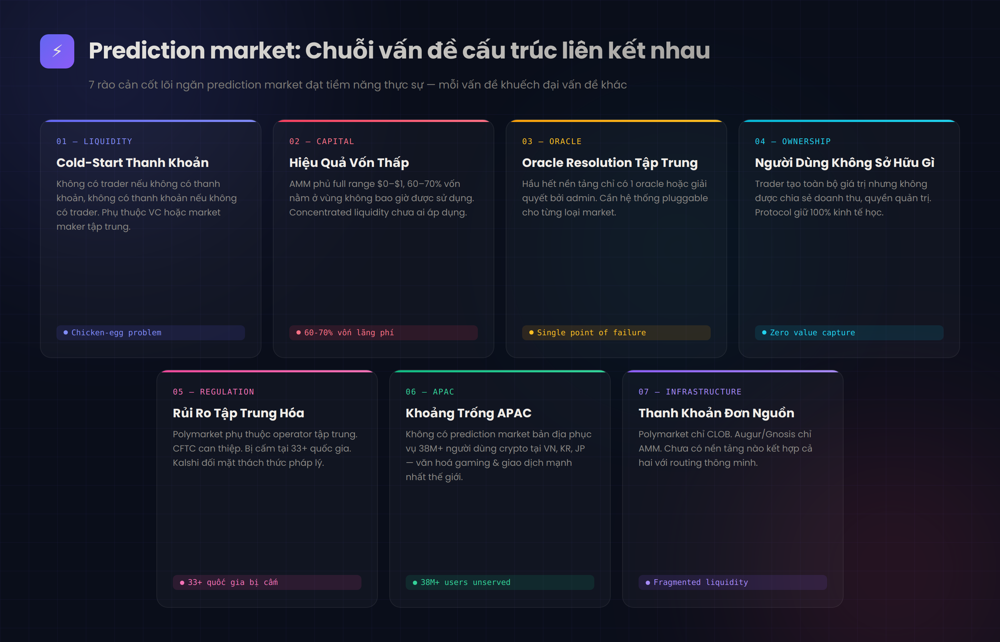

# 2. Vấn Đề Thị Trường

Prediction market đối mặt với chuỗi vấn đề cấu trúc liên kết nhau:

<figure><figcaption></figcaption></figure>

### 2.1 Cold-Start Thanh Khoản

Không có trader nếu không có thanh khoản, không có thanh khoản nếu không có trader. Các nền tảng hiện tại dựa vào VC khổng lồ hoặc market maker tập trung để tạo độ sâu ban đầu.

### 2.2 Hiệu Quả Vốn Thấp

AMM prediction market (Augur, Omen) yêu cầu LP phủ full range $0–$1 → 60–70% vốn nằm ở vùng không bao giờ được sử dụng. Concentrated liquidity chưa ai áp dụng cho prediction market.

### 2.3 Oracle Resolution Tập Trung

Hầu hết nền tảng chỉ có 1 oracle hoặc giải quyết bởi admin. Cần hệ thống pluggable chọn oracle phù hợp cho từng loại market.

### 2.4 Người Dùng Không Sở Hữu Gì

Trader tạo toàn bộ giá trị (volume, phí, dữ liệu) nhưng không được chia sẻ doanh thu, quyền quản trị hay lợi ích kinh tế. Protocol giữ 100% kinh tế học.

### 2.5 Rủi Ro Tập Trung Hóa

Polymarket phụ thuộc operator tập trung. CFTC đã can thiệp. Bị cấm tại 33+ quốc gia (Ba Lan, Singapore, Bỉ…). Kalshi đối mặt thách thức pháp lý tại Nevada và Arizona.

### 2.6 Khoảng Trống APAC

Không có prediction market bản địa phục vụ 38M+ người dùng crypto tại VN, KR, JP — những khu vực có văn hoá gaming và giao dịch mạnh nhất thế giới.

### 2.7 Thanh Khoản Đơn Nguồn

Polymarket chỉ CLOB. Augur/Gnosis chỉ AMM. Chưa có nền tảng nào kết hợp cả hai với routing thông minh.
