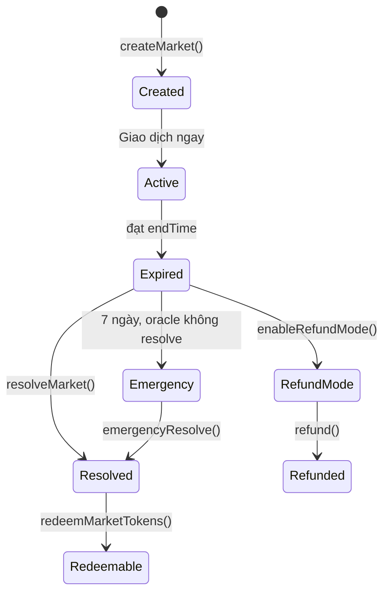

# Phân xử kết quả

Phân xử là quá trình xác định kết quả của market và cho phép bên thắng đổi token lấy USDC.

## Vòng đời market

## Phân xử bình thường

1. **Oracle resolve:** Oracle được gán gọi `resolve(marketId, outcome)` với `true` (YES thắng) hoặc `false` (NO thắng)
2. **Bất kỳ ai finalize:** Sau khi oracle đã resolve và `endTime` đã qua, bất kỳ ai cũng gọi được `resolveMarket(marketId)`
3. **Winner redeem:** Người giữ token thắng gọi `redeemMarketTokens(marketId)` để nhận $1.00 USDC cho mỗi token

## Phân xử khẩn cấp

Nếu oracle không resolve trong **7 ngày** sau `endTime`:

- Địa chỉ có `OPERATOR_ROLE` có thể gọi `emergencyResolve(marketId, outcome)`
- Đây là cơ chế an toàn, không phải flow thông thường

## Chế độ refund

Nếu một market không thể phân xử đúng cách (câu hỏi mơ hồ, oracle lỗi, có tranh chấp):

1. `OPERATOR_ROLE` gọi `enableRefundMode(marketId)`
2. Mọi holder gọi `refund(marketId)`
3. USDC được trả lại theo tỷ lệ nắm giữ

> ⚠️ Refund mode không thể đảo ngược. Khi đã bật, market không thể resolve theo cách bình thường nữa.

## Phân xử theo category

Với [thị trường nhiều kết quả](multi-outcome-markets.md), `resolveCategory(categoryId, winningOutcomeIndex)` phân xử toàn bộ các market trong category. Chỉ `ADMIN_ROLE` gọi được.

## Tiếp theo

- [Thị trường nhiều kết quả](multi-outcome-markets.md) — category và group operation
- [Developer: Resolve & Redeem](../developers/resolve-redeem.md) — ví dụ code
- [Oracle](../contracts/oracle.md) — chi tiết oracle adapter
