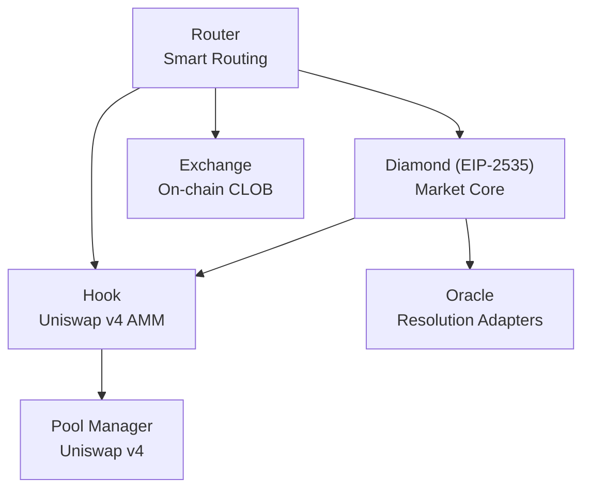

# Tổng quan Smart Contracts

PrediX gồm năm contract cốt lõi, deploy trên **Unichain Sepolia Testnet** (Chain ID: `1301`).

## Kiến trúc

## Địa chỉ contract

| Contract | Địa chỉ | Vai trò |
|----------|---------|------|
| **Diamond** | `0xF38a265E6e4F57D000a1CC08004da5B4A380B08A` | Tạo market, vị thế, phân xử |
| **Hook** | `0xAe7eA7eba1D3B0815dCA2b43f250428c20ed30c0` | AMM Uniswap v4 + phí động |
| **Exchange** | `0xa202abCb2A358c0862B2dA76b553398339F2C638` | Engine khớp lệnh CLOB |
| **Router** | `0xEfc57eB2b5b5BE7E5b8377be23f8D31354811Eb7` | Smart routing (CLOB + AMM) |
| **Oracle** | `0x699A8C74663b1C852E195b2ffa00D5965E992Cf3` | Manual oracle adapter |
| **USDC** | `0x12fd156C8b5F2901BA2781d97db84AaC56b2b911` | Collateral test |
| **Pool Manager** | `0x00B036B58a818B1BC34d502D3fE730Db729e62AC` | Lõi Uniswap v4 |

## Thông tin mạng

| Thuộc tính | Giá trị |
|----------|-------|
| Mạng | Unichain Sepolia |
| Chain ID | `1301` |
| RPC | `https://sepolia.unichain.org` |
| Explorer | `https://sepolia.uniscan.xyz` |

## Vì sao Diamond Proxy (EIP-2535)

48 source file trên 6 facet vượt giới hạn 24KB của contract. Diamond pattern cho phép:

- **Nâng cấp modular:** Update MarketFacet mà không động đến AccessControl
- **Shared storage:** Mọi facet chia sẻ state qua struct `AppStorage`
- **Không cần migration:** Luôn một địa chỉ duy nhất, dù có nâng cấp bao nhiêu lần

## Tải ABI

- [Diamond ABI (MarketFacet)](./abis/diamond.json)
- [Exchange ABI](./abis/exchange.json)
- [Router ABI](./abis/router.json)
- [Hook ABI](./abis/hook.json)
- [ERC-20 ABI](./abis/erc20.json)

## Tiếp theo

- [Diamond](diamond.md) — facet, function routing, nâng cấp
- [Exchange](exchange.md) — cơ chế CLOB
- [Router](router.md) — logic smart routing
- [Bảo mật](security.md) — access control, cap, audit
