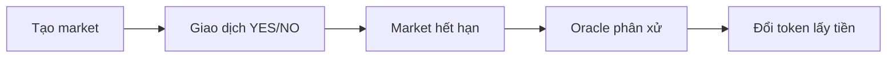

# Cơ chế hoạt động

## Vòng đời một market

### 1. Tạo market

Admin tạo market kèm câu hỏi, thời điểm kết thúc và oracle sẽ dùng. Giao thức tự động deploy hai token ERC-20 (YES và NO) cùng khởi tạo pool Uniswap v4 tương ứng.

### 2. Giao dịch

Người dùng mua YES hoặc NO thông qua Router. Router kiểm tra sổ lệnh CLOB trước để tìm lệnh giới hạn có thể khớp, phần còn lại được chuyển sang AMM — luôn cho giá tốt nhất có sẵn.

- **YES ở $0.60** nghĩa là thị trường đánh giá sự kiện có xác suất 60%.
- **YES + NO ≈ $1.00** luôn đúng, được ràng buộc bằng arbitrage.

### 3. Phân xử

Sau khi qua `endTime`, oracle đệ trình kết quả. Bất kỳ ai cũng có thể gọi `resolveMarket()` để hoàn tất.

### 4. Đổi token lấy tiền

Mỗi token thắng cuộc đáng giá $1.00, token thua đáng giá $0. Gọi `redeemMarketTokens()` để nhận USDC.

## Ví dụ

Bạn tin rằng ETH sẽ vượt $10K trước tháng 12.

| Bước | Hành động | Chi phí / Thu về |
|------|--------|-------------|
| Mua | 100 YES ở giá $0.60 | Trả $60 USDC |
| Chờ | Market hết hạn, ETH vượt $10K | — |
| Redeem | 100 YES → 100 USDC | Nhận $100 |
| **Lợi nhuận** | | **+$40 USDC (lãi 67%)** |

Nếu ETH không vượt $10K, token YES bạn giữ trị giá $0 và bạn mất $60 đã bỏ ra.

> ⚠️ Tổn thất tối đa luôn bằng số tiền đã mua. Không thể lỗ nhiều hơn vốn.

## Khái niệm quan trọng

- **Split/Merge:** Chuyển đổi giữa USDC và cặp token — xem [Split & Merge](../concepts/split-and-merge.md)
- **Phí:** Phí AMM động 0.5% → 5% — xem [Phí](../concepts/fees.md)
- **Phân xử:** Bình thường, khẩn cấp, và refund — xem [Phân xử](../concepts/resolution.md)

## Tiếp theo

- [Khởi động nhanh](quick-start.md) — giao dịch đầu tiên trong 5 bước
- [Token kết quả](../concepts/outcome-tokens.md) — chi tiết về YES/NO
